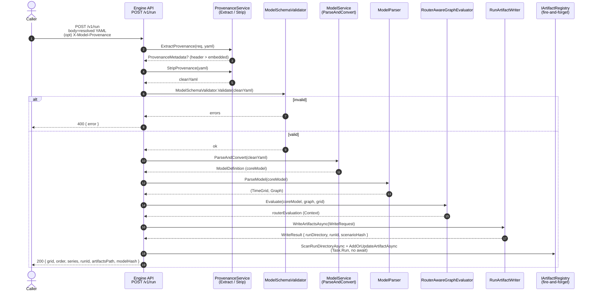
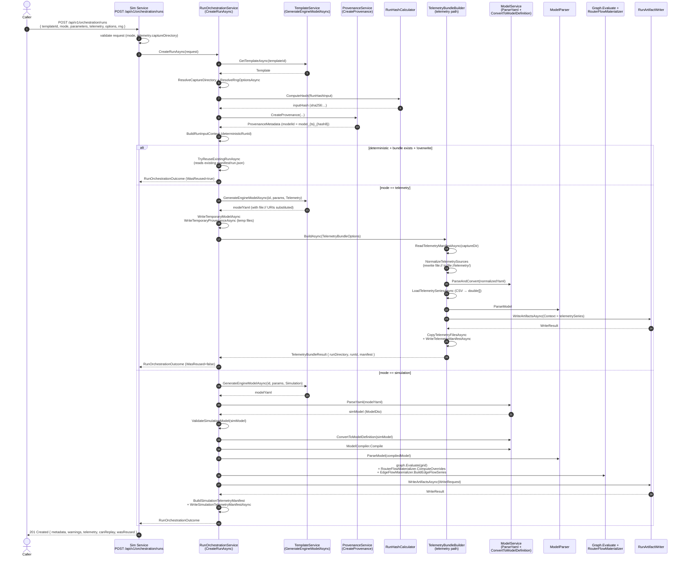
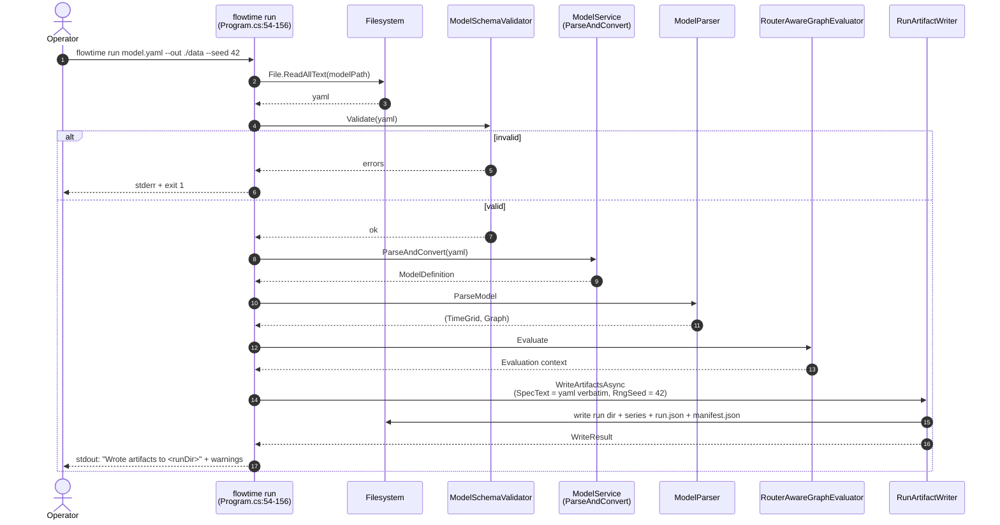
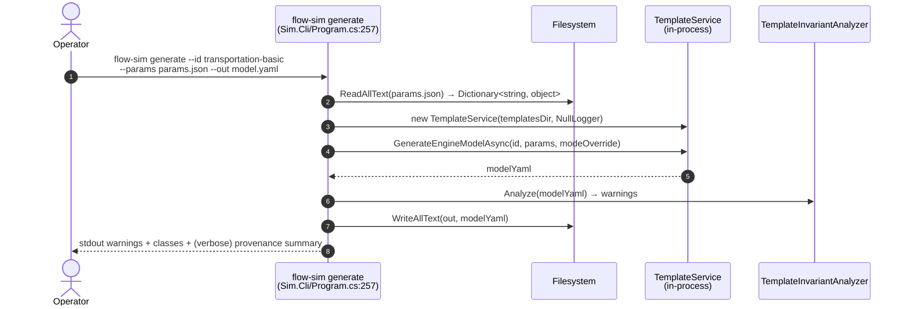
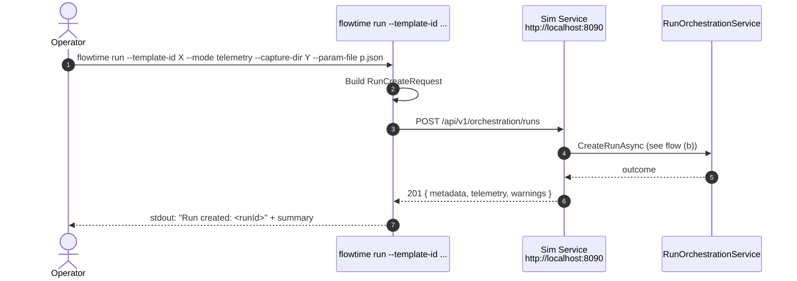

# Run lifecycle

End-to-end documentation of how a run is initiated, validated, evaluated, and persisted, for each entry point. The canonical run artifact is described in `07-storage-and-artifacts.md`.

## Entry-point inventory

| Entry point | Surface | Endpoint / command | Body / args | Produces |
|---|---|---|---|---|
| Engine `/v1/run` | HTTP `POST` on Engine API (port 8081) | `src/FlowTime.API/Program.cs:620` | Raw resolved-model YAML body (text/plain or YAML); optional `X-Model-Provenance` header | Run artifact under `<dataRoot>/<runId>/`, plus inline JSON response |
| Sim orchestrate run | HTTP `POST` on Sim Service (port 8090) | `src/FlowTime.Sim.Service/Extensions/RunOrchestrationEndpointExtensions.cs:13` `POST /api/v1/orchestration/runs` | `{ templateId, mode, parameters, telemetry, options, rng }` (`RunCreateRequest`) | Run artifact under `<simDataRoot>/runs/<runId>/`; HTTP response contains metadata only |
| Sim draft run | HTTP `POST` on Sim Service | `src/FlowTime.Sim.Service/Program.cs:455` `POST /api/v1/drafts/run` | `DraftRunRequest` (inline draft source + parameters + mode + telemetry) | Same as orchestrate; runs from inline/draft template content |
| Sim generate (no run) | HTTP `POST` on Sim Service | `src/FlowTime.Sim.Service/Program.cs:326` `POST /api/v1/templates/{id}/generate` | `{ <param>: <value>, ... }` JSON; `?mode=` query | YAML model document (no run, no artifact) |
| Engine `/v1/validate` | HTTP `POST` on Engine API | `src/FlowTime.API/Endpoints/ValidationEndpoints.cs:12` | `{ yaml, tier: schema\|compile\|analyse }` | Tiered validation result; no run |
| Engine `/v1/sweep`, `/v1/sensitivity`, `/v1/goal-seek`, `/v1/optimize` | HTTP `POST` on Engine API | `src/FlowTime.API/Endpoints/SweepEndpoints.cs` etc. | `{ yaml, ... }` | Multi-evaluation derived results (Rust engine, in-memory) |
| `flowtime run <model.yaml>` | CLI | `src/FlowTime.Cli/Program.cs:54-156` | Resolved-model YAML on disk + `--out`, `--seed`, `--deterministic-run-id` | Run artifact under `--out` (default `./data`) |
| `flowtime run --template-id ...` | CLI (orchestration mode) | `src/FlowTime.Cli/Program.cs:49-51` → `TelemetryRunCommand.ExecuteAsync` (`src/FlowTime.Cli/Commands/TelemetryRunCommand.cs:21`) | Mirror of `RunCreateRequest` flags; calls Sim service over HTTP | Run artifact under Sim service's data root (the CLI is a thin proxy) |
| `flowtime validate`, `sweep`, `sensitivity`, `goal-seek`, `optimize` | CLI | `src/FlowTime.Cli/Commands/{Validate,Sweep,Sensitivity,GoalSeek,Optimize}Command.cs` | JSON-on-stdin, JSON-on-stdout; matches `/v1/...` endpoint shapes | Stdout JSON; no artifact |
| `flow-sim generate` | Sim CLI | `src/FlowTime.Sim.Cli/Program.cs:257` (verb `generate`) | `--id <template-id> --params <file>` | YAML model on stdout / `--out` file (no run) |
| `flow-sim validate` | Sim CLI | `src/FlowTime.Sim.Cli/Program.cs:460` | `--id <template-id> --params <file>` | Pass/fail + error list (no run) |
| `flow-sim list templates`, `show template`, `show model`, `list models`, `refresh templates` | Sim CLI | `src/FlowTime.Sim.Cli/Program.cs:120-144` | Listing/inspection only | No run |
| Blazor UI orchestration | UI | `src/FlowTime.UI/Services/TemplateServiceImplementations.cs:949` | Same as `POST /api/v1/orchestration/runs` via `simClient.CreateRunAsync` | Run via Sim service |
| Svelte UI orchestration | UI | `ui/src/lib/api/sim.ts:42` `${API}/orchestration/runs` proxied via Vite to `http://localhost:8090` | Same as Sim orchestrate | Run via Sim service |
| Svelte UI listing | UI | `ui/src/lib/api/flowtime.ts:30` `GET /v1/runs` proxied to `http://localhost:8081` | List query | Run summaries |
| Sim `POST /api/v1/series/ingest`, `/series/summarize`, `/profiles/fit`, `/profiles/preview`, `/drafts/map-profile` | HTTP `POST` on Sim Service | `src/FlowTime.Sim.Service/Program.cs:567-700+` | CSV/series payload | Stored series under `<simDataRoot>/series/<id>/` (not a "run") |
| Engine `POST /v1/telemetry/captures` | HTTP `POST` on Engine API | `src/FlowTime.API/Endpoints/TelemetryCaptureEndpoints.cs:15` | `{ source: { type: "run", runId }, output: { captureKey, directory, overwrite } }` | Capture bundle under telemetry root from a previously-run engine artifact |

> **Drift:** the docstring at `src/FlowTime.Sim.Service/Program.cs:189-200` lists `availableEndpoints` for the v1 health response that omits `/api/v1/orchestration/runs`, `/api/v1/drafts/*`, `/api/v1/series/*`, `/api/v1/profiles/*`, and `/api/v1/templates/{id}/source`. Cosmetic but misleading.

> **Drift:** the Engine API exposes `/v1/runs` (GET list, GET detail) which reads from the same `runsRoot` as the Sim Service when both use the default data dir. There is no Engine-side write path through orchestration — `MapRunOrchestrationEndpoints` on the Engine API only registers the read endpoints (`src/FlowTime.API/Endpoints/RunOrchestrationEndpoints.cs:14-15`).

## Per-entry-point sequence diagrams

### (a) Engine API direct submission — `POST /v1/run`

The simplest path. Caller posts a resolved-model YAML; engine evaluates and writes artifacts.



Notes:
- Validation tier: schema only (`ModelSchemaValidator.Validate` at line 657). Compile and Analyse tiers are not invoked here — the model is parsed via `ModelService.ParseAndConvert` (which can throw `ModelParseException`) and evaluated. Invariant analysis happens inside `RunArtifactWriter` (`InvariantAnalyzer.Analyze`, see `RunArtifactWriter.cs:116`) and the warnings are written into `run.json`.
- Artifact registry update is fire-and-forget (`Task.Run` at line 712) and gated by `ArtifactRegistry:AutoAddEnabled` (default true).

### (b) Sim service template-driven run — `POST /api/v1/orchestration/runs`

The richest path. Caller provides a `templateId` and parameter overrides. Sim resolves the template, substitutes parameters, validates, evaluates (or builds a telemetry bundle), and writes the canonical run artifact.



Notes:
- Validation tier: schema + compile via `ValidateSimulationModel` (simulation), or via the `TelemetryBundleBuilder` parse path (telemetry). Analyse-equivalent runs implicitly via `InvariantAnalyzer.Analyze` inside `RunArtifactWriter`. The Sim service also pre-runs `TemplateInvariantAnalyzer.Analyze` on every template at startup (`Program.cs:101-107`) and stores warnings in `TemplateWarningRegistry`.
- The Sim service reuses existing runs by deterministic id (`TryReuseExistingRunAsync`, `RunOrchestrationService.cs:323`) unless `dryRun` is set or `overwriteExisting` is true.
- The dry-run path (mode-specific) returns a `RunOrchestrationPlan` rather than running. Telemetry dry-run reads only `<captureDir>/manifest.json`. Simulation dry-run parses the model but does not evaluate.
- The capture directory path resolves against `TelemetryRoot` config or `<solutionRoot>/examples/time-travel` (`RunOrchestrationService.cs:62-86`).

### (c) CLI engine run — `flowtime run <model.yaml>`

In-process, no network. Reads a pre-resolved YAML from disk, parses, evaluates, writes artifacts.



`flowtime run` does **not** speak to either HTTP service. The shared logic lives in `FlowTime.Core` (`ModelService`, `ModelSchemaValidator`, `RunArtifactWriter`) and the CLI links it directly.

### (d) Sim CLI generate — `flow-sim generate --id <id> --params overrides.json`

Renders a resolved model from a template. Does **not** run anything.



The Sim CLI never calls the Sim service. It instantiates `TemplateService` directly against the same templates directory.

### (e) CLI orchestrated run — `flowtime run --template-id ... --mode telemetry --capture-dir ...`

This path is detected by `ShouldUseOrchestration` in `src/FlowTime.Cli/Program.cs:262`. It diverts to `TelemetryRunCommand.ExecuteAsync` (`src/FlowTime.Cli/Commands/TelemetryRunCommand.cs:21`) which **calls the Sim service over HTTP**.



The base URL is `FLOWTIME_SIM_API_BASE_URL` env (default `http://localhost:8090/`), set in `TryCreateSimHttpClient` (`TelemetryRunCommand.cs:481`).

## Validation traversal

Validation is **client-agnostic** at the Engine API: any caller (UI, MCP, agent, test) goes through the same tiered surface. There is no privileged caller (`src/FlowTime.TimeMachine/Validation/TimeMachineValidator.cs:9-14`).

| Entry point | Tier(s) actually invoked | Where |
|---|---|---|
| `POST /v1/run` (engine) | Schema only at the gate; **compile is implicit** through `ModelService.ParseAndConvert`; **analyse is implicit** through `InvariantAnalyzer.Analyze` inside `RunArtifactWriter` (warnings written to `run.json`) | `src/FlowTime.API/Program.cs:657, 670, 116 of RunArtifactWriter` |
| `POST /v1/validate` (engine) | Caller-selected tier (`schema`, `compile`, or `analyse`). Tiers are cumulative — `compile` re-runs schema; `analyse` re-runs schema+compile | `src/FlowTime.API/Endpoints/ValidationEndpoints.cs:24` → `TimeMachineValidator.Validate` |
| `POST /api/v1/orchestration/runs` (sim) | **Template-side**: schema (`TemplateSchemaValidator`), parser (`TemplateParser.ParseFromYaml`), `TemplateValidator.Validate`, `TemplateValidator.ValidateArrayParameters`, `ValidateConstNodeLengths`. **Engine-side**: `ValidateSimulationModel` (`RunOrchestrationService.cs:839`) checks `grid.start`, `grid.bins`, topology nodes; for the simulation path, `ModelCompiler.Compile` runs implicitly. `InvariantAnalyzer` runs inside `RunArtifactWriter`; `TemplateInvariantAnalyzer` runs once per `GenerateEngineModelAsync` call when invoked from `BuildGenerateResponseAsync` (`Program.cs:377`) but **not** automatically inside `RunOrchestrationService`. | Sim Service + Sim Core |
| `POST /api/v1/templates/{id}/generate` (sim) | Template-side validators only. `TemplateInvariantAnalyzer.Analyze` runs after model generation and feeds `TemplateWarningRegistry` (`Program.cs:377-383`). | Sim Service |
| `flowtime run <model.yaml>` | `ModelSchemaValidator.Validate` only at the CLI gate; analyse-equivalent inside `RunArtifactWriter` | `src/FlowTime.Cli/Program.cs:76` |
| `flowtime run --template-id ...` | Same as (b); the CLI is just an HTTP proxy | Sim Service |
| `flow-sim generate` | Template-side validators only (no engine validation; the model is emitted, not run) | Sim CLI |
| `flow-sim validate` | Calls `templateService.ValidateParametersAsync` which internally runs `GenerateEngineModelAsync` and reports any thrown `TemplateValidationException`/`TemplateParsingException` (`TemplateService.cs:282-301`) | Sim CLI |

The same model body submitted to `POST /v1/run` versus passed through the orchestrator does **not** traverse the same tiers. The orchestrator wraps it with a heavier template-validation prelude; the direct engine endpoint trusts that the YAML is already a valid resolved model.

## Service-to-service handoffs

The Sim service and the Engine API **do not communicate over HTTP** in any production path. Both services share the same in-process libraries:

- `FlowTime.Sim.Core` provides `TemplateService`, `ProvenanceService`, `RunHashCalculator`, `TemplateInvariantAnalyzer`, the templates+parser+validator pipeline.
- `FlowTime.Core` provides `ModelService` (parse YAML → `ModelDto` → `ModelDefinition`), `ModelSchemaValidator`, `ModelCompiler`, `ModelParser`, `Graph`, `RouterAwareGraphEvaluator`, `RouterFlowMaterializer`, `EdgeFlowMaterializer`, `RunArtifactWriter`, `InvariantAnalyzer`.
- `FlowTime.TimeMachine` provides `RunOrchestrationService`, `TelemetryBundleBuilder`, `TelemetryGenerationService`, the validation tier router, and the Sweep/Sensitivity/GoalSeek/Optimize runners.

Both services register `RunOrchestrationService` directly:

```csharp
// src/FlowTime.API/Program.cs:112
builder.Services.AddSingleton<RunOrchestrationService>();

// src/FlowTime.Sim.Service/Program.cs:60
builder.Services.AddSingleton<RunOrchestrationService>();
```

Both services also register `TelemetryBundleBuilder` and an `ITemplateService` pointing at the **same** `templates/` directory by default. The Sim service registers its own `TemplateService` (line 47-52); the Engine API registers a `SimTemplateService` alias (line 95-110).

The only HTTP contract that crosses the boundary is the **CLI → Sim** call from `TelemetryRunCommand` (described above) and the **UI → Sim** / **UI → Engine** calls from the Blazor and Svelte UIs. Both UIs hit each service directly via HTTP — there is no service-to-service proxy.

> **Surprise:** because both services link `RunOrchestrationService`, both could in principle handle template-driven runs. In practice only `Sim.Service.MapRunOrchestrationEndpoints` registers the POST verb (`src/FlowTime.Sim.Service/Extensions/RunOrchestrationEndpointExtensions.cs:13`). The Engine API's `MapRunOrchestrationEndpoints` (`src/FlowTime.API/Endpoints/RunOrchestrationEndpoints.cs:14`) only registers GET endpoints (list + detail). The two `MapRunOrchestrationEndpoints` extensions live in different namespaces and have different shapes — a name collision that would confuse a casual reader.

## Time-machine flow

There is no single endpoint named `/v1/timemachine/...`. The Time Machine surface is composed of:

| Capability | Endpoint | Implementation |
|---|---|---|
| Tiered validation | `POST /v1/validate` | `src/FlowTime.API/Endpoints/ValidationEndpoints.cs` |
| Telemetry capture from a run | `POST /v1/telemetry/captures` | `src/FlowTime.API/Endpoints/TelemetryCaptureEndpoints.cs` |
| Parameter sweep | `POST /v1/sweep` | `src/FlowTime.API/Endpoints/SweepEndpoints.cs` |
| Sensitivity analysis | `POST /v1/sensitivity` | `src/FlowTime.API/Endpoints/SensitivityEndpoints.cs` |
| Goal seek | `POST /v1/goal-seek` | `src/FlowTime.API/Endpoints/GoalSeekEndpoints.cs` |
| Optimize (Nelder-Mead) | `POST /v1/optimize` | `src/FlowTime.API/Endpoints/OptimizeEndpoints.cs` |
| Engine WebSocket session | `GET /v1/engine/session` (WebSocket upgrade) + `GET /v1/engine/session/health` | `src/FlowTime.API/Services/EngineSessionBridge.cs`, registered at `src/FlowTime.API/Program.cs:204-214` |

All sweep/sensitivity/goal-seek/optimize endpoints share a common shape: take resolved YAML, evaluate it many times against a parameter axis using `IModelEvaluator`, return per-point series. The evaluator is provided by the Rust engine bridge (`SessionModelEvaluator` or `RustModelEvaluator` depending on `RustEngine:UseSession`, `Program.cs:57-71`). When `RustEngine:Enabled=false`, all four endpoints return 503.

The CLI mirrors these as JSON-on-stdio commands (`src/FlowTime.Cli/Commands/{Sweep,Sensitivity,GoalSeek,Optimize}Command.cs`).

There is no `/v1/timemachine/replay` or similar endpoint that re-runs a stored run with a delta. Replay happens by calling `POST /api/v1/orchestration/runs` with the same `templateId` + parameters; deterministic-run-id reuse short-circuits to the existing artifact (`RunOrchestrationService.TryReuseExistingRunAsync`).

## Telemetry-driven runs

Two distinct telemetry paths exist:

### Path 1 — Generate telemetry **from** a previously-executed engine run

`POST /v1/telemetry/captures` on the Engine API (`src/FlowTime.API/Endpoints/TelemetryCaptureEndpoints.cs:15`). Body:

```json
{
  "source": { "type": "run", "runId": "run_..." },
  "output": { "captureKey": "...", "directory": "...", "overwrite": false }
}
```

Reads a run artifact under `RunsRoot`, transforms its series CSVs into telemetry-shaped CSVs under `TelemetryRoot/<directory>/`, writes `manifest.json` (telemetry-manifest schema). Implementation in `TelemetryGenerationService.GenerateAsync`. This is the engine-run → reusable-telemetry-bundle direction.

### Path 2 — Run a template **against** captured telemetry

`POST /api/v1/orchestration/runs` on the Sim Service with `mode: "telemetry"` and `telemetry.captureDirectory: <path>` (relative to `TelemetryRoot` or absolute). Implementation in `RunOrchestrationService.CreateTelemetryRunAsync` (`src/FlowTime.TimeMachine/Orchestration/RunOrchestrationService.cs:402`):

1. Resolve capture directory (`ResolveCaptureDirectory`).
2. Generate the model YAML via `TemplateService.GenerateEngineModelAsync(..., TemplateMode.Telemetry)`. Telemetry-bound parameters carry `file://` URIs into `nodes[].source` placeholders before substitution.
3. Hand off to `TelemetryBundleBuilder.BuildAsync`:
   - Read `<captureDir>/manifest.json`.
   - `NormalizeTelemetrySources` rewrites absolute `file://` URIs to relative `file://telemetry/<file>` to make the run portable (`TelemetryBundleBuilder.cs:174`).
   - Load each declared CSV via `LoadTelemetrySeriesAsync` into a `Dictionary<NodeId, double[]>`.
   - Call `RunArtifactWriter.WriteArtifactsAsync` with `Context = telemetrySeries` (no engine evaluation; the values come from the captured CSVs).
   - Copy CSV files into `<runDir>/model/telemetry/` and write `<runDir>/model/telemetry/telemetry-manifest.json`.

The result is a canonical run artifact that looks identical to a simulation run except its series originate from telemetry rather than engine evaluation.

`FlowTime.Adapters.Synthetic` (`src/FlowTime.Adapters.Synthetic/RunArtifactAdapter.cs`) is a **read-only adapter** for run artifacts. It is used by tests and tooling to load `runs/<runId>/`, expose `RunManifest`, `SeriesIndex`, and individual series. It is not an "ingestion endpoint."

## Failure modes

### `POST /v1/run` (engine)

| Failure | Response |
|---|---|
| Empty body | 400 `{ error: "Empty request body" }` |
| Schema validation fails | 400 `{ error: "<concatenated errors>" }` |
| `ModelService.ParseAndConvert` throws `ModelParseException` | 400 `{ error: ex.Message }` |
| Other exception during evaluate or write | 400 `{ error: ex.Message }` (catch at line 745) |
| Provenance header invalid JSON and not a bare modelId | 400 `{ error: "Invalid provenance: ..." }` |

No partial artifact is written on failure if the failure occurs before `RunArtifactWriter.WriteArtifactsAsync` returns. If `RunArtifactWriter` itself fails mid-write, partial files may remain — the writer creates `runDir`, `series/`, `model/`, `aggregates/` upfront and writes files in sequence (`RunArtifactWriter.cs:142-145`). There is no transactional rollback.

### `POST /api/v1/orchestration/runs` (sim)

| Failure | Response |
|---|---|
| Missing `templateId` | 400 `{ error: "templateId is required." }` |
| Bad `mode` | 400 `{ error: "mode must be 'telemetry' or 'simulation'." }` |
| Telemetry without `captureDirectory` | 400 `{ error: "telemetry.captureDirectory is required for telemetry runs." }` |
| Template id not found | 404 `{ error: ... }` (caught from `ArgumentException`, `RunOrchestrationEndpointExtensions.cs:104`) |
| `TemplateValidationException` from any validator | 400 `{ error: ex.Message }` |
| `InvalidOperationException` (e.g. existing run + no overwrite) | 400 |
| Telemetry capture file missing | 422 `{ title: "Capture artifacts missing", detail: ex.Message }` |
| Other unhandled exception | 500 `{ title: "Run creation failed", detail: ex.Message }` |

If `TelemetryBundleBuilder.BuildAsync` fails after `RunArtifactWriter` has written a partial directory, the directory is left in place. The orchestrator does not delete on failure; subsequent calls with `overwriteExisting: true` recover. The `TryDeleteTemporaryFile` cleanup (`RunOrchestrationService.cs:301`) only handles the temp model+provenance files passed through `WriteTemporaryModelAsync`.

### CLI

`flowtime run` exits 1 on validation/parse failure (writes to stderr); 130 on Ctrl+C; 2 on usage errors. `flow-sim generate` similarly maps exceptions to exit codes and prints diagnostics on stderr.

## Concurrency & state

| Surface | State | Notes |
|---|---|---|
| `TemplateService.templateCache` | In-memory `Dictionary<string, (Template, string)>` keyed by template id (`TemplateService.cs:22`) | Guarded by `cacheLock`. Populated lazily by `LoadTemplatesIfNeededAsync` on first request. Refreshed only via `POST /api/v1/templates/refresh` (`Program.cs:317`). Per-instance: each registered `ITemplateService` has its own cache. |
| `TemplateWarningRegistry` (Sim service) | Per-template invariant warning list (`src/FlowTime.Sim.Service/Services/TemplateWarningRegistry.cs:13`) | Singleton (registered at line 46 of Sim's Program.cs). Locked behind `gate`. Populated at startup (`Program.cs:101-107`) for every shipped template by running `TemplateInvariantAnalyzer.Analyze` against the default-parameter generation. Drives the `status: warning` flag on `/healthz?detailed=true`. |
| `SeriesStorage` (Sim service) | File-system rooted at `<simDataRoot>/series/<seriesId>/series.json` (`Services/SeriesStorage.cs:6`) | Each `/api/v1/series/ingest` request constructs its own `SeriesStorage` instance — not a shared service singleton. |
| `IArtifactRegistry` (Engine API) | File-system index at `<dataRoot>/artifacts/index.json` (`FileSystemArtifactRegistry`) | Singleton. Updated fire-and-forget after each `POST /v1/run`. Rebuild via `POST /v1/artifacts/index`. |
| `RunOrchestrationService` | Stateless apart from `manifestReader` (a stateless `RunManifestReader`) and a configured `telemetryRoot` path (`RunOrchestrationService.cs:48-49`). | Singleton. Reuse-existing-run logic reads the file system; no in-memory map. |
| Engine `IModelEvaluator` (Rust bridge) | If `RustEngine:UseSession=true`, a `SessionModelEvaluator` owns a per-request engine subprocess (`Program.cs:61`); otherwise stateless `RustModelEvaluator` (line 70). | Scoped lifetime: per HTTP request. Multiple concurrent sweep requests fork multiple subprocesses. |
| `EngineSessionBridge` | A WebSocket-to-subprocess proxy (`src/FlowTime.API/Services/EngineSessionBridge.cs`) | Singleton. Each `WebSocket` request spawns a fresh engine subprocess. |

There is **no shared in-memory state across concurrent runs that would cause one run to interfere with another**. The template cache is read-only at request time. Two concurrent runs against the same template + parameters land at the same deterministic run id; the first write wins (the second `RunArtifactWriter` call would land in the same directory, racing). The reuse logic at `TryReuseExistingRunAsync` is best-effort, not transactional.
