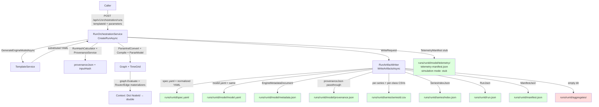

# Storage & artifacts

How a run materialises on disk, what schemas the writers actually produce, and how the artifacts can be discovered and reused.

## Run artifact bundle

The canonical "this is what a run produced" bundle is written by `RunArtifactWriter.WriteArtifactsAsync` in `src/FlowTime.Core/Artifacts/RunArtifactWriter.cs:98`. It is the **only** writer of the canonical run shape — every entry point (Engine `/v1/run`, Sim simulation, Sim telemetry, CLI) routes through it. `TelemetryBundleBuilder.BuildAsync` (`src/FlowTime.TimeMachine/TelemetryBundleBuilder.cs:29`) wraps it with telemetry-specific pre/post steps but still delegates the artifact writing.

### What it produces

For a run id `<runId>` under output root `<root>`, the writer creates this tree:

```
<root>/<runId>/
├── spec.yaml                          # the model YAML, normalized (line ending normalized; semantics fields normalized to series ids)
├── run.json                           # the run summary (RunJson DTO)
├── manifest.json                      # canonical manifest (ManifestJson DTO)
├── model/
│   ├── model.yaml                     # same as spec.yaml — duplicate canonical copy
│   ├── metadata.json                  # engine-side metadata (template + provenance summary, telemetry source detection)
│   ├── provenance.json                # (only if ProvenanceJson supplied) full provenance metadata
│   └── telemetry/                     # (only on telemetry-mode runs)
│       ├── telemetry-manifest.json    # CaptureManifestWriter output
│       └── <files copied from captureDir>
├── series/
│   ├── index.json                     # SeriesIndexJson — series metadata + format pointers
│   ├── <seriesId>.csv                 # per series; one CSV per node × class
│   └── ...
└── aggregates/
    └── (created empty; populated only by POST /v1/runs/{id}/export)
    └── export.csv                     # only after explicit export — see below
    └── export.ndjson
    └── export.parquet
```

### `spec.yaml` and `model/model.yaml`

The same content is written twice (`RunArtifactWriter.cs:149-151`):

```csharp
await File.WriteAllTextAsync(Path.Combine(runDir, "spec.yaml"), normalizedSpecText, Encoding.UTF8);
var canonicalModelPath = Path.Combine(modelDir, "model.yaml");
await File.WriteAllTextAsync(canonicalModelPath, normalizedSpecText, Encoding.UTF8);
```

`normalizedSpecText` is the request's `SpecText` after `NormalizeTopologySemantics` (line 130, definition at 918). The normalizer rewrites topology semantics fields (e.g. `arrivals: served_north`) into the canonical series id form (e.g. `arrivals: served_north@SERVED_NORTH@DEFAULT`) so downstream readers don't have to reconstruct the mapping. If parsing the spec as YAML fails, it falls through unchanged.

> **Drift note (history):** `spec.yaml` predates `model/model.yaml` and remains for backward compatibility with adapters that read at the run-root level. Both files are byte-identical at write time.

### `run.json` (canonical schema: `docs/schemas/run.schema.json`)

Built from `RunJson` at `RunArtifactWriter.cs:317-340`, then `RunSeriesEntry` (line 1247) lists each series. Shape produced:

```json
{
  "schemaVersion": 1,
  "runId": "run_deterministic_a1b2c3d4" | "run_<templateSlug>_<inputHash>" | "run_<UTCtimestamp>_<rand8>",
  "engineVersion": "0.1.0",
  "source": "engine",
  "inputHash": "sha256:..." | null,
  "grid": { "bins": 288, "binSize": 5, "binUnit": "minutes", "timezone": "UTC", "align": "left" },
  "modelHash": "sha256:...",
  "scenarioHash": "sha256:...",
  "createdUtc": "2026-05-06T12:34:56.789Z",
  "classCoverage": "full" | "partial" | "missing",
  "warnings": [ { "code", "message", "nodeId", "bins", "value", "severity", "edgeIds" }, ... ],
  "series": [ { "id", "path", "unit" }, ... ],
  "classes": [ { "id", "displayName", "description" }, ... ]
}
```

> **Drift:** `docs/schemas/run.schema.json` declares `additionalProperties: false` and lists only `schemaVersion, runId, engineVersion, source, grid, scenarioHash, createdUtc, series, warnings`. The writer emits `inputHash`, `modelHash`, `classCoverage`, and `classes` in addition (see `RunJson` definition at `RunArtifactWriter.cs:1218-1233`). The run.json that actually lands on disk **does not validate** against the published schema. The schema is older than the writer.

### `manifest.json` (canonical schema: `docs/schemas/manifest.schema.json`)

Built from `ManifestJson` at `RunArtifactWriter.cs:1248-1262`, written at `RunArtifactWriter.cs:404`:

```json
{
  "schemaVersion": 1,
  "scenarioHash": "sha256:...",
  "modelHash": "sha256:...",
  "rng": { "kind": "pcg32", "seed": 123 },
  "seriesHashes": { "<seriesId>": "sha256:..." },
  "eventCount": 0,
  "createdUtc": "...",
  "provenance": { "hasProvenance": true, "modelId": "model_...", "templateId": "...", "inputHash": "sha256:..." }?,
  "classes": [ { "id", "displayName", "description" }, ... ]
}
```

The schema declares `additionalProperties: false` and does **not** define `classes` as a top-level key. Same drift as run.json — the writer emits `classes` (line 401) and the schema has no slot for it. The schema's `provenance` block lacks `source` and `hasProvenance`.

`eventCount` is hard-coded to 0 (`RunArtifactWriter.cs:398`). It exists in the schema but is unused by the engine — events came from earlier streaming designs.

### `model/metadata.json`

Built from `EngineMetadataDocument` (`RunArtifactWriter.cs:76-94`), written by `WriteMetadataAsync` (line 881-916). No published schema. Content:

```json
{
  "schemaVersion": 1,
  "templateId": "transportation-basic" | "adhoc-model",
  "templateTitle": "Transportation Network with Hub Queue",
  "templateNarrative": "...",
  "templateVersion": "3.0.1",
  "mode": "simulation" | "telemetry",
  "modelHash": "sha256:...",
  "source": "flowtime-sim" | null,
  "generator": "flowtime-sim/1.0.0" | null,
  "modelId": "model_<timestamp>_<hash8>" | null,
  "generatedAtUtc": "...",
  "receivedAtUtc": "...",
  "parameters": { "splitAirport": 0.4, ... },
  "hasTelemetrySources": false,
  "telemetrySources": [ "file://..." ],
  "nodeSources": { "<nodeId>": "file://..." }
}
```

`telemetrySources` and `nodeSources` are populated by `TelemetrySourceMetadataExtractor.Extract(normalizedSpecText)` (line 154) which scans the wire YAML for `nodes[].source` URIs. This is how the engine reconstructs telemetry-source identity now that `NodeDto.Source` was dropped from the DTO surface (`SimModelBuilder.cs:18-22`).

### `model/provenance.json`

Written only when `ProvenanceJson` was supplied on the `WriteRequest` (`RunArtifactWriter.cs:158-161`). Content is the JSON-serialised `ProvenanceMetadata` (see `src/FlowTime.Sim.Core/Models/ProvenanceMetadata.cs`):

```json
{
  "source": "flowtime-sim",
  "modelId": "model_20260506T123456Z_abc12345",
  "templateId": "transportation-basic",
  "templateVersion": "3.0.1",
  "templateTitle": "Transportation Network with Hub Queue",
  "mode": "telemetry",
  "parameters": { ... },
  "inputHash": "sha256:...",
  "rng": { "kind": "pcg32", "seed": 20250327 },
  "telemetryBindings": { "telemetryDemandNorthSource": "north.csv" },
  "generatedAt": "2026-05-06T12:34:56.789Z",
  "generator": "flowtime-sim/1.0.0",
  "schemaVersion": "1"
}
```

The orchestrator builds this via `ProvenanceService.CreateProvenance` (`src/FlowTime.Sim.Core/Services/ProvenanceService.cs:19`), serialises it, and passes the JSON string through `RunOrchestrationRequest` → `RunInputContext.ProvenanceJson` → `RunArtifactWriter.WriteRequest.ProvenanceJson`.

### `series/index.json` (canonical schema: `docs/schemas/series-index.schema.json`)

Built from `SeriesIndexJson` (`RunArtifactWriter.cs:1283`), written at line 366:

```json
{
  "schemaVersion": 1,
  "grid": { "bins": 288, "binSize": 5, "binUnit": "minutes", "timezone": "UTC" },
  "series": [
    { "id": "served_north@SERVED_NORTH@DEFAULT",
      "kind": "flow",
      "path": "series/served_north@SERVED_NORTH@DEFAULT.csv",
      "unit": "entities/bin",
      "componentId": "SERVED_NORTH",
      "class": "DEFAULT",
      "classKind": "fallback",
      "points": 288,
      "hash": "sha256:..." },
    ...
  ],
  "classes": [ { "id", "displayName", "description" }, ... ],
  "classCoverage": "full" | "partial" | "missing",
  "formats": {
    "aggregatesTable": {
      "path": "aggregates/node_time_bin.parquet",
      "dimensions": ["time_bin", "component_id", "class"],
      "measures": ["arrivals", "served", "errors"]
    }
  }
}
```

> **Drift:** The schema requires every entry to have exactly `id, kind, path, unit, points, hash` and forbids additional properties. The writer emits `componentId`, `class`, `classKind` on every series entry (`SeriesMeta` at line 1285). Top-level `classes` and `classCoverage` are also writer-only fields not present in the schema. The schema's `kind` enum is `["flow", "state", "derived"]` but the writer emits `"flow"` and `"edge"` (the latter for edge-flow series, line 287).

> **Drift:** `formats.aggregatesTable.path` always points to `aggregates/node_time_bin.parquet`, but the engine never writes that file. The aggregates Parquet that does get written is `aggregates/export.parquet`, and only when `POST /v1/runs/{id}/export` is invoked (`src/FlowTime.API/Program.cs:1308-1310`). The path in the index is aspirational.

### `series/<seriesId>.csv`

Each series is written as a two-column CSV via `WriteSeriesCsvAsync` (`RunArtifactWriter.cs:1130`):

```
bin_index,value
0,123.4
1,134.5
...
```

Series id format is `<measure>@<componentId>@<classId>` (or `<edgeKey>@<componentId>@<classId>` for edge series). `componentId` is the upper-cased measure (`CreateSeriesDescriptor`, line 544-553). `classId` is `DEFAULT` unless multi-class data is present, in which case the per-class CSV is written alongside the DEFAULT one (line 244-263). `HasFiniteValues` (line 1144) skips classes whose values are all NaN.

Newlines are forced to `\n` (line 1133).

### `model/telemetry/<files>` (telemetry-mode only)

Telemetry runs additionally:

1. Copy the per-node CSVs declared in `<captureDir>/manifest.json` into `<runDir>/model/telemetry/` (`TelemetryBundleBuilder.CopyTelemetryFilesAsync`, line 108).
2. Write `<runDir>/model/telemetry/telemetry-manifest.json` via `CaptureManifestWriter.WriteAsync` (line 109). The format follows `docs/schemas/telemetry-manifest.schema.json` (schema version 2). For simulation-mode runs, `RunOrchestrationService.WriteSimulationTelemetryManifestAsync` (line 919-923) writes a stub manifest with no files but the correct grid and any run-time warnings.

## Schemas (and their writers)

| Schema | Path | Producer | Drift status |
|---|---|---|---|
| Template | `docs/schemas/template.schema.json` | Read by `TemplateSchemaValidator.Validate` (`src/FlowTime.Sim.Core/Templates/TemplateSchemaValidator.cs`); not "produced" — it's the input contract | Schema covers parameter types `boolean` and node kind `router` that are exercised lightly; otherwise current. |
| Engine model | `docs/schemas/model.schema.yaml` | Read by `ModelSchemaValidator.Validate` (Engine side) | Out of scope for this document; documented at the engine side. |
| `run.json` | `docs/schemas/run.schema.json` | `RunArtifactWriter.cs:317-340` | **Drift**: writer emits `inputHash, modelHash, classCoverage, classes`; schema has `additionalProperties: false` and no slots. |
| `manifest.json` | `docs/schemas/manifest.schema.json` | `RunArtifactWriter.cs:391-402` | **Drift**: writer emits `classes`; schema has `additionalProperties: false` and no slot. |
| `series/index.json` | `docs/schemas/series-index.schema.json` | `RunArtifactWriter.cs:342-364` | **Drift**: writer emits `componentId/class/classKind` per series, top-level `classes/classCoverage`, and `kind: "edge"` (not in enum). |
| `model/telemetry/telemetry-manifest.json` | `docs/schemas/telemetry-manifest.schema.json` | `CaptureManifestWriter.WriteAsync` (`src/FlowTime.TimeMachine/Artifacts/CaptureManifestWriter.cs`) — invoked by `TelemetryBundleBuilder` and `RunOrchestrationService` | Schema declares `schemaVersion: 2`, requires `supportsClassMetrics`. The writer emits all required fields. |
| `time-travel-state.schema.json` | `docs/schemas/time-travel-state.schema.json` | Read by `RunCreateResponse` (state output of orchestrator) — wire shape only | Used as response schema, not written to disk. |
| `model/metadata.json` | (no published schema) | `RunArtifactWriter.WriteMetadataAsync` (line 881) | No schema. The shape is whatever `EngineMetadataDocument` (line 76) currently emits. |
| `model/provenance.json` | (no published schema; mirrors `ProvenanceMetadata`) | Pass-through of caller's `ProvenanceJson` | Authoring contract is the C# `ProvenanceMetadata` type. |

## Storage layout

### Roots

| Root | Default | Override | Used by |
|---|---|---|---|
| Engine API data root | `<solutionRoot>/data` (via `DirectoryProvider.GetDefaultDataDirectory`) | `FLOWTIME_DATA_DIR` env, then `ArtifactsDirectory` config | `src/FlowTime.API/Program.cs:1330` (`GetArtifactsDirectory`) and `Program.ServiceHelpers.DataRoot/RunsRoot` (line 1376, 1419) |
| Sim Service data root | `./data` (relative to CWD) | `FLOWTIME_SIM_DATA_DIR` env, then `FlowTimeSim:DataDir` config | `src/FlowTime.Sim.Service/Program.cs:1740` |
| Sim Service templates root | `<cwd>/../../templates` | `FLOWTIME_SIM_TEMPLATES_DIR` env, then `FlowTimeSim:TemplatesDir` config | `Program.cs:1775` |
| Sim Service draft templates root | `<cwd>/../../templates-draft` | `FLOWTIME_SIM_DRAFT_TEMPLATES_DIR`, then `FlowTimeSim:DraftTemplatesDir` | `Program.cs:1812` |
| Sim Service models root (generated) | `<simDataRoot>/models` | (no override) | `Program.cs:1842` |
| Sim Service series root | `<simDataRoot>/series` | (no override) | `Program.cs:1850` |
| Telemetry capture root | `<solutionRoot>/examples/time-travel` | `TelemetryRoot` config | `RunOrchestrationService.cs:62-86`; `Program.ServiceHelpers.TelemetryRoot` for Engine API |

The Engine API and Sim Service typically point at the **same** `<solutionRoot>/data/runs/` when both run with default settings, because the Sim Service writes `runs` under its data root (`Path.Combine(ServiceHelpers.DataRoot(config), "runs")` at `RunOrchestrationEndpointExtensions.cs:45`) and the Engine API reads `RunsRoot = DataRoot` (line 1419). This is how the Engine API's `GET /v1/runs` listing can see runs the Sim service produced.

### Run id formats

`RunArtifactWriter.WriteArtifactsAsync` constructs the run id at line 133:

```csharp
var runId = request.DeterministicRunId
    ? BuildDeterministicRunId(request, scenarioHash)
    : $"run_{DateTime.UtcNow:yyyyMMddTHHmmssZ}_{Guid.NewGuid().ToString("N")[..8]}";
```

Three id shapes coexist:

1. **Deterministic with template+inputHash:** `run_<sanitized-templateId>_<inputHashHex>` via `DeterministicRunNaming.BuildRunId` (`src/FlowTime.Core/Artifacts/DeterministicRunNaming.cs:8`). Example: `run_transportation-basic_a1b2c3d4...`. Used when both `request.TemplateId` and `request.InputHash` are present (i.e. orchestrator-driven runs with `deterministicRunId: true`).
2. **Deterministic without template:** `run_deterministic_<scenarioHash[7..15]>` (`RunArtifactWriter.cs:1213`). Used when only `DeterministicRunId` is set but no `TemplateId`/`InputHash` (e.g. `flowtime run model.yaml --deterministic-run-id`).
3. **Non-deterministic:** `run_<UTCtimestamp>_<8 random hex chars>`. Default for `flowtime run` and the engine `/v1/run` endpoint.

The Sim orchestrator additionally wraps with `RunInputContext.DeterministicRunId` computed via `DeterministicRunNaming.BuildRunId(templateId, inputHash)` at `RunOrchestrationService.cs:370` — the same algorithm used inside `BuildDeterministicRunId`.

### Discovery

There's no real-time index. Discovery happens through:

- **`GET /v1/runs`** (`src/FlowTime.API/Endpoints/RunOrchestrationEndpoints.cs:14`) — enumerates `<runsRoot>` directories, calls `RunOrchestrationService.TryLoadRunAsync` on each (`RunOrchestrationService.cs:167`), collects `RunSummary` entries. Filters by `mode`, `templateId`, `hasWarnings`. Pagination via `page`/`pageSize`.
- **`GET /v1/runs/{runId}`** — same loader, single run.
- **`GET /v1/artifacts`** (`src/FlowTime.API/Program.cs:230`) — broader artifact registry with full-text search, tag filters, provenance filters (`templateId`, `modelId`). Backed by `IArtifactRegistry`/`FileSystemArtifactRegistry` which maintains its own `index.json` outside the run directories.
- **`POST /v1/artifacts/index`** — rebuilds the registry's index by scanning the run root.
- The Sim service has **no** corresponding listing endpoint. Sim's `GET /api/v1/templates` lists templates; runs come back via the Engine API.

The `flowtime artifacts list` CLI command (`src/FlowTime.Cli/Program.cs:170`) builds a fresh `FileSystemArtifactRegistry`, rebuilds its index, and prints a table with provenance filters (`--template-id`, `--model-id`).

## Series storage formats

### Per-series CSV (always)

Every series is written as a two-column CSV (`bin_index,value`) under `<runDir>/series/`. This is the primary on-disk format. There is no Parquet, NDJSON, or JSON for individual series at write time.

### Aggregate exports (only on demand)

`POST /v1/runs/{runId}/export` (`src/FlowTime.API/Program.cs:1183`) and the corresponding `GET /v1/runs/{runId}/export/{format}` (line 1219) materialise aggregate forms into `<runDir>/aggregates/`:

- `aggregates/export.csv` via `AggregatesCsvExporter`
- `aggregates/export.ndjson` via `NdjsonExporter`
- `aggregates/export.parquet` via `ParquetExporter` (`src/FlowTime.API/Services/ParquetExporter.cs:14`)

The `ParquetExporter` uses `Parquet.Net` 5.4.0 (`src/FlowTime.API/FlowTime.API.csproj:33`) and schema-projects the run's series into rows of `(time_bin, component_id, class, measure, value)`. None of these export files are written by `RunArtifactWriter` itself — the directory is created empty (`RunArtifactWriter.cs:140, 145`) and stays empty until the export endpoint runs.

> **Drift:** `series/index.json` always declares `formats.aggregatesTable.path: "aggregates/node_time_bin.parquet"` even though the actual exported file is named `aggregates/export.parquet`. The declared filename is a stub.

### Telemetry-source CSVs

For telemetry-mode runs, the telemetry source CSVs (e.g. `north.csv`) are copied verbatim from `<captureDir>` to `<runDir>/model/telemetry/`. These are the inputs (per-bin counts), not the artifact series — the artifact series live under `<runDir>/series/` and reflect the model's interpretation of the telemetry through the topology.

## Provenance metadata

### What's captured

`ProvenanceMetadata` (`src/FlowTime.Sim.Core/Models/ProvenanceMetadata.cs:7`) carries:

- `source: "flowtime-sim"`
- `modelId`: `model_<UTCtimestamp>_<8-hex>` from `ProvenanceService.FormatModelId` (line 96-100)
- `templateId` / `templateVersion` / `templateTitle` (snapshot at run time)
- `mode`
- `parameters`: a snapshot of merged template defaults + caller overrides
- `inputHash`: the deterministic SHA-256 over `{ templateId, templateVersion, mode, parameters, telemetryBindings, rng }` computed by `RunHashCalculator.ComputeHash` (`src/FlowTime.Sim.Core/Hashing/RunHashCalculator.cs:25`)
- `rng`: `{ kind, seed }`
- `telemetryBindings`: the original per-parameter telemetry bindings (param-name → relative file path)
- `generatedAt` (ISO 8601 UTC)
- `generator: "flowtime-sim/<version>"`
- `schemaVersion: "1"`

### Where it's attached

The Sim orchestrator constructs provenance once per run inside `BuildRunInputContext` (`RunOrchestrationService.cs:347-400`) and passes it to `RunArtifactWriter` as `ProvenanceJson`. The writer:

1. Writes the full JSON to `model/provenance.json` (line 158-161).
2. Extracts a few fields into `ProvenanceRef` for `manifest.json`'s `provenance` slot (line 374-389): `hasProvenance`, `modelId`, `templateId`, `inputHash`.
3. Embeds the same fields into `model/metadata.json` via `ExtractMetadataContext` + `WriteMetadataAsync` (line 153, 156).

For Engine `POST /v1/run` (no template), provenance is optional. `ProvenanceService.ExtractProvenance` (`src/FlowTime.API/Services/ProvenanceService.cs:27`) tries the `X-Model-Provenance` HTTP header first, then any embedded `provenance:` block in the YAML. If both are present, the header wins (line 108-115). If neither is present, no provenance.json is written.

### Hash content

Two distinct hashes coexist on disk:

| Hash | Content | Computed by | Used for |
|---|---|---|---|
| `inputHash` (in provenance + manifest + run.json) | Sorted JSON canonicalization of `{templateId, templateVersion, mode, parameters, telemetryBindings, rng}` (`RunHashCalculator.cs:25-53`) | `RunHashCalculator.ComputeHash` | Deterministic run-id derivation; replay/reuse detection |
| `scenarioHash` (in run.json + manifest) | SHA-256 of `<normalizedSpec>\n<seed | "null">\n<startTimeBias | "null">` (`RunArtifactWriter.cs:1122-1128`) | `ComputeScenarioHash` | Engine-side scenario identity (independent of template provenance) |
| `modelHash` (in run.json + manifest + metadata) | SHA-256 of `model/model.yaml` file contents (`RunArtifactWriter.cs:155, 416-421`) | `ComputeFileHashAsync` | Model-content identity |
| `seriesHashes[id]` (in manifest) | SHA-256 of each per-series CSV file | `ComputeFileHashAsync` | Series-content integrity |
| `modelId` (in provenance) | `ProvenanceService.ComputeDeterministicHash` over `templateId + sorted-parameters JSON`, first 8 hex chars (`ProvenanceService.cs:66-89`) | `ProvenanceService` | Human-readable handle (`model_<ts>_<8hex>`) |
| `ModelDto.provenance.modelId` (in resolved YAML) | SHA-256 of the **substituted YAML** (lower-hex, full 64 chars) (`SimModelBuilder.cs:444-450`) | `SimModelBuilder.ComputeModelId` | YAML-content identity |

Note that `ModelDto.provenance.modelId` (Sim-builder side) and `ProvenanceMetadata.modelId` (orchestrator side) are **different values**. The builder hashes the post-substitution YAML; the orchestrator's `ProvenanceService` hashes templateId+parameters and prepends a timestamp. Both end up on disk in different files. This is a deliberate split per `m-E24-02` (the "wire-shape `modelId`" lives inside the YAML; the "human-friendly `modelId`" lives in `provenance.json`/`metadata.json`).

## Determinism guarantees

Given the same `(templateId, templateVersion, mode, parameters, telemetryBindings, rng.kind, rng.seed)`:

- `RunHashCalculator.ComputeHash` is deterministic (sorted-keys canonical JSON). ✅
- `DeterministicRunNaming.BuildRunId` returns the same run id. ✅
- `SimModelBuilder.ComputeModelId` over the substituted YAML returns the same hash if YAML emission is byte-stable.
- YAML emission **almost** byte-stable: the YamlDotNet serializer with the configured event emitters is deterministic, but `BuildProvenance` injects `DateTimeOffset.UtcNow.ToString("o")` for `generatedAt` (`SimModelBuilder.cs:392`) and the orchestrator's `ProvenanceService` injects another `DateTime.UtcNow` (`ProvenanceService.cs:32`). Those timestamps land in `provenance.json`/`metadata.json`/`run.json`'s `createdUtc`/`receivedAtUtc` fields — but **not** inside the substituted YAML proper unless `template.Provenance` was pre-set.

Wait — look closer: `SimModelBuilder.BuildProvenance` does set `GeneratedAt = template.Provenance?.GeneratedAt ?? now` (line 420). The provenance block is part of the resolved YAML. So `modelId` (sha256 of substituted YAML) **does** vary across runs because the YAML contains a fresh timestamp.

The result: `inputHash` is reproducible, but the on-disk `modelId` (`ModelDto.provenance.modelId`) is **not** reproducible across two runs of the same input. The orchestrator does **not** use `ModelDto.provenance.modelId` for run-id determinism — it uses `inputHash`. So the run id stays stable; only the YAML's embedded `modelId` drifts.

Other non-determinism vectors:

- `RunArtifactWriter` writes `createdUtc` / `receivedAtUtc` as `DateTime.UtcNow.ToString("o")` in `run.json` and `metadata.json`. These are non-reproducible.
- Series CSVs have no timestamps and are byte-deterministic given the same evaluation context.
- `seriesHashes` in manifest.json are byte-deterministic when CSVs are.
- `manifest.json.createdUtc` is non-reproducible.
- `RngSeed` defaults to `123` (`RunArtifactWriter.cs:25`, `RunOrchestrationService.cs:42`) when not provided. Two runs with no explicit seed will share the same seed.

## Caching and reuse

| Cache / reuse mechanism | Where | Behaviour |
|---|---|---|
| `TemplateService.templateCache` | `src/FlowTime.Sim.Core/Services/TemplateService.cs:22` | In-memory; first request loads all `*.yaml` files from `templatesRoot`. Held under `cacheLock`. Refreshed only on `POST /api/v1/templates/refresh` (Sim) or `POST /v1/templates/refresh` (Engine). |
| `TemplateWarningRegistry` | `src/FlowTime.Sim.Service/Services/TemplateWarningRegistry.cs` | In-memory; per-template invariant warning list populated at service start. |
| Deterministic run reuse | `RunOrchestrationService.TryReuseExistingRunAsync` (`RunOrchestrationService.cs:323`) | When a deterministic-run-id directory already exists and `overwriteExisting` is false, the orchestrator loads the existing artifact via `TryLoadRunAsync` and returns it with `WasReused = true`. This is content-addressed reuse keyed on `inputHash`. |
| `IArtifactRegistry` (`FileSystemArtifactRegistry`) | Engine API singleton (`src/FlowTime.API/Program.cs:85-86`). Persists at `<dataRoot>/artifacts/index.json`. | After every `POST /v1/run` writes a run, a fire-and-forget task scans the new directory and updates the registry index (line 712-728). `POST /v1/artifacts/index` rebuilds it from scratch. The CLI's `flowtime artifacts list` builds a fresh registry per invocation (no shared state). |
| Series storage (Sim) | `src/FlowTime.Sim.Service/Services/SeriesStorage.cs` (file-system, one `series.json` per `seriesId`) | Persistent on disk; not an in-memory cache. Used by `/api/v1/series/ingest` and `/api/v1/series/summarize`. |
| Engine session bridge | `EngineSessionBridge` singleton (`src/FlowTime.API/Services/EngineSessionBridge.cs`) | Long-lived; spawns a child engine subprocess per WebSocket. Not a cache, but a long-lived handoff state. |

There is no run-id-keyed series cache or run-result cache outside the file system. Two simultaneous identical runs would race against the same deterministic directory.

## Storage flowchart for a single Sim simulation run



Telemetry-mode runs differ in two ways:
1. After `RunArtifactWriter` writes, `TelemetryBundleBuilder.CopyTelemetryFilesAsync` copies CSVs from `<captureDir>` into `<runDir>/model/telemetry/`.
2. `TelemetryBundleBuilder.WriteTelemetryManifestAsync` writes a populated `telemetry-manifest.json` (not a stub) listing each copied file with metric kind, hash, and class id.
