## `FlowTime.Adapters.Synthetic` survey

Despite the name, this project is **not** a synthetic-data generator. It is the canonical run-artifact reader that maps the on-disk run directory layout (`run.json`, `manifest.json`, `series/index.json`, `series/*.csv`) into typed C# DTOs. The historical name comes from when it was used to expose Sim-generated ("synthetic") artifacts to the engine; today it is the shared surface used by both Sim and Engine to read any run directory.

Project location: `src/FlowTime.Adapters.Synthetic/` (`net9.0`, references only `FlowTime.Core`; `FlowTime.Adapters.Synthetic.csproj:1-13`).

Public surface:

- `ISeriesReader` — five async/sync methods (`src/FlowTime.Adapters.Synthetic/ISeriesReader.cs:8-34`):
  - `ReadRunInfoAsync(runPath)` → `RunManifest` (run.json)
  - `ReadManifestAsync(runPath)` → `DeterministicManifest` (manifest.json with hashes)
  - `ReadIndexAsync(runPath)` → `SeriesIndex` (series/index.json)
  - `ReadSeriesAsync(runPath, seriesId)` → `Series` (CSV)
  - `SeriesExists(runPath, seriesId)` → bool
- `FileSeriesReader` — the only production implementation, parses JSON with `System.Text.Json` and CSVs line-by-line under `InvariantCulture` (`src/FlowTime.Adapters.Synthetic/FileSeriesReader.cs:13`).
- `RunArtifactAdapter` — caching facade over `ISeriesReader` exposing convenience methods like `GetComponentSeriesAsync(componentId)` and `ValidateAsync()` (cross-checks grid bins between `run.json` and `series/index.json`, verifies series file lengths) (`src/FlowTime.Adapters.Synthetic/RunArtifactAdapter.cs:10`, `:96-165`).
- DTOs: `RunManifest`, `RunWarning`, `DeterministicManifest`, `RngInfo`, `SeriesReference`, `TimeGrid`, `ManifestClassEntry`, `SeriesIndex`, `SeriesMetadata` (`src/FlowTime.Adapters.Synthetic/RunManifest.cs:6-97`, `SeriesIndex.cs:6-29`).

Callers (verified by grep):

- `FlowTime.API`: every artifact-export endpoint and reader (`Program.cs:1070`, `1078`, `1125`, `1140`, `Services/MetricsService.cs:54`, `Services/ParquetExporter.cs:51-52`, `Services/StateQueryService.cs:298-299`, `Services/NdjsonExporter.cs:50-51`, `Services/AggregatesCsvExporter.cs:53-54`).
- `FlowTime.TimeMachine`: `Capture/RunArtifactReader.cs:28,44`, `Telemetry/CanonicalBundleSource.cs:43`.
- Tests: `tests/FlowTime.Adapters.Synthetic.Tests/`, `tests/FlowTime.Integration.Tests/RustSinkIntegrationTests.cs`.

What it solves: provides one place to parse the canonical run-artifact layout. There is no "synthesizing" of telemetry here — the actual fake-data generation lives in `FlowTime.Sim.Core` (templates, RNG, PMF) and the actual telemetry capture from a run lives in `FlowTime.TimeMachine.TelemetryCapture`.

> **Drift:** the project name suggests it produces synthetic data; in practice it reads any run directory regardless of source. Renaming candidate.

## Telemetry ingestion surface

Telemetry, in this codebase, has **three** concrete surfaces — and they do not yet form a complete ingest-from-the-outside pipeline:

### 1. Telemetry capture (run → bundle)

`FlowTime.TimeMachine.TelemetryCapture` reads an existing FlowTime/Sim run directory and emits a "telemetry bundle" — a directory of CSVs plus a `manifest.json` per `docs/schemas/telemetry-manifest.schema.json`:

- Entry point: `TelemetryCapture.ExecuteAsync(TelemetryCaptureOptions, ct)` (`src/FlowTime.TimeMachine/TelemetryCapture.cs:35`).
- Reads the run via `Capture/RunArtifactReader.cs:31` (which uses `FileSeriesReader` + `RunArtifactAdapter`).
- Emits per-binding CSVs `{node}_{metric}[ _{class}].csv` with header `bin_index,classId,value` (`TelemetryCapture.cs:303`).
- Writes `manifest.json` matching the published schema, with grid, files, hashes, classes, coverage, and provenance (`TelemetryCapture.cs:167-186`).
- Optional `GapInjector` introduces NaN gaps for testing replay tolerance (`Processing/GapInjector.cs`, options at `Processing/GapInjectorOptions.cs`).
- HTTP endpoint: `POST /v1/telemetry/captures` via `TelemetryCaptureEndpoints.cs:15`. Request shape `TelemetryCaptureRequest { Source { Type: "run", RunId }, Output { CaptureKey, Directory, Overwrite } }`. Response is `TelemetryCaptureSummary` with classes/coverage/warnings.
- CLI: `flowtime telemetry capture` (mentioned in `docs/architecture/time-machine-analysis-modes.md`; in code `flowtime telemetry run` exists, see `src/FlowTime.Cli/Commands/TelemetryRunCommand.cs:31`).

### 2. Telemetry-mode runs (bundle → run)

`FlowTime.TimeMachine.TelemetryBundleBuilder` consumes a capture directory plus a model YAML and writes a canonical run that *uses* the captured CSVs as input:

- Entry point: `TelemetryBundleBuilder.BuildAsync(TelemetryBundleOptions, ct)` (`src/FlowTime.TimeMachine/TelemetryBundleBuilder.cs:29`).
- Reads `manifest.json` from the capture dir (`TelemetryBundleBuilder.cs:158-172`).
- Rewrites `file://` URIs in the model so the YAML semantics fields point at the bundle's CSVs (`NormalizeTelemetrySources`, `RewriteTelemetrySemanticsToSources`, `TelemetryBundleBuilder.cs:174-189`, `:297-424`).
- Loads CSVs into `Dictionary<NodeId, double[]>` aligned to the model's grid bins (`LoadTelemetrySeriesAsync`, `:195-267`).
- Calls `RunArtifactWriter.WriteArtifactsAsync` to emit the canonical run directory; copies CSVs into `model/telemetry/`; writes `model/telemetry/telemetry-manifest.json` (`:69-109`).
- Validates per-class conservation against totals (`ValidateClassSeries`, `:705-802`).

This is composed into the request flow by `RunOrchestrationService` (`src/FlowTime.TimeMachine/Orchestration/RunOrchestrationService.cs:45,53` — takes `TelemetryBundleBuilder` as a dependency). The orchestration request carries `Mode = "telemetry"`, `CaptureDirectory`, and `TelemetryBindings`. Endpoints are surfaced in `RunOrchestrationEndpoints.cs:14-15` (`GET /v1/runs`, `GET /v1/runs/{runId}`); the actual *create-run* path is the same `POST /v1/run` used for simulation runs (`Program.cs:620`), which dispatches by mode.

### 3. `ITelemetrySource` / `TelemetryData` (snapshot input)

A separate, narrower abstraction lives in `FlowTime.TimeMachine.Telemetry`:

- `ITelemetrySource.ReadAsync()` returns a deterministic `TelemetryData` snapshot (`src/FlowTime.TimeMachine/Telemetry/ITelemetrySource.cs:17-23`).
- `TelemetryData` carries `TimeGrid Grid`, `IReadOnlyDictionary<string, double[]> Series` keyed by node ID (per-class series use `nodeId@classId`), and optional `TelemetryProvenance` (`src/FlowTime.TimeMachine/Telemetry/TelemetryData.cs:10-27`).
- Implementations: `CanonicalBundleSource` (reads a bundle directory via `FileSeriesReader`, `Telemetry/CanonicalBundleSource.cs:25`) and `FileCsvSource` (a single named `t,value` CSV bound to a `seriesId` and `TimeGrid`, `Telemetry/FileCsvSource.cs:23`).
- The interface has no `ITelemetrySink` partner — that is explicitly deferred per `D-2026-04-07-020`, noted at `ITelemetrySource.cs:14-15`.

This source abstraction has **no production caller in `src/`** today (verified by `grep -rn "ITelemetrySource"` outside its own folder and its tests). It is wired only in `tests/FlowTime.TimeMachine.Tests/`. The source contract was built ahead of time for the future Fit/replay path but is not yet plumbed into runs.

### Schemas

- `docs/schemas/telemetry-manifest.schema.json` — canonical capture-bundle manifest. Schema version 2, requires `schemaVersion`, `grid`, `files`, `provenance`, `supportsClassMetrics`. `metric` enum: `Arrivals | Served | Errors | ExternalDemand | QueueDepth | Capacity` (lines `docs/schemas/telemetry-manifest.schema.json:72-79`).
- `docs/schemas/time-travel-state.schema.json` — separate, time-travel state snapshot schema (`/runs/{runId}/state` etc.).

### Originating epic — E-0015

`work/epics/E-0015-telemetry-ingestion-topology-inference-and-canonical-bundles/epic.md`, status `proposed`. Quoting the status note (line 7): "capture is shipped; ingestion pipeline is not". The epic spec is explicit (`epic.md:55-62`):

- Capture is shipped (`POST /v1/telemetry/captures`, `flowtime telemetry capture`).
- Bundle contract exists (`docs/schemas/telemetry-manifest.schema.json`).
- Gold schema is defined.
- **`TelemetryLoader` service is not implemented.**
- **Graph Builder does not exist.**
- **No external dataset has been ingested yet.**

E-0015 plans Bronze → Silver → Gold ingestion, topology inference, and external dataset paths (BPI Challenge 2012, PeMS, MTA, Alibaba) — none of which exist in code.

## Telemetry types and data shapes

Three coexisting data shapes are visible in the code:

| Shape | Where it lives | Bins/units |
|---|---|---|
| **Capture-bundle CSV** | `{captureDir}/*.csv`, `bin_index,classId,value` header (`TelemetryCapture.cs:303`) | One row per `(bin, class)`, NaN for gaps |
| **Canonical run-series CSV** | `{runDir}/series/{seriesId}.csv`, header `t,value` (`FileSeriesReader.cs:131-170`) | One row per `t`, parsed as `double[]` |
| **Snapshot `TelemetryData`** | In-memory `IReadOnlyDictionary<string, double[]>`; series IDs may include `@classId` suffix | Length must equal `TimeGrid.Bins` |

These three shapes are **not unified by a single contract type**. `TelemetryCapture` writes the bundle shape; `TelemetryBundleBuilder` reads it back to emit the canonical run shape; `CanonicalBundleSource` reads the canonical shape into `TelemetryData`; `FileCsvSource` reads a hand-written CSV into `TelemetryData`. The bundle CSV header (`bin_index,classId,value`) is distinct from the run CSV header (`t,value`).

Per-edge telemetry: not modeled. The capture surface is per-node, per-metric (`TelemetryMetricKind` enum: `Arrivals`, `Served`, `Errors`, `ExternalDemand`, `QueueDepth`, `Capacity` — `src/FlowTime.TimeMachine/Models/TelemetryMetricKind.cs`). Edge-flow series are produced by the Engine (C# `EdgeFlowMaterializer`; Rust `edge_map`) but are not first-class telemetry inputs.

How telemetry reaches engine evaluation: telemetry-mode runs go through `TelemetryBundleBuilder` which mutates the parsed `ModelDefinition` so that `kind: const` nodes carry the captured `Values` array (`TelemetryBundleBuilder.cs:240-244`). The engine then evaluates the model normally. There is no "live" telemetry feeder — every replay is a pre-baked array.

## Time-machine surface

`FlowTime.TimeMachine` is the bulk of the analysis-and-ingest layer. Subdirectories (line counts under `src/FlowTime.TimeMachine/`):

- `Validation/` — tiered model validation (used by `POST /v1/validate`):
  - `TimeMachineValidator.Validate(yaml, tier)` returning `ValidationResult` (`Validation/TimeMachineValidator.cs:25-39`).
  - Three tiers: `Schema` (parse + JSON schema), `Compile` (build the graph), `Analyse` (evaluate + run `TemplateInvariantAnalyzer`) (`Validation/ValidationTier.cs:8-26`, `Validation/TimeMachineValidator.cs:41-103`).
  - `ValidationResult`, `ValidationError`, `ValidationWarning` records (`Validation/ValidationResult.cs`).
- `Telemetry/` — `ITelemetrySource`, `TelemetryData`, `CanonicalBundleSource`, `FileCsvSource` (covered above).
- `Capture/` — `RunArtifactReader.cs` aggregates run artifacts and produces `RunCaptureContext` + `TelemetrySeriesBinding[]` for `TelemetryCapture`.
- `Artifacts/` — `CaptureManifestWriter.cs` writes the bundle manifest.
- `Models/` — `TelemetryCapturePlan`, `PlannedCaptureFile`, `TelemetryCaptureOptions`, `TelemetryMetricKind`, `CaptureWarning`.
- `Processing/` — `GapInjector.cs`, `GapInjectorOptions.cs`.
- `Orchestration/` — `RunOrchestrationService.cs` (the create-a-run brain), `RunOrchestrationContractMapper.cs`, `RunDirectoryUtilities.cs`, `RunOrchestrationModels.cs`.
- `Sweep/` — the analysis-modes layer:
  - `IModelEvaluator` seam (`Sweep/IModelEvaluator.cs:8-17`).
  - Two production evaluators: `RustModelEvaluator` (per-eval subprocess via `RustEngineRunner`, `Sweep/RustModelEvaluator.cs:9`) and `SessionModelEvaluator` (persistent subprocess + MessagePack framing, `Sweep/SessionModelEvaluator.cs:27-388`).
  - `SweepRunner` (1-D parameter sweep, `Sweep/SweepRunner.cs:7`).
  - `SensitivityRunner` (central-difference partial derivatives, `Sweep/SensitivityRunner.cs`).
  - `GoalSeeker` (binary search to a target metric, `Sweep/GoalSeeker.cs`).
  - `Optimizer` (Nelder-Mead simplex, multi-parameter, `Sweep/Optimizer.cs:7`).
  - YAML mutation utilities `ConstNodePatcher` and `ConstNodeReader`.
  - Strongly-typed specs and results: `SweepSpec`, `SensitivitySpec`, `GoalSeekSpec`, `OptimizeSpec`, `SearchRange`, `OptimizeObjective`, `SweepResult`, `SensitivityResult`, `GoalSeekResult`, `OptimizeResult`, `OptimizeTracePoint`, `GoalSeekTracePoint`.
- Top-level: `TelemetryBundleBuilder.cs` (covered above), `TelemetryGenerationService.cs` (orchestrates `TelemetryCapture` + writes `autocapture.json` + updates the in-run telemetry manifest, `TelemetryGenerationService.cs:40-158`), `TelemetryCapture.cs`, `TelemetryBundleOptions.cs`.

HTTP endpoints (each `MapPost`/`MapGet` under `src/FlowTime.API/Endpoints/`):

| Path | File | Notes |
|---|---|---|
| `POST /v1/validate` | `ValidationEndpoints.cs:12` | Always 200; errors/warnings in body |
| `POST /v1/telemetry/captures` | `TelemetryCaptureEndpoints.cs:15` | Run → capture bundle; 409 if exists and not overwrite |
| `POST /v1/sweep` | `SweepEndpoints.cs:12` | 503 when `RustEngine:Enabled=false` |
| `POST /v1/sensitivity` | `SensitivityEndpoints.cs:12` | 503 when Rust engine off |
| `POST /v1/goal-seek` | `GoalSeekEndpoints.cs:9` | 503 when Rust engine off |
| `POST /v1/optimize` | `OptimizeEndpoints.cs:9` | 503 when Rust engine off |
| `GET /v1/runs`, `GET /v1/runs/{id}` | `RunOrchestrationEndpoints.cs:14-15` | List/details |
| `GET /v1/engine/session/health` | `Program.cs:199` | Engine session bridge probe |

There is **no** `POST /v1/fit`, `POST /v1/chunked-eval`, or `/v1/time-machine/*` endpoint in the current code. Fit and chunked are E-0022 scope and `proposed`.

What is **currently implemented** in time-machine:
- Tiered validation (schema, compile, analyse).
- Telemetry capture from a completed run.
- Telemetry-mode runs (replay of captured bundles through the engine).
- Sweep, sensitivity, goal-seek, multi-parameter optimize (all gated on Rust engine).
- Two model-evaluator backends: per-eval `RustModelEvaluator` and session-based `SessionModelEvaluator` over MessagePack.

What is **planned** but not implemented:
- Model fit (`FitSpec`/`FitRunner`/`POST /v1/fit`) — E-0022 m-E22-01.
- Chunked evaluation (`POST /v1/chunked-eval`, Rust `chunk_step` session command) — E-0022 m-E22-02.
- `FlowTime.Pipeline` SDK wrapper — E-0022 m-E22-03.
- Direct-source telemetry adapters (Prometheus, OpenTelemetry, BPI logs) — explicitly out-of-scope per E-0022; expected to flow through E-0015 instead.

## What time machine wants to do

Per `work/epics/E-0022-time-machine-model-fit-chunked-evaluation/epic.md` (the design intent, not the code):

- **Model fit:** compose `ITelemetrySource` + `Optimizer` with a residual objective (RMSE / MAE) so the optimizer can find parameter values that best match an observed series. Hard-blocked on E-0015 (a dataset path) and the Telemetry Loop & Parity epic (drift bounds).
- **Chunked evaluation:** add a `chunk_step { bins: N }` command to the Rust engine session protocol. Caller drives chunks; between chunks, an external controller can patch parameters and continue. Enables feedback simulation with control loops outside the engine.
- **`FlowTime.Pipeline` SDK:** crystallize `Sweep`, `Sensitivity`, `GoalSeek`, `Optimize`, `Fit`, `ChunkedEvaluate` as a clean embeddable API. Existing API/CLI callers would migrate to the SDK.
- **Replay parity invariant:** "capture baseline → replay bundle = same outputs modulo measured drift" is owned by the unscheduled Telemetry Loop & Parity epic, not by E-0022 itself.

## Synthetic data and the Sim/Engine boundary

The line is fuzzy and crosses three projects:

- **`FlowTime.Sim.Core`** generates synthetic models by templating (`src/FlowTime.Sim.Core/Templates/Template.cs:340-391` — `TemplateMode { Simulation, Telemetry }`). It does *not* generate telemetry CSVs directly; it produces model YAMLs whose nodes hold synthetic value arrays computed from PMFs/RNG.
- **`FlowTime.TimeMachine.TelemetryCapture`** turns a *completed run* (synthetic or otherwise) into a capture bundle.
- **`FlowTime.TimeMachine.TelemetryBundleBuilder`** turns a capture bundle + a model into a *new* run that replays the bundle.

Shape mismatch:
- Sim produces a model with const-node values (no separate "telemetry" artifact).
- Capture produces bundle CSVs with header `bin_index,classId,value`.
- Engine consumes either form via `ModelDefinition` whose const-node `Values: double[]` arrays are pre-filled by the bundle-builder (`TelemetryBundleBuilder.cs:240-244`).

There is no single `ITelemetry` contract spanning Sim and Engine. The path "Sim simulates → capture → replay through Engine" is enabled by writing CSVs and having both sides agree on the canonical run-directory layout via `FlowTime.Adapters.Synthetic`.

> **Drift:** docs/flowtime.md:333 says "PMFs are interchangeable with telemetry — once compiled, a PMF-driven node produces the same type of time series as a telemetry-driven node." In code, this is true at the `ModelDefinition` level (both end up as `Values: double[]` on a const node) but only by virtue of the bundle-builder's pre-baking step. There is no runtime feed of telemetry into a live evaluation — telemetry is always consumed as a static array.

## Drift findings

1. **Project name vs. role.** `FlowTime.Adapters.Synthetic` is the canonical run reader, used by API and TimeMachine. The name implies it's tied to synthetic data; it isn't.
2. **`ITelemetrySource` has no production caller.** The interface lives in `src/FlowTime.TimeMachine/Telemetry/` with two implementations and tests, but no `RunOrchestrationService` / API endpoint dispatches through it. The actual telemetry replay path uses `TelemetryBundleBuilder` directly. The interface appears built for E-0022 Fit but is sitting idle.
3. **No `ITelemetrySink`.** Per comment at `Telemetry/ITelemetrySource.cs:14-15`, this is "deferred per D-2026-04-07-020". Capture is hard-coded to file-CSV writing inside `TelemetryCapture.WriteTelemetryCsvAsync`.
4. **E-0015 status note.** Epic `proposed`; spec says (line 7) "capture is shipped; ingestion pipeline is not." `docs/operations/telemetry-capture-guide.md` exists but is a capture-only guide; there is no ingestion guide because no ingestion exists.
5. **Two CSV header conventions live side-by-side.** Capture bundles use `bin_index,classId,value`; canonical run series use `t,value`. Both are read by `FileSeriesReader` indirectly (via different code paths) but the formats are not interchangeable. Documenting this in one place is missing.
6. **`TelemetryBundleBuilder.RewriteTelemetrySemanticsToSources` is dead-on-arrival.** The method exists and is fully implemented (`TelemetryBundleBuilder.cs:297-424`) but is never called — `NormalizeTelemetrySources` (`:174-189`) is the live path. Confirm with grep: only `NormalizeTelemetrySources` is invoked from `BuildAsync` (`:43`).
7. **`docs/architecture/time-machine-analysis-modes.md`** documents Sweep/Sensitivity/GoalSeek/Optimize accurately and explicitly marks Fit and Monte Carlo as future. No drift here.
8. **`/v1/time-machine/*` route prefix does not exist.** All time-machine surfaces sit directly under `/v1/`. Documentation in `docs/architecture/time-machine-analysis-modes.md` matches this.
9. **Edge telemetry not modelled.** `TelemetryMetricKind` includes only node-level metrics. Edge series exist in engine output but are not capturable as telemetry inputs.
10. **`telemetry-manifest.schema.json` accepts only six metric values** (`Arrivals|Served|Errors|ExternalDemand|QueueDepth|Capacity`). The model topology supports more (attempts, failures, retryEcho, processingTimeMsSum, servedCount per `TopologyNodeSemanticsDefinition`). Capture cannot round-trip retry/failure semantics.

## Telemetry/synthetic data flow today

```mermaid
flowchart LR
  subgraph Sim["FlowTime.Sim (synthetic generation)"]
    T[Template + parameters] --> M[Model YAML<br/>const nodes with values]
  end

  subgraph Engine["FlowTime.API + FlowTime.Core (evaluation)"]
    R[POST /v1/run]
    RUN[Run directory<br/>run.json, manifest.json,<br/>series/index.json,<br/>series/*.csv]
  end

  subgraph TM["FlowTime.TimeMachine"]
    CAP[TelemetryCapture<br/>POST /v1/telemetry/captures]
    BUNDLE[Capture bundle<br/>manifest.json + *.csv<br/>header: bin_index,classId,value]
    BLD[TelemetryBundleBuilder<br/>RunOrchestration mode=telemetry]
    SRC[ITelemetrySource<br/>CanonicalBundleSource<br/>FileCsvSource]
    DATA[TelemetryData<br/>Grid + Series dict]
    SWEEP[SweepRunner / Optimizer / etc.]
  end

  subgraph Adapter["FlowTime.Adapters.Synthetic"]
    READER[FileSeriesReader<br/>RunArtifactAdapter]
  end

  subgraph Rust["engine/ (Rust)"]
    RE[flowtime-engine<br/>session protocol]
  end

  T --> M --> R --> RUN
  RUN --> READER
  READER --> CAP
  CAP --> BUNDLE
  BUNDLE --> BLD
  BLD --> R
  BUNDLE -. unused today .-> SRC
  SRC --> DATA
  DATA -. planned: Fit (E-0022) .-> SWEEP
  SWEEP --> RE

  classDef planned stroke-dasharray: 5 5,stroke:#888;
  class SRC,DATA planned;
```

External dataset ingestion (E-0015) is entirely absent from the diagram because no code exists for it.
