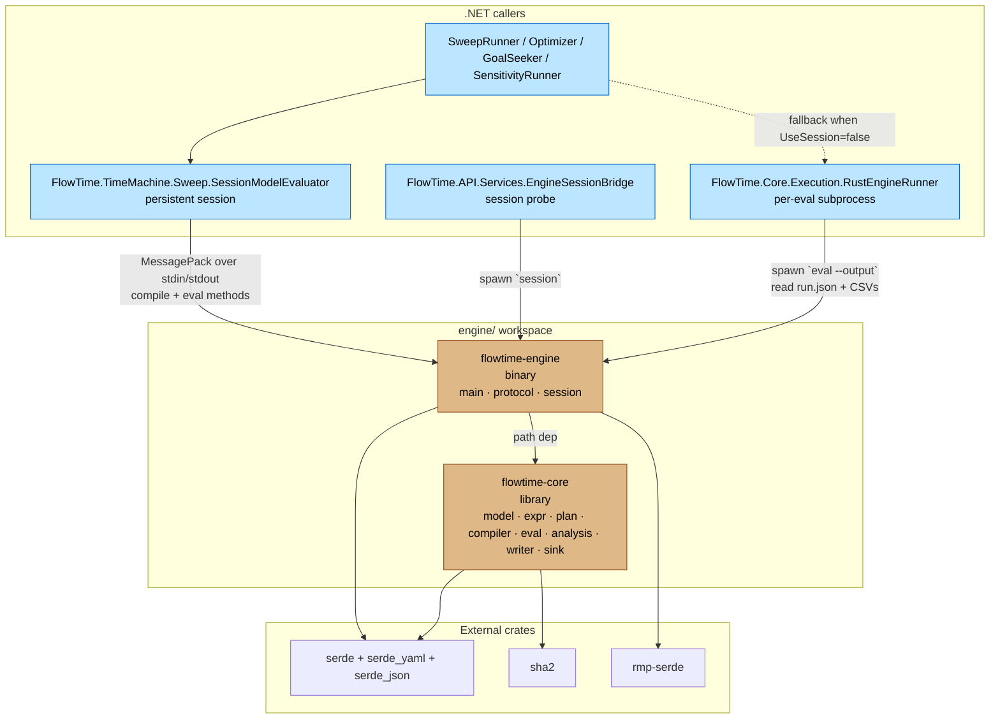

## Workspace layout

The Rust engine is a Cargo workspace at `engine/` (`engine/Cargo.toml:1-15`):

- Workspace package: version `0.1.0`, edition `2024`.
- Workspace dependencies: `serde 1` (with `derive`), `serde_yaml 0.9`, `serde_json 1`, `sha2 0.10`, `rmp-serde 1`.
- Two members: `core` and `cli`.

Crate `flowtime-core` (`engine/core/Cargo.toml:1-11`):
- Library crate, name `flowtime-core`.
- Direct deps: `serde`, `serde_yaml`, `serde_json`, `sha2`. No `rmp-serde`.

Crate `flowtime-engine` (`engine/cli/Cargo.toml:1-15`):
- Binary crate, name `flowtime-engine`.
- Deps: `flowtime-core` (path), `serde`, `serde_json`, `serde_yaml`, `rmp-serde`.
- Dev-deps: `serde_json`, `rmp-serde` (for integration tests).

There is no FFI / `#[no_mangle]` / `cdylib` configuration. The crate is **CLI-only**; .NET invokes the binary via subprocess.

## Code surface

Module sizes (lines, from `wc -l`):

| File | LOC | Role |
|---|---|---|
| `engine/core/src/lib.rs` | 8 | Module re-exports only |
| `engine/core/src/model.rs` | 301 | YAML deserialization types |
| `engine/core/src/expr.rs` | 494 | Expression parser → AST |
| `engine/core/src/plan.rs` | 341 | `Plan`, `Op`, `ColumnMap`, `ParamTable` |
| `engine/core/src/compiler.rs` | 4578 | `ModelDefinition` → `Plan`; class decomposition; edge series; graph derivation |
| `engine/core/src/eval.rs` | 1039 | Bin-major matrix evaluator |
| `engine/core/src/analysis.rs` | 499 | Invariant analyzer producing `Warning`s |
| `engine/core/src/writer.rs` | 685 | Minimal artifact writer (CSVs, index.json, run.json, manifest.json) |
| `engine/core/src/sink.rs` | 1606 | Full artifact sink (StateQueryService-compatible layout) |
| `engine/cli/src/main.rs` | 179 | CLI dispatcher |
| `engine/cli/src/protocol.rs` | 232 | MessagePack length-prefixed framing types |
| `engine/cli/src/session.rs` | 319 | Persistent-session state machine |

Key public API (`engine/core/src/lib.rs:1-8` re-exports `model`, `expr`, `plan`, `compiler`, `eval`, `analysis`, `writer`, `sink`):

- `model::parse_model_yaml(yaml: &str) -> Result<ModelDefinition, String>` (`engine/core/src/model.rs:235`).
- `compiler::compile(&ModelDefinition) -> Result<Plan, CompileError>` (`engine/core/src/compiler.rs:568`).
- `compiler::eval_model(&ModelDefinition) -> Result<EvalResult, CompileError>` (`engine/core/src/compiler.rs:53`).
- `compiler::eval_model_with_params(model, &[(String, ParamValue)])` (`engine/core/src/compiler.rs:62`).
- `compiler::derive_graph(&ModelDefinition) -> GraphInfo` (`engine/core/src/compiler.rs:1139`).
- `compiler::EvalResult { state, column_map, bins, warnings, class_map, classes, edge_map }` (`engine/core/src/compiler.rs:31-42`).
- `eval::evaluate(plan)` and `eval::evaluate_with_params(plan, overrides)` (`engine/core/src/eval.rs:17-26`).
- `eval::extract_column(state, col, bins) -> Vec<f64>` (`engine/core/src/eval.rs:243`).
- `analysis::analyze(model, eval_result) -> Vec<Warning>` (`engine/core/src/analysis.rs:22`).
- `writer::write_artifacts*` — minimal artifact writer (`engine/core/src/writer.rs:22-31`).
- `sink::write_sink(out_dir, model, eval_result, model_yaml, &SinkConfig)` — full sink (`engine/core/src/sink.rs:100`).
- `sink::deterministic_run_id(template_id, input_hash)` (`engine/core/src/sink.rs:66`).
- `expr::parse(input: &str) -> Result<Expr, ParseError>` (`engine/core/src/expr.rs:55`).

`Plan`/`Op` enum surface (`engine/core/src/plan.rs:81-144`): 19 op kinds — `Const`, `VecAdd/Sub/Mul/Div/Min/Max`, `Clamp`, `Mod`, `ScalarAdd/Mul`, `Floor/Ceil/Round`, `Step`, `Pulse`, `Shift`, `Convolve`, `QueueRecurrence`, `DispatchGate`, `ProportionalAlloc`, `Copy`. Plus `ParamValue { Scalar, Vector }` and `ParamKind { ConstNode, ArrivalRate, WipLimit, InitialCondition }` (`engine/core/src/plan.rs:147-180`).

CLI commands (`engine/cli/src/main.rs:24-37`):

- `flowtime-engine parse <model.yaml>` — parse + print summary.
- `flowtime-engine plan <model.yaml>` — compile + dump the Op list.
- `flowtime-engine eval <model.yaml> [--output <dir>]` — evaluate; with `--output` writes the full artifact sink (`main.rs:99-156`).
- `flowtime-engine validate <model.yaml>` — parse, compile, analyze; emits `{ "valid": bool, "warnings": [...] }` JSON (`main.rs:158-179`).
- `flowtime-engine session` — start the persistent MessagePack session.
- Bare `*.yaml` path is treated as `parse` for legacy callers (`main.rs:31`).

Session protocol (`engine/cli/src/protocol.rs`, `session.rs`):

- Wire format: 4-byte big-endian length prefix + MessagePack body. 64MB cap, zero-length rejected (`protocol.rs:124-131`).
- Methods (`session.rs:27-35`): `compile`, `eval`, `get_params`, `get_series`, `validate_schema`.
- `compile` returns `{ params, series, bins, grid, graph, warnings }` (`protocol.rs:35-42`).
- `eval` returns `{ series, elapsed_us, warnings }` after applying `overrides: { paramId: number | number[] }` (`session.rs:129-161`).
- `validate_schema` is a tier-1 check — parse-only, no compile (`session.rs:41-62`).
- State machine holds `Option<ModelDefinition>`, `Option<Plan>`, `Option<EvalResult>` and reuses the compiled `Plan` across `eval` calls (`session.rs:16-20`, `:130-160`).

There is **no** `chunk_step` method. That is E-0022 m-E22-02 scope and not yet implemented (verified by absence in `session.rs:27-35`).

## Functional parity with .NET engine

What the Rust engine *does* today:

- Parses the same YAML schema as C# `ModelDefinition` (`engine/core/src/model.rs:5-6` — explicit comment "These mirror the C# ModelDefinition types").
- Supports `kind: const`, `kind: expr`, `kind: pmf` for model nodes (`compiler.rs:638-650`).
- Supports topology kinds `serviceWithBuffer`, `queue`, `dlq`, `service` for analysis; `serviceWithBuffer` is the default (`compiler.rs:154-155`, `:728-729`, `analysis.rs:31`).
- Supports `router` topology nodes (`compiler.rs:1163`) and `constraint` definitions with proportional allocation (`Op::ProportionalAlloc`, exercised in `tests/fixture_deserialization.rs:192-217`).
- Expression functions: `MIN`, `MAX`, `CLAMP`, `MOD`, `FLOOR`, `CEIL`, `ROUND`, `STEP`, `PULSE`, `SHIFT`, `CONV` (`compiler.rs:1688-1791`).
- Queue mechanics: `QueueRecurrence` op with optional WIP limit + overflow channel (`plan.rs:122-132`).
- Dispatch schedules via `DispatchGate` (`plan.rs:135`, exercised by `topology-dispatch.yaml`).
- SHIFT-based feedback cycles handled naturally because evaluation is bin-major (`eval.rs:5-9`, comment).
- Per-class column decomposition **inside the engine** (`compiler.rs:97-120`, `propagate_class_decomposition`).
- Edge-series materialization (`compiler.rs:82,1094-1104`, `compute_edge_series`).
- Invariant analyzer with `non_negativity`, `conservation`, `queue_balance`, `stationarity` checks emitting `analysis::Warning` (`analysis.rs:22-42`).
- Two artifact-output paths: the minimal `writer.rs` (CSVs + 4 JSON files) and the full `sink.rs` (StateQueryService-compatible — model/, spec.yaml, per-class CSV naming, aggregates/ placeholder, provenance — `sink.rs:1-12` doc comment).
- Deterministic run IDs from `(template_id, input_hash)` matching the C# `DeterministicRunNaming` (`sink.rs:60-70`).

What the Rust engine *does not* do (per `G-0016` and grep):

- Per-class decomposition is computed but not exposed in `EvalResult` in the same JSON shape as C# `ClassContributionBuilder`. `EvalResult` has `class_map` (`compiler.rs:37-38`) but the consumer adapter has to project this manually.
- `outputs:` filtering and renaming — the `OutputDefinition` type is parsed (`model.rs:118-124`) but never read by the compiler or writers (per `G-0016` line 18: "OutputDefinition parsed in model.rs but never used in compiler or writer").
- Edge CSV naming `edge_{id}_{metric}@{component}@{class}.csv` is sink-layer work; current Rust sink emits a different naming.
- Series ID format `{nodeId}@{COMPONENT}@{CLASS}` — Rust sink uses bare `{nodeId}` plus suffixes; C# uses the at-separated format (`G-0016` lines 33-34).
- `model/metadata.json` extraction from YAML is partial; `model/provenance.json` is partially documented per D-0043.
- No `aggregates/` directory contents; placeholder only.
- Casing: Rust lowercases topology node IDs; C# preserves casing (`G-0016` line 41).

How the .NET API uses it:

- `RustEngineRunner` (`src/FlowTime.Core/Execution/RustEngineRunner.cs:14`) spawns `flowtime-engine eval` per call, reads back `run.json`, `manifest.json`, and series CSVs.
- `EngineSessionBridge` (`src/FlowTime.API/Services/EngineSessionBridge.cs`) and `SessionModelEvaluator` (`src/FlowTime.TimeMachine/Sweep/SessionModelEvaluator.cs:27`) drive the session protocol over MessagePack for sweep/sensitivity/goal-seek/optimize.
- Gating: `RustEngine:Enabled` configuration flag in `Program.cs:37`. When false, the analysis endpoints return 503 (`SweepEndpoints.cs:46-49`, `SensitivityEndpoints.cs`, `GoalSeekEndpoints.cs:48-51`, `OptimizeEndpoints.cs:73-76`).
- `RustEngine:UseSession` (default `true`) toggles between `SessionModelEvaluator` and `RustModelEvaluator` (`Program.cs:57`).

The .NET engine (`FlowTime.Core`) remains the production engine for the main `POST /v1/run` path and for telemetry-mode runs orchestrated by `RunOrchestrationService`. The Rust engine is the engine for the analysis modes.

## Test coverage

Inline `#[cfg(test)]` test count by file (from `grep -c '#\[test\]'`):

| File | Tests |
|---|---|
| `engine/core/src/compiler.rs` | 72 |
| `engine/core/src/eval.rs` | 31 |
| `engine/core/src/sink.rs` | 30 |
| `engine/core/src/analysis.rs` | 8 |
| `engine/core/src/writer.rs` | 13 |
| `engine/core/src/expr.rs` | 12 |
| `engine/core/src/plan.rs` | 3 |
| `engine/core/src/model.rs` | 2 |
| `engine/cli/src/protocol.rs` | 5 |
| `engine/core/tests/fixture_deserialization.rs` | 22 |
| `engine/cli/tests/session_integration.rs` | 20 |

Total: ~218 tests. `engine/cli/src/main.rs` and `engine/cli/src/session.rs` have no inline tests; session is covered exclusively by the integration test (which spawns the binary).

Integration tests:

- `engine/core/tests/fixture_deserialization.rs` — parses all `engine/fixtures/*.yaml` files (asserts ≥21 fixtures, line 97), and evaluates topology, router, and constraint fixtures with hard-coded expected vectors (`:104-217`).
- `engine/cli/tests/session_integration.rs` — spawns the actual binary and exercises `compile`/`eval`/`get_params`/`get_series`/`validate_schema` via the MessagePack protocol; covers compile-success, compile-error, eval-overrides, recompile-replaces-state, vector-overrides, unknown-override-ignored, topology-with-WIP, capacity warnings, schema-validation failures (`session_integration.rs:84-766`).

Fixtures (`engine/fixtures/`, 21 YAMLs):
`class-enabled`, `complex-pmf`, `constraint-below-capacity`, `constraint-proportional`, `hello`, `http-service`, `microservices`, `order-system`, `pmf`, `retry-service-time`, `router-class`, `router-mixed`, `router-weight`, `router-with-constraint`, `simple-const`, `topology-backpressure`, `topology-cascading-overflow`, `topology-dispatch`, `topology-retry-echo`, `topology-simple-queue`, `topology-wip-limit`.

## G-0016 — Rust Engine Parity

Source: `work/gaps/G-0016-rust-engine-parity-evaluation-core-gaps.md`, status `open`.

Quoting the gap as written:

> The Rust matrix engine (E-0020) handles compilation, evaluation, and basic artifact writing for simple models, but cannot replace the C# evaluation pipeline for models that use classes, edges, or output filtering. These are evaluation-layer gaps per D-0044 — the engine core must return complete results before the artifact sink or consumers can use them.

Engine-core gaps (must be in Rust):
- **Per-class column decomposition** — Critical, Deferred (M-0033). Rust computes class routing internally (`__class_` columns) but does not expose per-class series in `EvalResult`. (Note: this has since landed partially per `compiler.rs:97-120` propagation, but the EvalResult shape exposing it as the C# `ClassContributionBuilder` does still differs — the gap remains "open".)
- **Edge series materialization** — High, Undocumented. C# `EdgeFlowMaterializer` produces per-edge throughput/attempt series; Rust uses edges for ordering only. (Edge series partially landed via `edge_map`, but per-edge attempt/failure/retry metrics are not.)
- **`outputs:` filtering/renaming** — Medium. `OutputDefinition` is parsed but never used in compiler or writer.

Artifact-sink gaps (separate from engine core):
- `model/model.yaml`, `model/metadata.json`, `model/provenance.json`.
- `spec.yaml` at run root (normalized topology with file:// URIs; needed by `StateQueryService`).
- Per-class CSV naming `{node}@{component}@{class}.csv` — depends on engine-core decomposition.
- Edge CSV naming.
- Full `series/index.json` schema (kind, unit, class, componentId, hash).
- Full `run.json` schema (classes, classCoverage, source, inputHash).
- Full `manifest.json` schema (rng, provenance section, classes).
- `aggregates/` directory.
- Series ID format `{nodeId}@{COMPONENT}@{CLASS}`.

Parity-harness gaps:
- "Parity test across all 21 Rust fixtures" — High, in scope of E-0020 spec but incomplete; M-0034 tested only 3.
- "Casing normalization" — Low; Rust lowercases topology node IDs, C# preserves casing.

Blocking relationships (per the gap):
- **E-0017** (Interactive What-If) requires per-class decomposition, outputs filtering, full index.json/run.json schema.
- **E-0018** (Time Machine/Pipelines) requires all of the above + edge series + artifact-sink parity. (Note: E-0018 is `done` per its status, suggesting these were resolved or worked around with the C# `RunArtifactWriter` remaining as the production sink per D-0044's "no premature deletion" guidance.)
- **Svelte UI state display** requires `StateQueryService` compatibility (spec.yaml with file:// URIs, per-class series).

References cited in G-0016: D-0044, D-0043, `work/epics/E-0020-matrix-engine/spec.md`, `docs/architecture/matrix-engine.md`.

Related gap: **G-0019** — "Sim-generated model shape vs. Rust engine compiler expectations" (`work/gaps/G-0019-sim-generated-model-shape-vs-rust-engine-compiler-expectations.md`). Indicates Sim-emitted YAML is not always shaped how the Rust compiler expects.

## Build / CI status

CI: **Rust is not built or tested in CI**. `.github/workflows/build.yml` is a `.NET 9` workflow only (lines 1-54): `dotnet restore → dotnet build → dotnet test` per project. No `setup-rust`, `cargo build`, or `cargo test` step. Verified by grep: no occurrences of `rust` or `cargo` in `.github/workflows/`.

Devcontainer: Rust toolchain is installed at devcontainer init (`.devcontainer/init.sh:26-30`):
```
curl --proto '=https' --tlsv1.2 -sSf https://sh.rustup.rs | sh -s -- -y --default-toolchain stable --profile minimal --component clippy
```
PATH adds `~/.cargo/bin` (`.devcontainer/devcontainer.json:96`). Comment says clippy is needed for `wf-dead-code-audit rust` recipe.

Local run (verified by inspection only — not executed):
- `cargo build --release` from `engine/` produces `engine/target/release/flowtime-engine`.
- `cargo test --workspace` runs all unit + integration tests. The session integration test prefers the release binary, falls back to debug (`session_integration.rs:9-18`).

The .NET runner discovers the binary by checking `engine/target/release/flowtime-engine` first, falling back to PATH (`Program.cs:42-46`).

## Why does this exist?

Direct ADR/decision support:

- `D-0044-rust-engine-architecture-evaluation-vs-artifact-sink-vs-consumer-adapters.md` (status `accepted`): "Three-layer architecture with a structured boundary between each: engine core (Rust, pure function); artifact sink (Rust library, mandatory but pluggable); consumer adapters (Rust or C#, per surface)."
- `D-0043-matrix-engine-provenance-port-basics-defer-sim-specific-explore-plan-hashing-later.md` and `D-0007-fix-p0-engine-bugs-before-further-svelte-ui-work.md` are also relevant scope decisions.

Originating epic: **E-0020 Matrix Engine** (`work/epics/E-0020-matrix-engine/epic.md`, status `done`, all 10 milestones M-0028 → M-0037 complete per the status note).

Quoting the epic goal (`epic.md:11-13`):
> Replace the C# object-graph evaluation engine with a Rust-based column-store + evaluation-plan engine. The new engine reads the same YAML model files, produces identical output artifacts, and ships as a standalone CLI binary (`flowtime-engine`). This is the foundation for E-0017 (Interactive What-If) and E-0018 (Time Machine).

Stated motivations (`epic.md:30-46`):
- Eliminate defensive copying (`&[f64]` slices vs C# `Series` clone-on-construction).
- Replace 6 class files + interface hierarchy with `enum Op` + `match` (~80 LOC).
- Compile to native CLI (~5–10 MB) and to WebAssembly (future, for in-browser E-0017).
- Single allocation per evaluation regardless of model size.
- Plan introspection — the evaluation is inspectable data, not opaque code.
- Enables incremental re-evaluation needed for E-0017 (<50ms) and parameter sweeps for E-0018.

So the Rust engine is **explicitly production-positioned**, not a spike. E-0020 is `done`; E-0017 and E-0018 (also `done`) build on it. The remaining gaps (`G-0016`) are residual evaluation-layer items where C# is still the truth and Rust does not yet match.

WebAssembly compilation is mentioned in the E-0020 epic as out-of-scope (`epic.md:77`) but architecturally enabled. No `wasm32-unknown-unknown` target configuration exists in the workspace today.

## Drift findings

1. **G-0016 says edge series are "ordering only"** (line 16) but `compiler.rs:82` and `compute_edge_series` materialize an `edge_map`. Per-edge metrics (attempt/failure/retry) are still incomplete — the gap is partially out of date for `flowVolume` but accurate for richer edge metrics.
2. **G-0016 says per-class decomposition "does not expose per-class series in EvalResult"** but `EvalResult.class_map` exists (`compiler.rs:37-38`) and `propagate_class_decomposition` is fully implemented. The remaining gap is in the artifact-sink projection, not the engine core. The gap text would benefit from a status refresh.
3. **`OutputDefinition` is dead-on-arrival.** `model.rs:118-124` parses it; no caller reads it. Confirmed by grep: only the deserialize attribute touches the `as_name` field.
4. **CI does not verify Rust.** Build, tests, fixtures all pass locally / in the devcontainer but `.github/workflows/build.yml` does not execute `cargo` at all. Any Rust regression lands silently until a developer runs it manually or until a `RustEngine:Enabled=true` API test fails.
5. **No `chunk_step` method** despite `docs/architecture/time-machine-analysis-modes.md:65` referencing the session protocol foundation. Chunked evaluation is E-0022 scope.
6. **Casing normalization remains.** Rust lowercases topology node IDs (verified at `compiler.rs:154`, `:485`, `:728` — `to_lowercase()` calls). C# preserves casing. Parity helpers compensate with case-insensitive comparison (`G-0016` line 41).
7. **`SessionModelEvaluator` constructs a `frame` byte array on every write** (`SessionModelEvaluator.cs:218-225`) — no drift, just noting that the C# side also implements its own MessagePack framing rather than using a library helper.
8. **The `RustEngineRunner` doc comment references reading `manifest.json`** (`RustEngineRunner.cs:11-12`) — this requires the Rust sink to write a `manifest.json` matching the C# expectation. The Rust `writer.rs` writes a minimal manifest (just hashes); the full `sink.rs` writes a richer one. Behavior depends on which path is taken; per-eval `RustModelEvaluator` uses `--output` which goes through `sink.rs` (`main.rs:108-126`).

## Crate graph and cross-language boundary



Boundary characteristics:

- The boundary is exclusively **subprocess + stdio** — no FFI, no shared library, no `cdylib`.
- Two protocols on top: (a) command-line eval that writes a directory and reads it back; (b) MessagePack length-prefixed framing over stdin/stdout for the session.
- .NET → Rust is one-directional. The Rust engine never calls back into .NET.
- The .NET `FlowTime.Core` engine still exists and remains authoritative for non-analysis paths (`POST /v1/run`, telemetry-mode runs).
