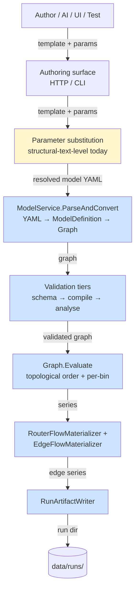

# Redesign substrate

This document is the synthesis of `01`–`09` filtered through one question: *if we were to rearchitect FlowTime to fix the structure-vs-data parameter problem and review the Sim/Engine boundary, what's the substrate we have to work with?*

It is **not** a redesign proposal. It identifies seams, classifies surfaces as load-bearing vs. incidental, and inventories the cleanup opportunities that ride along with any structural change.

## The two architectural questions on the table

1. **The parameter substitution layer.** Today, value parameters (`splitAirport: 0.3`) are eliminated via *YAML-text-level string replacement* before the engine sees the model (see `03-template-pipeline.md`). The author's mental model includes parameters; the engine's mental model does not. This costs us semantic context everywhere downstream — diagnostics, time-machine ergonomics, AI-authoring feedback loops.

2. **The Sim/Engine boundary.** `FlowTime.API` and `FlowTime.Sim.Service` are deployed as two separate processes on different ports, but **they don't talk over HTTP** (see `06-run-lifecycle.md`). They share the same in-process libraries and the same `data/runs/` filesystem. The boundary is structural-deployment-level, not architectural-domain-level.

These are linked: the canonical answer to (1) — making value parameters first-class engine nodes — also reduces the surface area of (2), because it pulls more of the "template understanding" into a layer the engine can address.

## What is load-bearing

These surfaces or behaviors must be preserved by any redesign. Removing or changing them breaks something real.

### LB-1 — Structural parameters genuinely need template-tier resolution
- **Evidence:** `bins`, `binSize`, `binUnit` (and structural booleans like `enableRetry`, structural integers like `wavePeriodBins`) shape the *evaluation grid* and *node topology*. The engine cannot start evaluation without these resolved. Cite `03-template-pipeline.md` parameter-taxonomy section.
- **Constraint on redesign:** The template-tier substitution surface cannot be eliminated entirely. It can be *narrowed* (to structural parameters only) but not removed.

### LB-2 — `RunArtifactWriter` is the universal artifact contract
- **Evidence:** Every entry point — Engine `/v1/run`, Sim simulation runs, Sim telemetry runs, both CLIs — routes through `RunArtifactWriter.WriteArtifactsAsync` (`06-run-lifecycle.md`). The shape of `<runId>/{run.json, manifest.json, series-index.json, series/, model/, aggregates/}` is the *de facto* external contract.
- **Constraint on redesign:** Whatever changes upstream, the run-artifact directory shape stays compatible (or migrates with explicit deprecation). Existing run artifacts on disk must remain readable.

### LB-3 — The expression evaluator's reference resolution
- **Evidence:** `ExprNode`'s evaluator looks up referenced node ids via `getInput(NodeId) → Series` from a memoised `Dictionary<NodeId, Series>` (`04-engine-runtime.md` execution-model section). All node references work this way — there is no special-case for constants vs. computed series.
- **Implication for redesign:** Promoting value parameters to first-class nodes is *natural* — they'd just be `kind: const` (or a new `kind: parameter`) nodes that the evaluator sees through the same lookup. The expression evaluator already does what we'd need.

### LB-4 — Topological-sort-with-feedback execution model
- **Evidence:** `Graph.Evaluate` uses Kahn's algorithm for the static order, with a bin-major loop for feedback subgraphs (lagged refs `SHIFT(_, lag>=1)`). Routers are passthrough at the graph layer with a second-pass `RouterAwareGraphEvaluator`. WIP overflow uses up-to-10 fixed-point iterations (`04-engine-runtime.md`).
- **Implication for redesign:** Adding parameter nodes doesn't change the execution model — they're sources, no inputs, evaluate once to a constant-valued series. They participate in the topological sort as roots.

### LB-5 — Telemetry-as-const-injection is the working pattern
- **Evidence:** Telemetry-mode runs work via `TelemetryBundleBuilder` pre-baking captured CSVs into const-node values — no live telemetry feed exists today (`08-telemetry-and-time-machine.md`). The pattern *is* "treat external data as const-node values."
- **Implication for redesign:** This is the *same* pattern the parameter-as-node redesign would use. Telemetry today injects external data as constants; parameter unification injects external data (the user's parameter values) as constants. They're the same shape under the hood, with different sources. **The redesign aligns with how telemetry already works.**

### LB-6 — The `FlowTime.Core` evaluator + `RunArtifactWriter` is the canonical engine
- **Evidence:** Both HTTP services link `FlowTime.Core` directly. Both CLIs link it directly. The Rust engine `flowtime-engine` is invoked as a subprocess for analysis modes (sweep, sensitivity, goal-seek, optimize) but not for the core `POST /v1/run` evaluation (`09-rust-engine.md`).
- **Constraint on redesign:** The C# core is authoritative. Rust parity (G-016) is a separate concern that this redesign needs to consider but not solve.

### LB-7 — Sweep / sensitivity / goal-seek / optimize already work via re-evaluation
- **Evidence:** All four endpoints share a common shape: take resolved YAML, evaluate it many times against a parameter axis. The Rust engine's `IModelEvaluator` is invoked repeatedly with edited parameters (`08-telemetry-and-time-machine.md`).
- **Implication for redesign:** This is exactly the use case that parameter-as-node would simplify. Today these endpoints take resolved YAML and *substitute new parameters back into it* somehow (per the Rust engine's evaluation loop). With parameters as nodes, "vary parameter X" becomes "edit const node X's value, re-evaluate" — drastically simpler.
- **What this means for redesign sequencing:** the sweep/sensitivity/optimize plumbing is a beneficiary, not a blocker. The redesign doesn't have to invent these — they already exist and would simplify under it.

### LB-8 — Provenance and run-id determinism
- **Evidence:** `inputHash = sha256(canonical request)`; deterministic `runId` derives from this; reuse logic in `TryReuseExistingRunAsync` short-circuits to existing artifacts (`06-run-lifecycle.md`).
- **Constraint on redesign:** Run-id determinism must continue to work. Any new shape for parameters has to flow through `RunHashCalculator` cleanly.

## What is incidental

These surfaces are present today but aren't load-bearing. A redesign can change, merge, or remove them without breaking real behavior.

### I-1 — The Sim/Engine HTTP-service split
- **Evidence:** They don't communicate. They share libraries, registrations, and filesystems. Each service is essentially the same set of endpoints with different active subsets (Sim has POST orchestration; Engine has GET runs + the validation/sweep/sensitivity surface).
- **Conclusion:** The split is a *deployment* choice, not an architectural necessity. A redesign could:
  - Keep two services (current).
  - Merge into one service with all endpoints.
  - Split differently (e.g., creation-service + read-service, or template-service + run-service).
  
  None of these break in-process callers. They affect the operations story (which doesn't exist anyway, per drift item 6.1).

### I-2 — `FlowTime.Sim.Core` as a separate library from `FlowTime.Core`
- **Evidence:** Engine API depends on Sim.Core; TimeMachine depends on Sim.Core; both CLIs depend on it.
- **Conclusion:** Sim.Core is a *core* library the whole system uses, not a "Sim-only" thing. The library boundary is misleading. A redesign might:
  - Merge into one core library.
  - Split into `FlowTime.Templates` (parsing + substitution) + `FlowTime.Engine.Core` (evaluator + artifact writer).
  
  The current "Sim" prefix is vestigial.

### I-3 — `FlowTime.Adapters.Synthetic` as a project name
- **Evidence:** It's the run-artifact reader (drift item 4.1). Renaming it is mechanical.
- **Conclusion:** Rename. `FlowTime.Artifacts.Reader` or `FlowTime.RunArtifactClient` more accurately describes it.

### I-4 — `ParameterSubstitution.cs` (the object-level parallel implementation)
- **Evidence:** Production uses YAML-text-level; this object-level path is only test-referenced (drift item 5.1).
- **Conclusion:** If the redesign moves to parameter-as-node, the YAML-text-level path can shrink dramatically (only structural parameters survive). The dead `ParameterSubstitution.cs` either becomes the new path or gets deleted — either way, the duplication ends.

### I-5 — Two `MapRunOrchestrationEndpoints` extension classes
- **Evidence:** Drift item 3.6.
- **Conclusion:** Pick one. After deciding the service split, only one remains.

### I-6 — Two `ValidationResult` types
- **Evidence:** Drift item 2.6.
- **Conclusion:** Merge into one. Probably in `FlowTime.Core`.

### I-7 — `eventCount: 0` vestigial field
- **Evidence:** Drift item 1.5.
- **Conclusion:** Remove from the writer. Update the schema (whether you keep schemas or not).

### I-8 — `model.yaml` written twice
- **Evidence:** Drift item 5.6.
- **Conclusion:** Pick one location. The redesign is a natural moment to consolidate.

### I-9 — Devcontainer and deployment fictions
- **Evidence:** Drift items 6.1–6.4.
- **Conclusion:** Either build the deployment (Dockerfiles, Compose) or delete the docs that claim it exists.

## Architectural seams

The natural cuts in the current architecture, from outermost to innermost:



The yellow box (Substitution) is the surface most affected by the parameter-as-node redesign. The blue boxes (Parser through Writer) are load-bearing engine surfaces that should pass through largely intact.

The seams that matter:

| # | Seam | Today's behavior | Redesign opportunity |
|---|---|---|---|
| S1 | Authoring → Substitution | Template YAML in, with `${name}` placeholders | *Narrow* the substitution surface to structural-only |
| S2 | Substitution → Parser | Resolved YAML in, no parameters | *Promote* value parameters to engine nodes (no longer substituted away) |
| S3 | Parser → Validator | `ModelDefinition` in | Validators see parameter names → richer diagnostics |
| S4 | Validator → Evaluator | Validated `Graph` in | No structural change |
| S5 | Evaluator → Writer | Evaluated series in | No structural change |
| S6 | Writer → Filesystem | Run-dir written | Backward-compatible artifact shape |

The proposed parameter-as-node move is *fundamentally a S1↔S2 redesign*. Everything to the right of S2 stays the same architecturally, just gains parameter-aware metadata.

## How the parameter-as-node redesign maps onto current code

A concrete walk-through of what code changes if value parameters become engine nodes.

### What changes

1. **Template parameter declarations gain a `treatAs` discriminator.**
   ```yaml
   parameters:
     - name: bins
       type: integer
       treatAs: structural    # substituted at template tier (today's path)
       default: 288
     - name: splitAirport
       type: number
       treatAs: value          # promoted to a node, not substituted
       default: 0.3
   ```
   `treatAs: value` is the new path; absence defaults to `structural` (back-compat).

2. **`SimModelBuilder.Build` gains a "value-parameter lowering" step** alongside its existing PMF-to-const lowering. For each value parameter:
   - Inject a `NodeDefinition` into the resolved model with `kind: const` (or new `kind: parameter`), `id` matching the parameter name (e.g., `splitAirport`), `values` populated to a constant-valued time-series at the parameter's value, plus metadata tagging it as parameter-derived.
   - Emit nothing into `provenance.parameters[name]` differently — the parameter snapshot remains.

3. **Substitution narrows to structural parameters only.** `TemplateService.SubstituteParameters` filters the substitution dictionary to structural parameters; value parameters' `${name}` references in expressions stay as references, parsed by `ExpressionParser` as `NodeReferenceNode` pointing at the new parameter node.
   - Today: `expr: "hub_dispatch * ${splitAirport}"` → after substitution `expr: "hub_dispatch * 0.3"`
   - Redesign: stays as `expr: "hub_dispatch * splitAirport"` — `splitAirport` is now a node id.

4. **Engine sees parameter nodes as ordinary const nodes.** No change to `Graph.Evaluate`. The expression evaluator looks up `splitAirport` like any other reference.

5. **Run artifact captures parameter nodes explicitly.** `series-index.json` lists them as series with `kind: const` and `componentId: parameter` (new metadata). The provenance still carries the parameter snapshot (unchanged).

6. **Validators see parameter names natively.** `InvariantAnalyzer` can emit warnings naming `splitAirport`, not `0.3`. M-069's heuristics for peer-split detection get drastically richer.

### What doesn't change

- `RunArtifactWriter` shape (LB-2).
- `Graph.Evaluate`, `RouterAwareGraphEvaluator`, `EdgeFlowMaterializer` (LB-4).
- `TimeMachineValidator` tier model (LB-7 et al.).
- The Engine API endpoints — `POST /v1/run` still accepts a resolved model.
- The Rust engine — it sees the same model shape (just with const nodes named after parameters; harmless).
- Provenance and run-id determinism (LB-8).

### What gets cleaner

- **Sweep / sensitivity / goal-seek / optimize** (LB-7) become "edit const node value, re-evaluate" instead of "re-substitute parameters into YAML."
- **Time machine** (E-22, mostly future) gets its primitive: parameter-mutation as a node-value mutation.
- **AI authoring** gets named feedback ("`splitAirport` looks peer-relative" instead of "constant 0.3 in expression").
- **Telemetry runs and value-parameter runs are structurally identical** — both inject external data into const nodes.

## Service boundary: keep, merge, or recut?

The Sim/Engine deployment split (I-1) is the second redesign question. Three viable options:

### Option A — Keep two services as-is

- **Cost:** Continued duplication of Program.cs registrations, `MapRunOrchestrationEndpoints` collisions, ambiguous responsibility for any new endpoint.
- **Benefit:** Zero migration cost. Existing UIs and CLIs keep working.
- **Verdict:** Doesn't actually fix anything but doesn't break anything either.

### Option B — Merge into one service

- **Cost:** Migration of CLI/UI configurations to point at one URL. Some endpoint-naming consolidation. The HTTP surface grows but doesn't change semantically.
- **Benefit:** Eliminates the false dichotomy. One service has all endpoints; one Program.cs registration; one set of contracts. `FlowTime.Sim.Service` and `FlowTime.API` collapse into something like `FlowTime.Service`. The "Sim" naming on libraries can also retire.
- **Verdict:** Cleanest if no operational reason exists to keep them split. The investigation found no such reason — there's no production deployment, no scaling story, no security boundary, no team boundary.

### Option C — Recut the split along a different axis

E.g., creation-service (template parsing, substitution, model emission) + run-service (evaluation, artifact storage, run reads) + analysis-service (sweep, sensitivity, optimize via Rust subprocess).

- **Cost:** More services to operate. Each gets a meaningful identity.
- **Benefit:** Each service has a clear domain. Possibly easier to scale analysis independently.
- **Verdict:** Probably overkill at current scale; worth flagging as a future option but not now.

The redesign substrate **does not require choosing yet** — but the parameter-as-node move is independent of this choice. We can land parameter unification under any of A/B/C.

## Cleanup opportunities riding along with redesign

If the redesign happens, here's the bundled cleanup that costs almost nothing extra and pays back drift debt:

| # | Cleanup | Source drift item |
|---|---|---|
| C-1 | Retire or fix `docs/schemas/*.schema.json` | 1.1, 1.2, 1.3, 1.4, 1.6 |
| C-2 | Document the actual Sim/Engine boundary in `CLAUDE.md` | 3.1, 3.2, 3.3 |
| C-3 | Delete or build `docs/guides/deployment.md` and friends | 6.1, 6.2, 6.3, 6.4 |
| C-4 | Fix `ValidationWarning` to carry full `InvariantWarning` shape across tier boundary | 2.3 |
| C-5 | Make tier-3 reach edge-flow conservation warnings (call `EdgeFlowMaterializer`) | 2.5 |
| C-6 | Rename `FlowTime.Adapters.Synthetic` to reflect its actual job | 4.1 |
| C-7 | Merge two `ValidationResult` types | 2.6 |
| C-8 | Delete `ParameterSubstitution.cs` (or replace YAML-text path with it) | 5.1 |
| C-9 | Pick one `modelId` semantic | 5.2, 5.3 |
| C-10 | Stop writing `model.yaml` twice | 5.6 |
| C-11 | Strict-enum `topology.nodes[].kind` | 2.7 |
| C-12 | Remove `eventCount` vestigial field | 1.5 |
| C-13 | Unify CSV header conventions for series and capture | 5.7 |

## Out-of-scope for the redesign (keep separate)

These are real concerns surfaced by the investigation but should NOT be folded into the parameter-as-node redesign — they're separate epics:

- **Rust engine parity (G-016 + extensions).** The C#/Rust evaluator alignment is a years-long story; let it stay an independent track.
- **Telemetry external ingestion (E-15 carrier).** The "Gold Builder" / `TelemetryLoader` / Graph Builder work is its own epic. Parameter unification *aligns* with it (telemetry-as-const-injection is the same shape) but doesn't subsume it.
- **Time-Machine fit, chunked evaluation, and `FlowTime.Pipeline` SDK (E-22 carrier).** Out of scope for this redesign, but parameter unification provides the cleaner substrate when E-22 lands.
- **CI improvements for test discipline and static analysis (E-26).** Already drafted as a separate epic.

## What's next (after this substrate is reviewed)

The next document to write is the **redesign proposal**: an epic spec (probably E-27) with milestone breakdown, ADR-candidate naming the new architecture, and a migration strategy.

Open questions the proposal needs to answer:

1. **`kind: const` reuse vs. new `kind: parameter`.** Reuse is simpler; new kind carries explicit semantic distinction (parameters can carry range/min/max/title for UI rendering). The investigation didn't surface a hard reason to choose one.

2. **Service boundary decision** — A, B, or C above.

3. **Migration strategy.** Templates today use `${name}` syntax pervasively. Two reasonable strategies:
   - **Big-bang:** all templates migrate at once; old syntax stops working.
   - **Coexistence:** both syntaxes work; new templates use node-references; old templates keep working. Substitution layer detects which form is in use per parameter.
   
   The investigation suggests coexistence — Sim already has a parallel object-level substituter (`ParameterSubstitution.cs`) that could be the back-compat path while the YAML-text-level path narrows to structural-only.

4. **What happens to the bridge canary tests** (`Survey_Templates_For_Warnings`)? They run on shipped templates; if templates change shape, the canary's baselines need to be rebuilt. Probably fine — the canary is designed for exactly this kind of change.

5. **Sequencing with E-25 (in-flight).** E-25's M-067/M-068/M-069 are about flow-authority enforcement. The redesign would likely either land *between* or *after* E-25. Landing after preserves E-25 unchanged. Landing between would let M-069's heuristics use parameter names natively, which is the original motivation for this whole investigation.

These open questions are the agenda for the redesign proposal — not for this substrate document.
