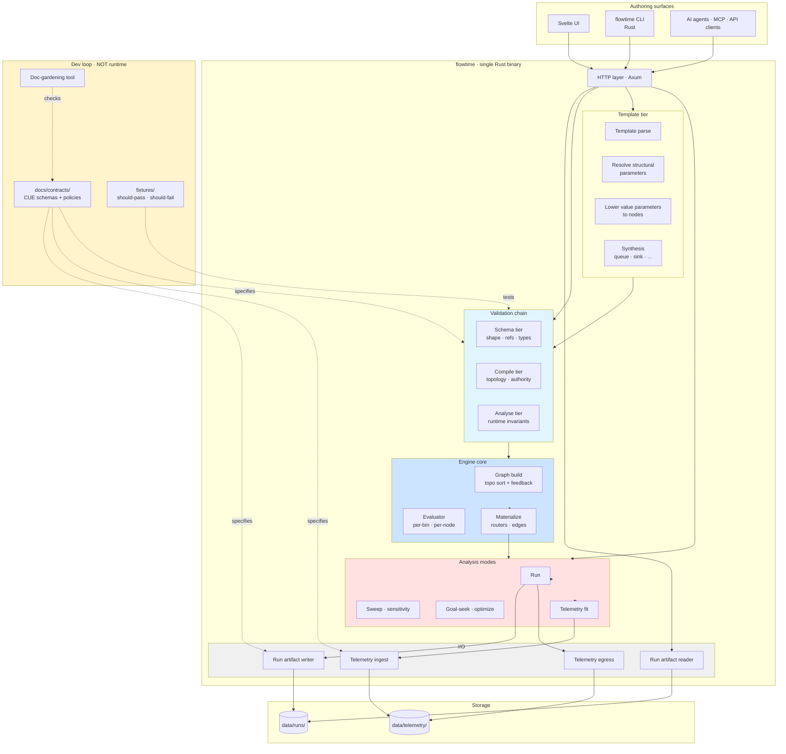
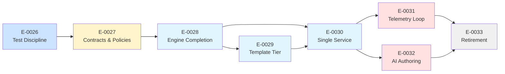

# Consolidation — FlowTime Architecture and Implementation Proposal

## What FlowTime is becoming

FlowTime is an **algebraic flow computation engine**. Authors describe a graph of nodes and edges over a time grid; the engine evaluates that graph deterministically, producing per-bin series at every node and edge. The same primitives describe simulation, what-if analysis, sensitivity sweeps, calibration against real telemetry, and the closed loop of extracting models from telemetry. There is one mental model end-to-end: a graph, a time grid, an evaluator. Everything else is library, contract, or surface.

This proposal describes the target architecture and the work to get there. The work is grouped under the theme **Consolidation** — a series of cohesive epics that together transition FlowTime from its current shape to this architecture.

---

## Principles

These are hard rules that inform every decision in the Consolidation series.

### P1 — Rust is the authoritative engine
The engine — parser, compiler, evaluator, validator chain, materializers, artifact writer — lives in a single Rust workspace. There is no parallel implementation in another language. There is one canonical evaluator; everything else is a client of it.

### P2 — Spec-driven schemas and policies
Every interface (template, model, run artifact, telemetry, contract) has a precise, machine-checkable specification. Specs live in **CUE** under a contracts tree as part of the development loop. They define both syntactic schema (shape) and semantic policy (invariants and constraints). Specs are *not* embedded at runtime — Rust enforces what CUE specifies, and the development loop verifies the two agree.

### P3 — Contracts are the truth surface
Contracts (per the aiwf v3 contract entity model) bind together a CUE schema, a fixture set (`should-pass/`, `should-fail/`), and a Rust validator. The contract is the single anchor for documentation, code, and tests. If a doc claims a policy exists, it must reference a contract; if a Rust validator implements a check, it must be fixture-tested against the contract; if a contract changes, dependent code is updated as part of the same change.

### P4 — Algebraic uniformity
Value parameters, constants, expressions, PMFs, telemetry-driven series, and computed series are all node kinds in the same evaluation graph. The evaluator does not distinguish "parameter" from "constant" from "telemetry" at the type level — they are all sources or computations the topological sort consumes. This makes parameter sweeps, telemetry replay, and model fit all use the same primitive: edit a node's value, re-evaluate.

### P5 — Templates are author-facing; models are engine-facing
The template language is the authoring surface. It can include features the engine has no concept of (parameter declarations with ranges and titles, structural switches, authoring metadata). The template processor lowers templates into models. The engine sees only models. The template surface is allowed to evolve more freely than the engine surface.

### P6 — One service, one binary
The HTTP service is a single Rust binary hosting evaluation, validation, template processing, analysis modes, telemetry I/O, and artifact reads/writes. There is no architectural split between "Sim" and "Engine"; the single service handles both authoring-driven and analysis-driven flows. Deployment may eventually multiplex this binary into multiple processes, but the architecture is single-service by default.

### P7 — Telemetry is symmetric with model output
Telemetry shape matches model output shape. Captured telemetry can drive a model. Model output can be exported as telemetry. The closed loop of `model → telemetry → fit → adjusted-model` uses one shape end-to-end.

### P8 — No backwards compatibility while pre-alpha
FlowTime has no production users. Every redesign decision optimizes for cleanliness over migration cost. Templates may change shape, run artifacts may change shape, contracts may change shape — the version after the change is the only version. Migration tooling is built only when the development team itself benefits from it. This principle applies to every change, not just to the Consolidation work.

### P9 — Diagnostics carry semantic context to the author
Every error, every warning, every analyzer signal traces back to a name the author chose: a parameter name, a node id, a template line number. AI authoring loops and human authors alike need diagnostics that name what the author was trying to do, not what the engine ended up evaluating.

### P10 — Doc-gardening is enforced, not aspired
A documentation drift check runs in CI. Docs that claim invariants must reference contracts; contracts must be referenced from docs; orphaned schemas, stale architecture diagrams, and obsolete examples fail the build. Doc rot is treated as a test failure, not as something to clean up later.

---

## Target architecture

The yellow box (`Dev loop`) is build-time/test-time only. Nothing in CUE ships in the Rust binary. The arrows from `Contracts` into the runtime boxes are dotted to mark *specification*, not invocation: contracts specify what the Rust validators must enforce, and fixtures verify the spec and impl agree.

---

## Surfaces and responsibilities

### Authoring surfaces

**Svelte UI.** The primary interactive authoring + analysis surface. Speaks HTTP to the single Rust service. Owns visualization, form generation from parameter schemas, run-artifact rendering, time-machine controls.

**`flowtime` CLI.** Single Rust binary. Subcommands for run, validate, sweep, sensitivity, goal-seek, optimize, telemetry capture, telemetry ingest, fit. Same code path as the HTTP service for the actual work — just a thin command-line surface in front of the service crate.

**AI agents and external API clients.** Speak HTTP. The HTTP API is the contract surface — documented under contracts, fixture-tested, stable within a major version (with the no-backwards-compat principle bounding "stability").

### The single service

**HTTP layer (Axum).** Endpoint definitions only. Handlers delegate to the engine, validation, template, mode, and I/O layers. No business logic in handlers.

**Template tier.** Parses templates, resolves structural parameters (those that shape the topology or grid), lowers value parameters into engine nodes, runs synthesis (queue/sink injection, derived-node computation). Output is a model. Templates may carry features the engine doesn't see; lowering is one-way.

**Validation chain.** Three tiers — schema, compile, analyse — each implementing policies declared in the contracts tree. All three tiers are reachable from `POST /v1/validate?tier=...`. Tier results carry full diagnostic richness (severity, bins, values, edge ids, source line numbers) to the caller.

**Engine core.** Parser → graph builder → evaluator → materializers. The graph is built from topological sort with feedback subgraphs; the evaluator walks node-major series-at-a-time except in feedback regions (bin-major). Routers are second-pass via materializer. Edge flows are first-class series.

**Analysis modes.** Run, sweep, sensitivity, goal-seek, multi-parameter optimize, telemetry fit. All implemented as repeated invocations of the engine core with parameter-axis edits and result aggregation. Because value parameters are first-class engine nodes, "vary parameter X" is "edit X's const-node value, re-evaluate" — a single primitive across all modes.

**I/O.** Run artifact writer (canonical directory shape, content-addressed run id). Run artifact reader (used by both the service for read endpoints and external consumers as a Rust library). Telemetry ingest (live source → engine via uniform shape). Telemetry egress (engine output → telemetry-shaped export).

### Storage

**`data/runs/`** — canonical run artifacts. Directory shape matches contract C-RUN. Includes resolved model, series, manifest, run record, aggregates, optional telemetry export.

**`data/telemetry/`** — captured telemetry bundles and ingested telemetry sources. Shape matches contract C-TEL.

### Dev loop

**`docs/contracts/`** — CUE schemas and policies. One subdirectory per contract (model, run-artifact, telemetry, validation-result, etc.). Each subdirectory contains the CUE definition, fixture inputs, and binding metadata.

**`fixtures/`** — mirrors `docs/contracts/`. For each contract, a `should-pass/` and `should-fail/` directory with example inputs. Used by both `cue vet` (during dev) and the Rust validator test suite (during build).

**Doc-gardening tool.** A repo-private CLI that walks `docs/`, identifies invariant claims, verifies each is anchored to a contract, and fails on orphaned references. Runs in CI and as a pre-push gate.

---

## Schemas and policies — the dev/runtime split

CUE is the specification language. Rust is the runtime. They never meet at runtime. They meet at *test time* through fixtures.

### What CUE owns
- Definitions of every data shape that crosses an interface (model, run artifact, telemetry, validation result, sweep request, etc.).
- Semantic policies: flow-authority, conservation, peer-split prohibition, type-vs-usage, range constraints, reference resolution, parameter-class consistency, etc.
- Fixture specifications: which fixtures should pass each policy, which should fail, and why.
- Optional code generation: deriving Rust types from CUE where the boilerplate is high.

### What Rust owns
- Parsing and evaluation (`serde_yaml`, `serde_json` for shape; hand-written expression parser; topological evaluator).
- Validators that implement each policy. Choice of idiom is per-validator: hand-written walk, visitor pattern, type-state, declarative attribute-based — whichever fits the policy.
- Property tests using `proptest` to exercise the validator beyond fixtures.

### How they stay in sync
- For every contract, the test suite loads each fixture from `should-pass/` and `should-fail/`, runs the Rust validator, and asserts the outcome matches the fixture's class.
- A `cue vet` pass over the same fixtures asserts that the CUE policy itself classifies them correctly.
- If CUE and Rust disagree on a fixture, the build fails. Either the CUE spec is wrong (update spec) or the Rust impl is wrong (update validator).
- A doc-gardening pass asserts that every CUE policy has a doc anchor, every doc anchor has a CUE policy, and every Rust validator is bound to a contract.

This pattern — spec language for the contract, native code for the implementation, fixtures as the bridge — is standard in domains where runtime performance matters (e.g., protocol buffers, OpenAPI codegen, Pact contract testing). It does not introduce a runtime dependency on the spec tooling.

---

## The Consolidation epic series

The work to reach this architecture is decomposed into eight epics, each with a clear scope and exit criterion. They share the `Consolidation` prefix to mark them as a single coordinated initiative.

### Consolidation — Test Discipline and Static Analysis (E-0026)
**Scope:** Repo-wide development tooling. Lints, format gates, build hardening, pre-push gate. CI jobs for format/build/test on Rust and on the Svelte UI. Property testing (proptest), snapshot testing (insta), mutation testing (cargo-mutants), architecture testing. Coverage gate. Supply-chain scan. Pre-push gate finishing in under 30 seconds.

**Exit criterion:** Every commit passes lints, format, build, tests, and clippy on the Rust workspace. CI runs Rust, Svelte UI, and any remaining .NET surfaces. The dev tooling that catches mistakes during the Consolidation work is in place.

**Dependency:** None. This is the entry point.

---

### Consolidation — Contracts and Policies (E-0027)
**Scope:** CUE infrastructure under `docs/contracts/`. One CUE module per contract: model, run-artifact, telemetry, validation-result, parameter, expression. Each contract carries its semantic policies (flow-authority, conservation, peer-split, type-vs-usage, range, reference resolution). Fixture sets in `fixtures/` mirror each contract's `should-pass/` and `should-fail/`. CI runs `cue vet` and asserts fixture classification. Doc-gardening tool stands up; CI fails on orphan claims.

**Exit criterion:** Every interface in the target architecture has a CUE contract. Every semantic policy named in this proposal is encoded in CUE. Every contract has a fixture set. Doc-gardening passes on the entire `docs/` tree. The contracts are *specification only* at this stage — no runtime enforcement yet; the next epics implement against them.

**Dependency:** E-0026.

---

### Consolidation — Rust Engine Completion (E-0028)
**Scope:** Bring the Rust engine to feature-completeness for the canonical run path. Close the artifact-sink projection gap (G-0016). Implement parameter-as-node natively: structural-vs-value parameter discrimination, value-parameter lowering to const nodes during template processing, expression references resolving to parameter nodes by name. Implement the validator chain in Rust, with each validator fixture-tested against its contract. Edge-flow conservation warnings reachable from the analyse tier. Validation results carry full diagnostic richness across tier boundaries.

**Exit criterion:** The Rust engine evaluates every shipped template, produces canonical run artifacts that pass the run-artifact contract, and emits warnings reachable from `POST /v1/validate?tier=analyse`. Property tests and fixture tests pass for every validator.

**Dependency:** E-0026, E-0027.

---

### Consolidation — Template Tier in Rust (E-0029)
**Scope:** Move the template processing pipeline into Rust. Template parser (YAML → typed template AST). Structural parameter resolution (substituting only what shapes topology/grid). Value parameter lowering (emit const-or-parameter nodes into the model). Synthesizers (queue, sink, derived nodes). Pre-engine validators (array shape, const-length, semantics outputs). Templates may evolve their shape during this epic; the no-backwards-compat principle applies.

**Exit criterion:** Every shipped template processes through the Rust template tier, produces a model that passes the model contract, and round-trips through the engine to a canonical run artifact identical (modulo timestamp) to the previous output. Templates have been migrated to use parameter-as-node syntax for value parameters.

**Dependency:** E-0028.

---

### Consolidation — Single Rust Service (E-0030)
**Scope:** New Rust HTTP service (Axum). All endpoints implemented: `POST /v1/run`, `POST /v1/validate`, sweep/sensitivity/goal-seek/optimize, telemetry capture, telemetry ingest, run reads, run listing, artifact export. UIs (Svelte primary; Blazor if still in flight) re-pointed at the new service. CLI re-implemented as a Rust binary against the same service crate.

**Exit criterion:** The new service handles every flow that the existing .NET services handle, against the same UIs. Health checks pass. End-to-end tests via the UI surfaces pass.

**Dependency:** E-0028, E-0029.

---

### Consolidation — Telemetry Loop (E-0031)
**Scope:** Symmetric telemetry. Live ingestion (Gold Builder, telemetry loaders for CSV / Parquet / streaming sources). Telemetry egress (run output → telemetry-shaped export). Model fit primitives (parameter optimization against captured telemetry, residual analysis). The closed loop: model → run → telemetry → ingest → fit → adjusted model.

**Exit criterion:** A model can be authored, run, captured as telemetry, re-ingested, fit against the captured telemetry, and the fit model can re-run reproducibly. End-to-end loop test in CI.

**Dependency:** E-0030.

---

### Consolidation — AI Authoring Surface (E-0032)
**Scope:** Diagnostics that carry semantic context end-to-end. Parameter names visible in every error and warning. Template line numbers in compile and analyse diagnostics. MCP server exposing FlowTime as a tool: `validate_template`, `run_template`, `inspect_run`, `suggest_fix`. Structured diagnostic format suitable for AI consumption (machine-readable codes plus human-readable messages plus pointers to relevant contracts).

**Exit criterion:** An AI agent can author a template, validate it, fix violations based on diagnostics, run it, and inspect the result through MCP without falling back to file inspection. Demo: AI authors a non-trivial template from natural language; ten-iteration correction loop succeeds.

**Dependency:** E-0030 (and benefits from E-0031).

---

### Consolidation — Retirement and Doc-Gardening (E-0033)
**Scope:** Delete retired surfaces. Remove `FlowTime.Core`, `FlowTime.API`, `FlowTime.Sim.Core`, `FlowTime.Sim.Service`, `FlowTime.TimeMachine`, `FlowTime.Adapters.Synthetic`, `FlowTime.Contracts`, `FlowTime.Expressions`, `FlowTime.UI` (if Blazor retirement is complete), both .NET CLIs. Delete `docs/schemas/*.json` (replaced by CUE contracts). Update `CLAUDE.md`, `docs/architecture/`, `docs/guides/`. Doc-gardening pass closes any final drift.

**Exit criterion:** No .NET sources remain in the repo (or only those needed for the Svelte UI's local dev environment, if any). The Consolidation contracts are the truth. Doc-gardening shows zero drift.

**Dependency:** E-0030, E-0031, E-0032.

---

## Sequencing and dependencies

Critical path: E-0026 → E-0027 → E-0028 → E-0029 → E-0030 → E-0033. Approximately six epics on the spine, with E-0031 and E-0032 branching off after E-0030.

Some milestones within epics may run in parallel — for example, within E-0027 different contracts can be authored independently, and within E-0028 different validators can be implemented in parallel once the contracts they depend on exist.

E-0031 (Telemetry Loop) and E-0032 (AI Authoring) can be parallel after E-0030 if there's parallel capacity. They have no dependency on each other and both depend only on E-0030.

---

## What stays, what changes, what dies

### What stays
- The expression grammar and AST. Already in Rust. Solid; preserved.
- The Rust engine core (`engine/`). Promoted to authoritative; extended.
- The shipped template set (`templates/*.yaml`). Migrated for parameter-as-node syntax during E-0029.
- The Svelte UI (`ui/`). Re-pointed at the new service during E-0030.
- Run artifact concepts (manifest, series-index, run record). Cleaned up; canonicalized via contracts.
- Provenance and run-id determinism. Preserved through the rebuild.
- ADR-0001 (flow-authority policy). Stays accepted; becomes the source for the flow-authority CUE policy in E-0027.
- The aiwf planning kernel. Used to manage the Consolidation work itself.

### What changes
- Templates: gain a structural-vs-value parameter discriminator. Value parameters become first-class engine nodes.
- Run artifacts: directory shape canonicalized; schema contracts replace JSON Schema files; deprecated fields removed.
- Validation: same three tiers, but implemented in Rust against CUE contracts; full diagnostic richness preserved across tier boundaries.
- Service surface: single Rust HTTP service replaces two .NET services; same endpoint list; cleaner internal layering.
- CLI: one Rust binary replaces two .NET binaries.
- Telemetry: symmetric shape with model output; live ingestion path stands up.
- Diagnostics: parameter names, template line numbers, contract references carried end-to-end.

### What dies
- `FlowTime.Core` (.NET evaluator).
- `FlowTime.API`, `FlowTime.Sim.Service` (.NET HTTP services).
- `FlowTime.Sim.Core` (template substitution + builder).
- `FlowTime.TimeMachine` (orchestration + sweep + validators in .NET).
- `FlowTime.Expressions` (.NET parser; the Rust parser already exists and is authoritative).
- `FlowTime.Adapters.Synthetic` (run-artifact reader; replaced by Rust reader).
- `FlowTime.Contracts` (.NET DTOs; replaced by CUE-derived Rust types).
- `FlowTime.UI` (Blazor) — retirement timing per the Svelte migration; not blocking Consolidation.
- `flowtime` (.NET CLI), `flow-sim` (.NET CLI).
- YAML-text-level parameter substitution.
- `docs/schemas/*.schema.json` (replaced by CUE contracts).
- `docs/guides/deployment.md` (or replaced if/when a real deployment story exists).

---

## Concrete first moves

The first work on the Consolidation critical path is E-0026. While E-0026 runs, the foundation ADRs and E-0027 contract drafts can be prepared in parallel — they don't compete for the same code surfaces.

### ADRs to draft (concurrent with E-0026)
1. **ADR-0002 — Rust as the authoritative engine.** Names the C# engine retirement, the single Rust service direction, and the criteria for "feature parity reached."
2. **ADR-0003 — Spec-driven schemas and policies.** Names CUE as the specification language, fixtures as the test bridge, the no-runtime-CUE rule, and the contract-binding mechanism.
3. **ADR-0004 — Parameter-as-node and structural-vs-value.** Names the parameter taxonomy, the lowering transformation, and the engine surface for parameter nodes.
4. **ADR-0005 — Pre-alpha, no backwards compatibility.** Codifies the principle. Applies repo-wide, not just to Consolidation.

### Contracts to draft (during E-0027)
- `C-MODEL` — engine model shape and core invariants.
- `C-TEMPLATE` — authoring template shape and lowering rules.
- `C-RUN` — run artifact directory and file shapes.
- `C-TELEMETRY` — telemetry capture and ingest shape.
- `C-VALIDATION` — validation result shape and severity model.
- `C-PARAMETER` — parameter declaration shape and structural-vs-value rules.
- `C-EXPRESSION` — expression grammar and AST surface.

Each contract carries its CUE definitions, its `should-pass/` and `should-fail/` fixtures, and its binding metadata identifying the Rust validator(s) responsible.

### CLAUDE.md updates (early, alongside ADRs)
- Add the no-backwards-compat principle.
- Add the doc-gardening rule (every invariant claim must reference a contract).
- Update project layout to reflect the in-progress migration and the upcoming retirements.
- Update agent routing: planner owns ADR drafting and epic specs, builder owns Rust implementation, reviewer owns contract verification.

### In-flight cleanup
- The flow-authority policy work in E-0025 has produced ADR-0001; that decision is preserved. The remaining E-0025 milestones (M-0067, M-0068, M-0069) are obsoleted by the Consolidation approach: their intent (engine alignment, golden canary, three-tier enforcement) is absorbed by E-0027 (policies in CUE), E-0028 (validators in Rust), and E-0029 (template alignment in Rust). Cancel these milestones with reasons referencing the Consolidation direction. M-0066 stays done.

---

## Open questions

These need resolution before E-0027 starts authoring CUE contracts. They do not block E-0026.

### Q1 — Strategy A (rebuild in `v2/`) or Strategy B (replace incrementally on main)
**Strategy A** branches a fresh tree, rebuilds the new architecture in isolation, and cuts over when ready. Cleanest endpoint, but a long flight without working software in the main tree.

**Strategy B** stands up the new architecture alongside the old, retiring components incrementally. Working software throughout. The tree carries coexistence complexity for a few epics.

The pre-alpha context tolerates either. Strategy B keeps test feedback alive throughout the redesign and is the recommended default. A is appropriate if the existing tree's gravity makes incremental replacement impractical.

### Q2 — `kind: const` reuse vs. new `kind: parameter`
Value parameters become engine nodes. They could reuse `kind: const` with a `name` and optional metadata (range, title, description), or they could be a new `kind: parameter` with explicit semantics.

Reusing `const` is simpler — fewer kinds in the runtime — but loses the explicit "this came from a parameter declaration" signal. A new kind makes the parameter source explicit and lets analysis modes (sweep, sensitivity, goal-seek) target parameter nodes specifically without metadata-sniffing. Recommendation leans toward a new kind, but the choice belongs to E-0029's milestone-internal decisions.

### Q3 — CLI shape
The new Rust binary can be one of:
- A single `flowtime` binary with all commands as subcommands.
- Two binaries (`flowtime` for run/validate, `flowtime-analysis` for sweep/sensitivity/optimize) for surface separation.
- No CLI at all — only the HTTP service, accessed via `curl` or scripted clients.

Recommendation: single binary. Simplest authoring surface. Belongs to E-0030.

### Q4 — UI retirement timing
The Svelte UI is the target. The Blazor UI is in the tree but described as retiring. Whether Blazor retires *during* Consolidation (E-0030 or earlier) or stays through E-0033 affects E-0033's scope. If Blazor stays, E-0033 retires it as part of the cleanup. If Blazor retires earlier, it's out of scope for E-0033.

Recommendation: retire Blazor in E-0030 alongside the service rebuild. The Svelte UI has reached the point where Blazor is a parallel surface, not a fallback.

---

## Definition of done for the Consolidation series

The Consolidation work is complete when:

1. The engine is Rust, single binary, feature-complete for every surface in this proposal.
2. Every interface has a CUE contract; every contract has fixtures; every Rust validator is fixture-tested; doc-gardening passes.
3. The closed telemetry loop works end-to-end: model → run → telemetry export → ingest → fit → adjusted model.
4. AI agents author, validate, run, and inspect via MCP without filesystem fallback.
5. No .NET sources remain (modulo any Svelte-UI-adjacent tooling).
6. The architecture documented in this proposal matches the architecture in the repo, with doc-gardening enforcing that match continuously.

After Consolidation, FlowTime is the algebraic flow computation engine described in the opening paragraph. Subsequent work (new node kinds, new analysis modes, new authoring surfaces) extends the algebra rather than fighting the implementation.
