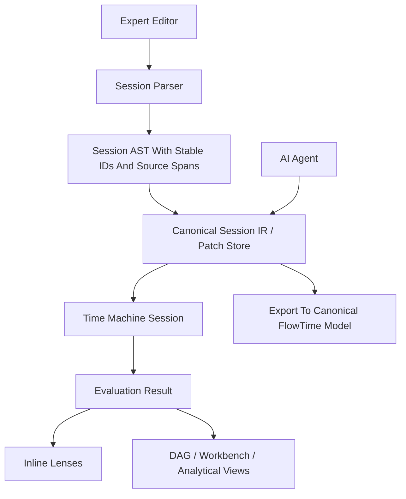

# Expert Authoring Surface

**Status:** proposal
**Date:** 2026-04-16
**Scope:** future expert authoring surface for Svelte UI, TUI, and AI-assisted workflows

**Related artifacts:**

- Epic draft: [work/epics/unplanned/expert-authoring-surface/spec.md](../../work/epics/unplanned/expert-authoring-surface/spec.md)
- Session contract reference: [work/epics/unplanned/expert-authoring-surface/reference/session-patch-model.md](../../work/epics/unplanned/expert-authoring-surface/reference/session-patch-model.md)

## Thesis

FlowTime should explore a Strudel-inspired surface as an **expert live
authoring mode** layered on top of the Time Machine, not as a replacement for
the canonical model, compiled facts, or run artifact story.

In that shape, the value is clear:

- experts get a fast edit-evaluate-see loop
- inline visuals sit beside authored logic
- AI agents can iterate against structured patches and cheap reevaluation
- committed FlowTime truth still exports back to the canonical model and run surfaces

This keeps the current product arc intact:

- [ROADMAP.md](../../ROADMAP.md) remains the sequencing truth
- the Time Machine remains the execution substrate
- [work/epics/unplanned/ui-workbench/spec.md](../../work/epics/unplanned/ui-workbench/spec.md) and the analytical views remain the main cross-user analysis surfaces
- canonical model + run artifacts remain the durable truth

## Product Position

FlowTime should support multiple surfaces over one deterministic engine.

| Audience | Primary surface | What they need |
|----------|-----------------|----------------|
| Expert human modeler | expert live session | rapid edit-evaluate-see loop, compact authoring, inline diagnostics, direct manipulation |
| AI agent | structured patch + validation protocol, optionally rendered as expert code | cheap iteration, stable identity, downstream impact feedback |
| Analyst / operator | workbench + analytical views | comparison, decomposition, warnings, provenance |
| Executive / BI consumer | summaries, scenario comparison, exports | decision-ready outputs, not live authoring |

This surface is high leverage, not universal. It is for users who think best in
compact textual operations and want feedback in the same place they edit.

## Why This Surface Is Valuable

## What The Live-Coding Model Gets Right

The live-coding model matters less because it is "code" and more because of the
runtime shape around the code.

It combines:

- a very compact textual surface
- a live loop where edits are picked up quickly without a full stop/restart cycle
- code-local visual feedback
- a single surface that can express structure, transformation, and view requests
- a runtime model where the active program can be swapped while the scheduler keeps running

That is the part FlowTime can benefit from.

## Why Expert FlowTime Users Benefit

Expert FlowTime users are not blocked by a lack of charts. They are blocked by
latency between a change and the proof of what that change did.

An expert authoring surface helps because it gives them:

- **edit locality**: the authored statement and the immediate consequence live together
- **high information density**: complex changes fit into a few lines instead of many UI steps
- **fast hypothesis testing**: one change can be checked without exporting, navigating, and reopening other panels
- **composability**: text chains and small abstractions are easier for experts than wizard-style forms
- **time-native thinking**: inline lenses make temporal behavior visible where the behavior is authored
- **AI compatibility**: an AI can work against the same session substrate without owning the canonical export format

For FlowTime specifically, this means an expert can change capacity, retry
shape, routing, or telemetry binding and see the impact inline before deciding
whether it is worth promoting into the canonical model.

## Hard Boundaries

### 1. Canonical truth stays where it is

The durable truth remains:

- canonical authored model
- compiled facts in Core / Time Machine
- canonical run directory and bundle artifacts

The expert session is the editing surface, not the final system of record. The
trusted commit boundary is export into the canonical FlowTime world.

### 2. Session state is not model truth

The following belong to the session surface and should not automatically become
part of the canonical model:

- pinned nodes
- current metric selection
- inline lens placement
- expanded cards
- current comparison baseline
- temporary warnings or visual debugging aids

These are session concerns, not model semantics.

### 3. Live data must still be reproducible

If the expert surface uses telemetry, each evaluation still needs a stable input
boundary:

- synthetic inputs
- frozen telemetry window
- sliding live window with snapshot identity

"Live" can describe the user experience, but the engine still needs a stable
evaluation input if the result is to be explainable and comparable.

### 4. DAG and workbench remain first-class

Inline visuals should complement, not replace, the topology DAG and workbench.

- the DAG answers: where is the structure, what is downstream, where is the heat
- the workbench answers: what changed, why, how does it compare
- inline lenses answer: what did this authored statement do right now

### 5. One deterministic engine, many shells

The expert surface, the DAG/workbench, AI tooling, and any future TUI should
all sit on top of the same execution substrate. No second runtime should be
created just for the expert editor.

## Interaction Model

## Mixed Code + Inline Visuals

The authoring surface should mix semantic statements with local feedback.

Two feedback modes make sense:

1. **Implicit inline lens**
   After a semantic statement such as capacity, arrivals, retry, or routing,
   the UI shows a small default visual over all bins.

2. **Explicit lens request**
   A lightweight authoring affordance such as `.scope(metric)` or
   `.lens(metric, style)` requests richer inline feedback at that point.

This preserves the mental model:

- semantic statements change the session model
- lens statements request feedback from the current runtime state

### Illustrative Example Only

The syntax below is conceptual. The important point is the relationship between
authoring statements and inline feedback.

```text
service auth
  .arrivals(series("orders.created"))
  .cap(180)            // inline sparkline: served vs capacity across bins
  .retry([0.0, 0.6, 0.3, 0.1])
  .scope(queueDepth)   // inline metric lens for queue depth

service checkout
  .cap(120)
```

Possible inline feedback next to or below statements:

- mini sparkline over all bins
- current-bin value chip
- delta versus prior baseline
- warning chip when invariants or overload conditions trip
- downstream impact hint such as `impacts: checkout, db_pool`

### Recommended Inline Feedback Types

| Lens type | Best use | Notes |
|-----------|----------|-------|
| Sparkline | quick trend over all bins | default after capacity / arrivals / served-like statements |
| Scope lens | one metric over time in more detail | explicit and temporary |
| Delta badge | compare before / after current edit | useful for what-if tuning |
| Downstream hint | show affected descendants | helps users and AI understand blast radius |
| Warning chip | surface trust or invariant issues immediately | must link to deeper explanation |

### Direct Manipulation Should Rewrite The Source

One of the strongest ideas in the live-coding model is that direct manipulation
and text editing are not separate worlds.

In FlowTime, that means actions such as:

- dragging a capacity handle
- pinning a node
- changing a lens style
- selecting a telemetry window

should update the session source or session patch store, not create a second
hidden configuration model.

The user should always be able to answer: "what statement caused this state?"

### Relationship To Existing UI

The current and planned Svelte UI already moves toward decomposed analytical
surfaces:

- [work/epics/unplanned/ui-workbench/spec.md](../../work/epics/unplanned/ui-workbench/spec.md)
- [work/epics/unplanned/ui-analytical-views/spec.md](../../work/epics/unplanned/ui-analytical-views/spec.md)
- [work/epics/unplanned/ui-question-driven/spec.md](../../work/epics/unplanned/ui-question-driven/spec.md)

The expert surface should plug into those surfaces rather than compete with
them.

Recommended synchronization model:

- selecting a node in the DAG highlights its related authored statements
- editing a statement highlights affected nodes and edges in the DAG
- inline lenses can pin their node directly into the workbench
- workbench cards can deep-link back to the authored statement that drives them

## How The Runtime Model Works Technically

To use the live-coding model well, it is important to be precise about what
makes it feel live.

It is not just "some text that magically runs". The shape is:

- a JavaScript-like authoring shell
- a transpilation and parsing layer
- a structured pattern or session abstraction
- a scheduler or update loop that owns time
- visual and output adapters that consume the same runtime facts

## 1. User code is a host-language surface with a live-coding transpilation step

In the Strudel model, the editor buffer is JavaScript-like code using chained
function calls. A typical line looks like this conceptually:

```text
note("c a f e").s("piano")
```

The important detail is that the editor content is not treated as an opaque DSL
blob. It is parsed as host-language code, transformed, then evaluated.

The technical flow is:

1. parse the editor text into a host-language AST
2. walk the AST and rewrite live-coding conveniences into explicit runtime calls
3. re-emit host-language code from the transformed AST
4. evaluate the transformed code inside the long-lived runtime

The classic example is compact pattern notation in double quotes or backticks.
Those strings are not left as ordinary strings. They are wrapped during
transpilation so that they become pattern-producing expressions. Single-quoted
strings remain normal strings.

That distinction matters because it keeps the surface compact for live use while
preserving a normal evaluation model.

## 2. Compact notation is compiled into ordinary pattern-building calls

Compact notation is not interpreted ad hoc at playback time. It is parsed into
its own AST and lowered into regular pattern-building calls.

That gives several useful properties:

- the surface stays compact for humans
- the runtime still works with ordinary structured objects
- source locations can be tracked precisely
- visuals and highlighting can point back to exact substrings in the editor

Technically there are two parser passes in play:

- the outer parser handles the host-language editor code
- the inner parser handles compact notation strings inside that code

The runtime combines both location systems so that an event generated from a
nested notation element can still map back to the right span in the editor.

## 3. Evaluation swaps the active program object inside a long-lived runtime

After transpilation, the resulting code is evaluated into one or more active
runtime objects.

This is the core point behind the "injected code" intuition: the editor content
is effectively injected into the running environment, evaluated, and the active
top-level object reference is replaced.

What changes is not the clock. What changes is the object the clock will query
next.

That separation is what makes the experience feel live instead of batch-based.

## 4. The scheduler owns time, and edits are heard on the next scheduling tick

The active program is queried by a scheduler over successive time windows.

Conceptually the loop is:

1. keep a running transport or update clock
2. on each scheduler tick, ask the active program for events in the next time window
3. send those events to the chosen output with deadlines relative to that clock

The important property is that querying is pure with respect to the time
window: a program maps a time span to a set of events.

Because of that, the runtime can replace the active program object between
scheduler ticks without restarting transport. The next scheduler callback simply
queries the new object.

That is the technically precise meaning of "the code is evaluated and picked up
on the next tick":

- the edited source is transpiled and evaluated
- the active runtime reference is swapped
- the next scheduling interval queries the new runtime object
- the transport clock continues running

The key product effect is not zero latency. It is **clock continuity under fast
program replacement**.

## 5. Visual feedback is fed from the same runtime, not bolted on afterward

Visual feedback works because the runtime carries source locations and event
structure all the way through evaluation.

There are two important categories of visuals:

- visuals derived from runtime events and their source locations
- visuals derived from signal or output analysis

The first category enables things such as:

- active notation highlighting
- punchcard or pianoroll style views
- inline visuals rendered at the point of the code chain

The second category enables things such as:

- scope-like time-domain views
- spectrum-like frequency views

It is also important that the same runtime result can be rendered:

- as a page-level analytical visual
- or as an inline local lens attached to a statement

## 6. Outputs interpret event values; they are not part of the authoring syntax

Runtime objects ultimately yield timed events with value payloads. Outputs are
responsible for turning those values into sound or other side effects.

That boundary is important because it keeps the language surface compact while
making output adapters replaceable.

For FlowTime, the equivalent boundary would be:

- authoring surface produces session structure + lens requests
- Time Machine produces deterministic evaluation results
- different UI surfaces decide how to render those results

## What FlowTime Should Borrow

FlowTime should borrow the **runtime pattern** behind the live-coding model,
not the music-specific semantics.

The useful parts to borrow are:

- editor text that lowers into a structured runtime form
- source-span tracking so runtime facts can point back to exact authored statements
- fast replacement of the active session result without losing surrounding UI state
- inline and global visuals fed by the same evaluation result
- direct manipulation that rewrites source or patches rather than creating hidden state

The parts not to copy blindly are:

- audio-specific notions of patterns, synths, and signal outputs
- arbitrary host-language code as engine truth
- a browser-only scheduler as the authoritative runtime

## First-Cut Editor Choice

For the exploratory browser implementation, the preferred editor shell should
be **CodeMirror 6**.

Reasoning:

- inline visuals are a central feature, not a side enhancement
- CodeMirror's DOM-first extension model is a better fit for inline widgets,
   block widgets, and scroll-synced overlay layers
- the spike should optimize for proving code-local analytical lenses rather
   than for maximizing VS Code-like editor parity on day one

Monaco remains a viable later alternative if the product eventually prioritizes
a heavier IDE-like experience over embedded visual flexibility, but that should
not drive the first experiment.

The important constraint is that the **session contract remains editor-
agnostic** even if the first UI shell uses CodeMirror.

## FlowTime Session Pipeline

The expert authoring surface needs an explicit session layer between authored
text and canonical export.



## Session Layers

The runtime should be explicit about its layers.

1. **Editor source**
   The user-facing expert text.

2. **Session AST**
   Parsed statements with stable identities and source spans.

3. **Canonical session IR**
   Deterministic, serializable, diffable structure sent to the execution layer.

4. **Execution state**
   Graph, expressions, series cache, metrics, diagnostics.

5. **Projection layer**
   Inline lenses, DAG overlays, workbench cards, warnings, comparisons.

The durable runtime boundary is a structured intermediate form rather than raw
editor text.

## Reevaluation Model For FlowTime

FlowTime should preserve the same user-facing feel as the live-coding model
while keeping the engine deterministic.

The right shape is:

1. the user edits the expert surface
2. the editor reparses only the changed region or statement group
3. the session layer lowers the edit into patch operations
4. the patch is applied to a long-lived Time Machine session
5. reevaluation runs on the next UI or engine update window
6. the current view state survives unless the edit invalidates it
7. new metrics and diagnostics are projected back onto source spans and nodes

The crucial constraint is this: if a host-language-like authoring shell exists,
that host-language runs in the authoring layer only. The Time Machine should
receive structured session IR or patches, never arbitrary user code as
execution truth.

## Inline Lenses In FlowTime

FlowTime's inline lenses are not audio scopes. They are metric-local analytical
views driven by deterministic engine output.

Likely first-class lenses:

- capacity versus served
- arrivals versus admitted
- queue depth over bins
- utilization sparkline
- bottleneck warning chip
- downstream impact summary

The lens system should use the same evaluation result as the DAG/workbench, not
a second analytical pipeline.

## Benefits For Expert FlowTime Users

The expert value proposition should be concrete.

| Benefit | Why it matters in FlowTime |
|---------|----------------------------|
| Shorter feedback loop | capacity, retry, and routing changes can be judged immediately |
| Better locality | the statement and its effect stay in one field of view |
| Better use of expertise | experts can encode compact transformations faster than they can drive many controls |
| Stronger time reasoning | inline metrics make bin-level behavior visible at the authoring site |
| Safer experimentation | session exploration stays ephemeral until export |
| Better AI collaboration | human and agent share one session substrate and one evaluation loop |

This matters because expert users are often doing repeated local reasoning:

- "what happens if auth capacity rises by 20%?"
- "does this retry shape reduce queue depth or just move the bottleneck?"
- "if I bind this real telemetry stream, what becomes unstable?"

The current DAG and workbench remain essential, but they are downstream views.
The expert surface brings the first proof of effect closer to the edit.

## AI Integration

This surface is also strong for AI, but only if the AI-facing contract is
structured first.

AI should primarily operate on structured operations such as:

- set capacity for node X
- add retry kernel to node Y
- bind telemetry source Z to node A
- insert queue between B and C
- request lens for metric M on node N

The UI may render those operations as expert text, but the AI should not be
forced to manipulate raw text as its primary protocol.

That gives the AI the same benefits this surface gives the human expert:

- cheap iteration
- stable identities
- immediate downstream visibility
- explicit export boundary when a session becomes worth committing

## Recommended Technical Shape

## Reuse existing Time Machine work

Do not build a separate execution runtime for the expert surface.

Build on:

- parameterized evaluation and sessions from E-17 / E-18
- tiered validation
- the current reevaluation loop
- shared workbench and analytical state

Relevant existing surfaces:

- [ui/src/routes/what-if/+page.svelte](../../ui/src/routes/what-if/+page.svelte)
- [src/FlowTime.API/Program.cs](../../src/FlowTime.API/Program.cs)
- [src/FlowTime.Cli/Commands/ValidateCommand.cs](../../src/FlowTime.Cli/Commands/ValidateCommand.cs)
- [docs/architecture/headless-engine-architecture.md](../architecture/headless-engine-architecture.md)

## Keep lenses out of the canonical model

Inline visuals should be defined as session metadata, not model semantics.

Examples:

- `cap(180)` is semantic
- the sparkline shown after `cap(180)` is session UI behavior
- `.scope(queueDepth)` is a session lens request, not durable model truth by default

That prevents view concerns from polluting export format.

## Support multiple shells over one session protocol

If the underlying session protocol is sound, it can power:

- a Svelte expert editor
- a terminal or TUI shell
- AI agent integration
- possibly later notebook-like surfaces

The shell is replaceable. The session protocol is the lasting asset.

For the first browser spike, that means:

- CodeMirror 6 for the authoring editor
- inline SVG or canvas widgets for small local lenses
- block widgets or view zones for larger local visuals
- one scroll-synced background or overlay rendering layer for broader visual context

## Build-versus-borrow caution

If FlowTime literally embeds or derives from a third-party live-coding codebase
or packages, license review is required before that becomes product direction.

The safer immediate move is to borrow the runtime ideas and interaction model:

- transpile or parse editor text into a structured runtime form
- preserve source-span mapping
- reevaluate against a long-lived session
- render inline and global lenses from the same result stream

That captures the value without prematurely coupling FlowTime to a third-party
runtime or license posture.

## User Flows

### Expert Human

1. Opens an expert session with a model and a frozen telemetry window.
2. Adjusts `cap` on `auth`.
3. Sees inline sparkline and warning chips update almost immediately.
4. Notices downstream `checkout` turns hot in the DAG and workbench.
5. Pins both nodes for side-by-side comparison.
6. Exports the best candidate to the canonical model and runs normal validation.

### AI Agent

1. Receives objective: reduce queue time at `auth` without overloading `db_pool`.
2. Applies structured session patches.
3. Uses inline lens results and downstream deltas to prune bad attempts.
4. Produces an exported candidate model plus rationale.

### Executive Consumer

1. Never uses the expert surface directly.
2. Consumes the resulting comparison view, summary narrative, and exported charts.
3. Sees the outcome of expert exploration, not the exploration tool itself.

## Sequencing Recommendation

Do not let this displace the current critical path:

- E-15 telemetry ingestion
- Telemetry Loop & Parity
- model fit
- workbench and analytical views

Recommended sequence:

1. **Near-term spike only**
   Reuse current what-if/session infrastructure to prototype one expert-only
   page with inline lenses.

2. **Source-span and patch substrate**
   Add stable source mapping plus a small session patch vocabulary.

3. **Workbench alignment**
   Ensure inline lenses, DAG, and workbench share selection, timeline, and
   baseline state.

4. **AI patch loop**
   Add agent-facing structured operations against the same session model.

5. **Optional syntax hardening**
   Only after the workflow proves useful should the expert syntax itself become
   a durable product surface.

## Non-Goals

- replacing FlowTime YAML / templates as canonical truth now
- replacing the DAG with code-only authoring
- making the expert surface the default UI for all users
- putting visualization state into exported models
- allowing arbitrary user code to become engine truth
- building a public canonical patch API before the session model proves out
- treating unbounded live telemetry as if it were automatically reproducible

## Open Questions

1. Should lens requests be explicit syntax, implicit editor affordances, or both?
2. What is the minimum stable session patch vocabulary that humans and AI can share?
3. Which metrics deserve default inline visuals after edit: capacity, arrivals, served, queue depth, utilization?
4. How much downstream impact should be shown inline before the UI becomes noisy?
5. Does TUI support matter in the first cut, or should the first version be browser-only?

## Recommendation

Explore this as **FlowTime Studio for experts**:

- mixed code + inline visuals
- fast session reevaluation
- explicit source-span mapping
- shared session patches for humans and AI
- synchronization with DAG and workbench
- export back into the canonical FlowTime world

That captures the strongest benefit of the live-coding model for FlowTime: a
live, high-density expert authoring loop that still lands in the deterministic
Time Machine and the existing artifact story.