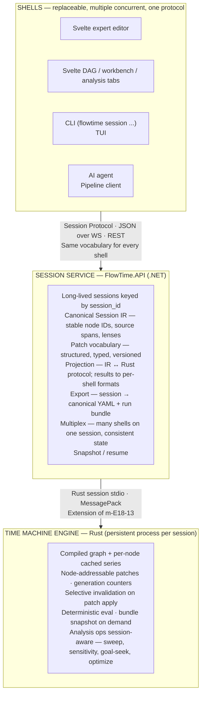
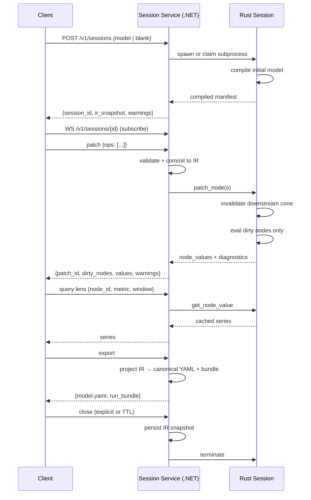

# FlowTime Studio — Architecture

**Status:** proposal
**Date:** 2026-04-24
**Scope:** long-lived session service, node-identity patch protocol, expert authoring shell, and the synthesis of Enso / Strudel / FlowTime's current formula-first core

**Related artifacts:**

- Expert authoring surface proposal: [docs/research/expert-authoring-surface.md](./expert-authoring-surface.md)
- Draft epic folder (to be absorbed): [work/epics/unplanned/expert-authoring-surface/](../../work/epics/unplanned/expert-authoring-surface/)
- Session protocol substrate (shipped): m-E18-02 + m-E18-13 (see `work/epics/E-18-headless-pipeline-and-optimization/`)
- Time Machine CLI (shipped): m-E18-14
- Roadmap plan for this work: [docs/research/flowtime-studio-roadmap-plan.md](./flowtime-studio-roadmap-plan.md)

## Thesis

FlowTime Studio is **not a new UI.** It is the architectural layer that makes
every existing and planned FlowTime surface — DAG, workbench, analysis tabs,
expert editor, CLI, TUI, and AI agents — share one long-lived deterministic
session with stable node identity, per-node cached values, and a structured
patch vocabulary.

Under this framing:

- the Rust engine already does **some** of what a dataflow environment like
  Enso does (compile-once / eval-many via the m-E18-13 session protocol), but
  it does not yet expose node identity, per-node cached values, or structured
  patches as first-class protocol concepts
- the Strudel-inspired expert editor in
  [docs/research/expert-authoring-surface.md](./expert-authoring-surface.md)
  assumes a layer that does not yet exist — a long-lived session with stable
  node IDs and selective re-evaluation
- the DAG, workbench, and analysis surfaces in E-21 assume per-request batch
  evaluation; they will rework naturally onto a session substrate once it exists

Studio is the **session substrate** that unifies all of this. It is the first
piece FlowTime needs before any "live, interactive, everywhere" story becomes
implementable across shells and pipelines without per-shell re-implementation.

## What This Is Not

- not a replacement for YAML as the canonical model
- not a replacement for the Time Machine engine
- not a new UI framework
- not a rewrite of E-17 or E-21
- not a browser-only live-coding environment
- not a research prototype — the dependencies (Rust session protocol, Time
  Machine CLI, analysis endpoints) are already shipped

## Synthesis — What We're Borrowing From Where

Three reference systems. Each contributes a different architectural idea.

### From Enso (the visual dataflow language)

- **Stable node identity.** Every node has a persistent ID independent of
  source position. Editing `cap(180) → cap(200)` mutates the spec, not the
  identity.
- **Per-node cached values.** Each node holds its current output. Edits
  invalidate only the downstream cone.
- **Typed ports.** Types flow along edges and are visible on the graph.
- **Visualization-as-metadata.** A lens or visualization request attaches to
  a node, not to a separate UI layer.
- **Session, not batch.** The runtime is always on; a "run" is a snapshot of
  session state, not the base unit.

### From Strudel (the live-coding environment)

- **Compact text lowers into a structured runtime form.** Editor text is
  parsed as host-language code; compact notation (quoted patterns, chained
  DSL calls) is rewritten into ordinary runtime calls at parse time.
- **Source-span tracking.** Runtime events remember where they came from;
  inline visuals can render against exact substrings in the editor.
- **Clock continuity under program replacement.** The scheduler keeps
  running; only the active program object swaps. Edits are heard on the next
  tick without restarting the transport.
- **Visuals fed from the same runtime.** Both inline lenses and page-level
  views consume the same evaluation results.

### From FlowTime's current shape

- **Bin-indexed series as the primary value type.** Time is a first-class
  axis, not an array dimension.
- **`shift` / `conv` as loop unrolling.** Feedback is semantic, not
  syntactic; the graph stays acyclic.
- **Deterministic bundle artifact.** Every evaluation can be snapshotted with
  hash + params + inputs + outputs for reproducibility and audit.
- **YAML as canonical source of truth.** Diffable, reviewable,
  AI-ingestible, template-friendly.
- **Tiered validation.** Schema → compile → analyze, each surfacing different
  kinds of findings.

### The key discriminator — what is authoritative

| System | Authoritative artifact | Derived surface |
|--------|-----------------------|-----------------|
| Enso | the graph (text is a serialization that includes layout) | text view |
| Strudel | the text (visuals are source-span overlays) | inline visuals |
| FlowTime today | YAML (DAG is a projection) | DAG view |
| FlowTime Studio | **YAML remains authoritative**; session IR is a runtime-only layer above it | all views |

FlowTime's stance matches Strudel's, not Enso's. Adopting Enso's graph-as-truth
would force node positions, colors, and visualization metadata to leak into the
canonical model. Studio keeps the canonical layer pure and puts Enso-shaped
ideas (node identity, value cache, typed ports, lens metadata) into a
**session IR** that lives in the service layer and serializes back to YAML on
export.

## Three-Layer Architecture



Three commitments make the layering work:

1. **The long-lived session lives in the .NET service, not the browser.** The
   browser holds a client connection and view state; everything canonical is
   on the server. This is what makes "close the tab and come back,"
   CLI/pipeline/LLM participation, and multi-shell synchronization possible.
2. **The Rust process is the session's engine, not the session itself.** One
   Rust subprocess per session (or pooled with session affinity). It owns the
   compiled graph and the per-node value cache. The .NET service owns
   identity, patches, spans, lenses, and export.
3. **One protocol, many shells.** Every shell speaks the same session
   protocol. No shell-specific runtime. No shell-specific patch vocabulary.

## The Keystone — Node Identity Across Layers

The single most load-bearing commitment in Studio's design is that **node
identity is stable across edits and addressable from every layer.**

- Session IR nodes carry stable IDs independent of source location.
- Source spans in the expert editor point to node IDs (one-to-many).
- Lens requests bind to node IDs.
- AI patches address node IDs as their primary target.
- The DAG and workbench key their visuals on the same node IDs.
- The Rust engine maps node IDs to its compiled node indices once per compile,
  not per eval.
- Export reconstitutes YAML with node IDs preserved in a lightweight manifest,
  so a re-imported model resumes against the same identities.

Without this, Strudel-the-runtime and Enso-the-value-graph do not compose:
inline lenses and DAG hovers would address different things; AI patches would
be source-span-relative and break under any edit; view state would drift from
model state on every patch.

This is the **one commitment** that must land in the first milestone of the
epic and is not negotiable.

## Session Service (.NET) — Detailed Responsibilities

The Session Service is the new architectural home for everything the current
`/v1/*` endpoints treat as one-shot.

### Session IR

```
Session
├─ id · created_at · ttl · owner
├─ Telemetry window binding
│    one of: synthetic · frozen_window(snapshot_id) · sliding_window(snapshot_id)
├─ Nodes: map<node_id, Node>
│    Node: { kind, spec (json), source_span, lenses[], pins[], tags }
├─ Edges: map<edge_id, {from: node_id, to: node_id, port, type}>
├─ Patches: append-only log (for undo, replay, export, audit)
├─ Compiled manifest: { node_id → rust_node_idx, hash_of_spec }
├─ Snapshots: periodic IR+cache capture for resume
└─ Subscribers: map<connection_id, {shell_kind, subscriptions[]}>
```

**Node IDs are stable across edits.** The spec changes; the identity does
not. This is the keystone described above.

**The telemetry binding is part of the session, not each evaluation.** A
session is pinned to a frozen or snapshot-versioned sliding window. This is
what makes Strudel's "clock continuity under program replacement" work in
FlowTime — the bin axis and telemetry window persist across patches.

### Patch vocabulary — minimum viable set

Structured, typed, versioned. Every shell produces these; no shell produces
raw text diffs.

```
SetExpr(node_id, expr_ast)
SetConst(node_id, value)
SetPmf(node_id, pmf_spec)
AddNode(kind, spec) → node_id
RemoveNode(node_id)
ConnectEdge(from_node, to_node, port)
DisconnectEdge(edge_id)
BindTelemetry(node_id, source_ref)
SetLens(node_id, lens_spec)      // session-only; does not export
SetPin(node_id, pinned: bool)    // session-only
SetTag(node_id, key, value)      // session-only annotations
SetTimeWindow(window_spec)
```

Each patch returns:

```json
{
  "patch_id": "p_0123",
  "dirty_nodes": ["n_auth", "n_checkout", "n_db"],
  "node_values": {
    "n_auth": { "served": [...], "queue": [...], ... },
    "n_checkout": { ... },
    "n_db": { ... }
  },
  "diagnostics": [
    { "level": "warning", "node_id": "n_db", "span": {...},
      "message": "utilization > 90% in last bin" }
  ],
  "elapsed_ms": 14
}
```

This is the AI contract. It is also the internal contract every Svelte shell
uses — the expert editor doesn't send text, it sends patches derived from
text edits; the DAG doesn't send a new model, it sends `SetConst` patches
derived from a dragged handle.

**Lens requests (`SetLens`) and session annotations (`SetPin`, `SetTag`)
never export.** They are session-only metadata. This is the hard boundary
that keeps the canonical model free of UI concerns — called out explicitly in
[expert-authoring-surface.md](./expert-authoring-surface.md) and reiterated
here because it is load-bearing.

### Text-to-patch at the edge

The expert-authoring surface adds one more stage **local to the shell** (or
hostable service-side for a TUI):

```
Editor text ──parse──▶ Expert AST (with source spans)
Expert AST ──diff against prior AST──▶ Patch sequence
Patch sequence ──send──▶ Session Service
```

Strudel's compact-notation rewriting happens at this edge. `cap(180)` lowers
into a `SetConst` patch; `series("orders.created")` lowers into a
`BindTelemetry` patch; `retry([0, 0.6, 0.3, 0.1])` lowers into a kernel-spec
patch. The session service never sees raw text.

This is what keeps the service uniform across shells. The DAG, the TUI, the
CLI, and the AI all target the same patch vocabulary through different
upstream paths.

## Rust Engine Extensions

The m-E18-13 session is 80% of the way there. What's missing:

1. **Node-addressable spec mutation.** Today the session re-takes a whole
   model. Needs: `patch_node(node_idx, new_spec)` that mutates one node's
   spec in-place and returns the invalidated downstream set. This is the
   protocol extension that makes per-node caching actually useful.
2. **Per-node cache with generation counters.** Each node holds
   `(generation, series)`. A patch bumps the node's generation; descendants'
   required-generation is raised by topological walk. Re-eval pulls from
   cache when `current_generation == required_generation`, recomputes
   otherwise. Pure bookkeeping over the existing evaluator.
3. **Cache query API.** `get_node_value(node_idx, window)` returns the cached
   series without triggering re-eval. Inline lenses and DAG hovers hit this
   endpoint.
4. **Typed port reflection.** `get_node_ports(node_idx) → [{port_name,
   type, unit, bin_size}]`. Enables edge-level type display in the DAG and
   the expert editor gutter.
5. **Snapshot / restore.** Serialize cache + compiled graph + generation
   vector for session resume across service restarts and migrations.

The big one is (1) + (2): node-addressable patches and generation-counter
cache invalidation. Everything else is mechanical.

None of this changes the engine's evaluation math or the bundle format. It
extends the session protocol to expose node identity and to avoid
recomputing unchanged subtrees.

## Protocol Shape

One WebSocket per session for bidirectional streaming. REST for session
creation, export, and one-shot queries. Both speak the same patch/result
vocabulary.

```
POST   /v1/sessions
         create; body = { model | blank, telemetry_binding, options }
         returns { session_id, ir_snapshot, warnings }

GET    /v1/sessions/{id}
         returns metadata + current IR

DELETE /v1/sessions/{id}
         close (explicit); sessions also close on TTL or last-client-disconnect

POST   /v1/sessions/{id}/patches
         body = { ops: [...] }; REST alternative to WS for pipelines
         returns patch result (same shape as WS patch-result frame)

GET    /v1/sessions/{id}/nodes/{node_id}
         returns current cached value + lens data

POST   /v1/sessions/{id}/export
         returns { model.yaml, run_bundle_ref }

POST   /v1/sessions/{id}/analysis/{op}
         op in {sweep, sensitivity, goal-seek, optimize, fit}
         runs against the session; reuses node cache; returns result

WS     /v1/sessions/{id}
         duplex: patches in, results + events out
         events: patch_applied, eval_complete, warning_raised, snapshot_ready
```

Analysis ops on a session reuse the per-node cache. A sweep that varies a
single const node recomputes only that node's downstream cone per sample.
This is the Enso-cache benefit paying out in the most expensive hot path.

The existing one-shot endpoints (`POST /v1/run`, `POST /v1/sweep`, etc.)
remain as **convenience wrappers** that create a session, run one op, close
the session. No breaking change for existing callers.

## Session Lifecycle



Sessions are **addressable, resumable, and inspectable from anywhere.** A
CLI can attach to a session created by a browser. An LLM loop can patch a
session and poll for results. Two browser tabs can open the same session and
see consistent state. The session is the unit of shared truth.

## How Each Consumer Uses The Same Backbone

### Svelte expert editor

- WebSocket connection to the session
- Parses text locally (CodeMirror 6 + custom parser)
- Diffs current AST against prior AST
- Sends patch sequence
- Renders inline lenses from `node_values` in the patch result
- Updates source-span highlights on diagnostics

### Svelte DAG / workbench

- Same WebSocket, same session
- Renders graph from `ir_snapshot` and subsequent `patch_applied` events
- Hovers and pins hit `/nodes/{node_id}` for values
- Edits from the DAG (dragging a capacity handle) emit `SetConst` patches
  identical to what the text editor would send
- View state (pins, metric selection, timeline baseline) keyed on stable
  node IDs so edits don't invalidate the view

### Svelte analysis tabs

- Same WebSocket, same session
- Sweep/sensitivity/goal-seek/optimize call
  `POST /v1/sessions/{id}/analysis/{op}` instead of the standalone endpoints
- Result cards render against the session-scoped result; the user can pin
  any sample into the workbench (creates a session patch trace entry)

### CLI in a pipeline

```bash
# stage 1 — create session
SID=$(flowtime session create --model x.yaml \
       --telemetry frozen:snapshot_2026_04_20 --json | jq -r .session_id)

# stage 2 — apply structured patches
flowtime session patch $SID --op 'SetConst node=auth.cap value=180'
flowtime session patch $SID --op 'SetConst node=auth.retry value=[0,0.6,0.3,0.1]'

# stage 3 — run analysis against the session
flowtime session analysis $SID --op optimize --spec ./optimize-spec.json

# stage 4 — export if converged
flowtime session export $SID --out ./candidate/

# stage 5 — close
flowtime session close $SID
```

Same session contract. Pipeline-friendly. The session lives for the
pipeline's duration; the exported bundle is the durable output.

### LLM agent

- Same REST endpoints
- Agent creates a session bound to a frozen telemetry window
- Issues structured patches (`SetCapacity`, `SetRetry`, `BindTelemetry`)
- Reads dirty-node deltas to prune bad attempts cheaply
- Calls `/analysis/goal-seek` against the live session for optimization
  within exploration
- Exports when converged; bundle is the durable artifact with full patch
  log and reproducible inputs
- **Never touches text as a protocol.** Text is a view the human opens on
  the same session if they want to review.

### TUI

- WebSocket, text authoring, no visuals beyond per-node value sparklines
  in ASCII
- Same patch vocabulary
- Uses source-span mapping to highlight diagnostics in the terminal

## What This Absorbs Or Re-Homes

This is a summary; the roadmap plan document has the full sequencing detail.

- **Expert authoring surface epic** (`work/epics/unplanned/expert-authoring-surface/`)
  is absorbed. Its session-patch-model reference becomes Studio's protocol
  reference. The expert editor shell becomes one milestone of the Studio
  epic.
- **One-shot analysis endpoints** (`/v1/sweep`, `/v1/sensitivity`,
  `/v1/goal-seek`, `/v1/optimize`, `/v1/fit` when it lands) remain as
  convenience wrappers that create-use-close an ephemeral session. No
  breaking change.
- **What-if interactive surface** (E-17 infrastructure, currently in
  maintenance) re-homes onto session patches. The parameter panel becomes a
  patch emitter; the push channel becomes the session WebSocket.
- **DAG / workbench view state** (E-21 surfaces) re-homes from "load a run
  bundle" to "open a session bound to a run bundle or a model." Adapter
  work, not rewrite, provided E-21 kept stable node IDs in view-state
  keys — which m-E21-06 and later should enforce.
- **Analysis tabs** (E-21 m-E21-03 through m-E21-05) switch their endpoint
  calls from standalone to session-scoped when Studio lands; UI unchanged.

## Two Decisions Worth Flagging Now

Neither needs to be settled before starting work on the Rust cache
extension. Both are reversible. Both are worth thinking about early.

### Decision A: session storage

- **In-memory** (lost on service restart; simple; fast)
- **Snapshotted to disk** (survives restart; complicates identity
  reconstruction after node-ID-space changes)

Recommendation: **in-memory with periodic snapshots to the bundle directory
keyed by session ID.** Resume is best-effort. Pipeline and LLM use cases
that require strict durability hold onto their patch log and replay.

### Decision B: Rust process topology

- **One Rust process per session** (simpler; memory-heavy for many idle
  sessions)
- **Pooled Rust processes with session affinity** (scales better; LRU
  eviction; slight complexity in process-to-session binding)

Recommendation: **start per-session; add pooling once session count warrants
it.** The Rust protocol is already stateless at its subprocess boundary, so
this is a runtime-side change only — not a protocol change.

## Non-Goals

- replacing YAML as canonical
- replacing the Time Machine engine
- making the expert editor the default UI
- putting lenses, pins, or layout into the exported canonical model
- building a browser-only live-coding environment
- shipping a public canonical patch API before the session model proves out
- allowing arbitrary user code to become engine truth
- treating unbounded live telemetry as automatically reproducible (the
  snapshot_id binding is the hard boundary)

## Open Questions

1. **Patch vocabulary versioning.** What is the compatibility story when the
   patch shape evolves? Recommendation: patches are versioned at the
   envelope; the service rejects unknown patch versions with a clear error;
   the shell is responsible for negotiating on session open.
2. **Session ownership and multi-tenant isolation.** Out of scope for v1.
   For now, sessions are single-owner per connection. Add auth later.
3. **Expert editor syntax.** Should expert text be an isolated DSL or a
   restricted subset of the canonical YAML? Recommendation: a thin DSL that
   lowers into the same AST the YAML parser produces. Experts author
   compact; canonical is YAML; they share an AST.
4. **AI patch cost model.** How does the AI know the cost of a patch before
   applying it? Some patches invalidate a small cone; some invalidate most
   of the graph. Recommendation: return an estimated `dirty_cone_size` in
   the patch result so agents can learn which patches are cheap.
5. **Multi-session analysis.** Can a sweep span multiple sessions (e.g.,
   different telemetry windows)? Recommendation: no in v1. A sweep runs
   within one session's telemetry binding. Multi-binding exploration is a
   future feature.

## Relationship To Existing Work

This section maps Studio's pieces back to shipped or in-flight work so the
overlap and the novel scope are both clear.

| Piece | Status | Becomes in Studio |
|-------|--------|-------------------|
| m-E18-02 session protocol | shipped | base protocol — extended, not replaced |
| m-E18-13 SessionModelEvaluator | shipped | persistent subprocess pattern — reused |
| m-E18-14 Time Machine CLI | shipped | `flowtime session *` commands extend this |
| `/v1/run`, `/v1/sweep`, etc. | shipped | ephemeral-session wrappers |
| E-17 what-if WebSocket | shipped | session WebSocket contract |
| E-21 workbench view state | in flight | must stay keyed on stable node IDs |
| E-21 analysis tabs | in flight | call sites switch to session endpoints |
| E-22 Pipeline SDK | drafted | stays narrow (batch wrapper); session client added in Studio |
| E-22 Model Fit | drafted | lands as one-shot, re-homes to session op |
| E-22 Chunked Evaluation | drafted | engine capability; Studio consumes it |
| Expert authoring surface proposal | drafted (unplanned) | absorbed into Studio as the expert-editor milestone |

**The net new scope Studio adds on top of already-shipped or in-flight work:**

1. Node-identity + per-node cache extension to the Rust session protocol
2. Session Service scaffold in .NET (IR, patch vocabulary, WS, resume)
3. Re-home of analysis ops onto sessions for cache reuse
4. Expert editor shell with text-to-patch and inline lenses
5. CLI session commands and documented AI patch loop

Everything else is adapter work on existing surfaces.

## The Three-Phase Product Arc, Restated

The ROADMAP.md thesis was "make it pure, make it interactive, make it
programmable." Studio makes all three compose correctly into one architectural
substrate:

- **Pure** — canonical YAML + deterministic Time Machine engine (shipped,
  stable)
- **Interactive** — session with node identity, cached values, structured
  patches, multi-shell (**what Studio is**)
- **Programmable** — same session substrate consumed by CLI, pipelines,
  LLMs, and future shells without per-surface re-implementation (Studio
  delivers the contract; pipelines and agents consume it)

Before Studio, "interactive" and "programmable" would each need their own
session-like runtime (WebSocket for UI, subprocess per call for CLI, HTTP
REST for LLM). Studio makes them one thing, which is the right end-state.
