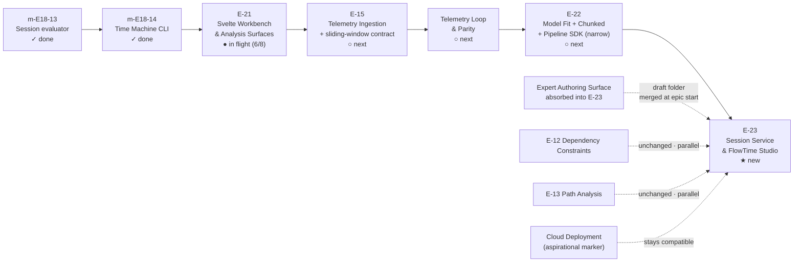
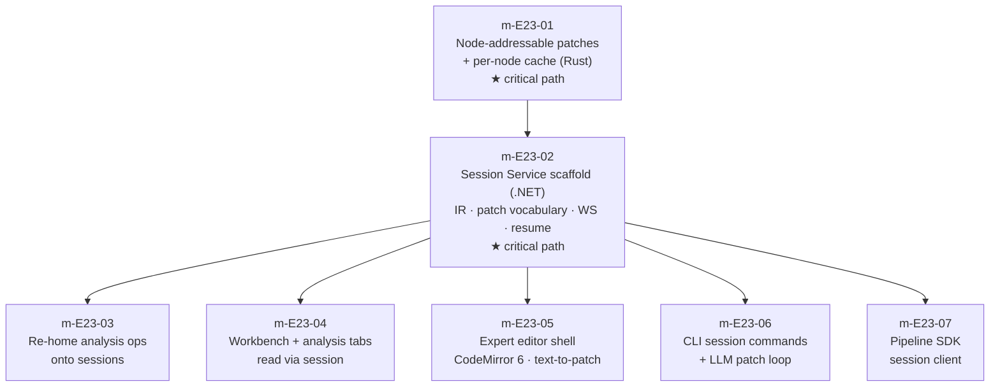

# FlowTime Studio — Roadmap Reshuffle Plan

**Status:** proposal
**Date:** 2026-04-24
**Scope:** an initial plan for reshuffling the FlowTime roadmap to land Studio
on the optimal critical path, and for the downstream impact on epics already
in flight, drafted, or aspirational

**Related artifacts:**

- Architecture doc (the thing being sequenced): [docs/research/flowtime-studio-architecture.md](./flowtime-studio-architecture.md)
- Expert authoring surface (to be absorbed): [docs/research/expert-authoring-surface.md](./expert-authoring-surface.md)
- Current roadmap: [ROADMAP.md](../../ROADMAP.md)
- Supplemental epic index: [work/epics/epic-roadmap.md](../../work/epics/epic-roadmap.md)

## Purpose

This plan does **not** commit any sequence. It proposes:

- **when** Studio should land relative to E-15, Telemetry Loop & Parity, and
  E-22
- **what** it absorbs, narrows, or re-scopes in already-drafted or in-flight
  epics
- **what** changes immediately (this week) vs what waits for a commitment
  gate
- **what** decision records should be captured before any work starts

The actual roadmap file edits (`ROADMAP.md`, `work/epics/epic-roadmap.md`,
`CLAUDE.md` Current Work) happen only once the commitment gate is passed.

## The Commitment Gate

This plan becomes the official sequencing plan only after:

1. human review of both research docs
2. explicit "yes, sequence Studio as E-23" decision logged in
   `work/decisions.md`
3. E-22's planning finalizes with the narrow-SDK scope (so Studio isn't
   racing a broader E-22 shape)
4. E-15's first-dataset milestone has a draft that names the
   sliding-window-with-snapshot-id source contract

Until then, this plan is a proposal. Nothing in it changes how current work
proceeds.

## Bottom-Line Proposed Sequence

**Studio is the fourth major landing after E-21.** It sits where the
roadmap's "UI Paradigm Epics" draft section currently sits, and it absorbs
several of those drafts into one architecturally coherent epic.

## Why This Sequence

### Why Studio lands after E-22 and not before

- **E-22's Pipeline SDK is a prerequisite-shaped sibling.** Pipeline SDK is
  the embeddable "run this model" surface. Studio's Session Service is the
  long-lived interactive sibling. Landing Pipeline SDK first as a narrow
  batch wrapper lets Studio embed it cleanly. Landing Studio first forces
  Pipeline SDK to be carved out of Studio later.
- **Model fit wants to run in a session.** If fit ships before Studio, it
  ships as one-shot `POST /v1/fit` and Studio re-homes it later. That is
  actually the correct call — fit's semantics are worth nailing down before
  they get bound to a live session, and the re-home is cheap (convenience
  wrapper).
- **E-15's telemetry work gives Studio something to bind to.** A live
  session without a telemetry binding is a toy. E-15's `ITelemetrySource`
  already supports frozen bundles and CSV (from m-E18-08); Studio needs it
  to also describe a sliding-window-with-snapshot-id contract. That
  interface extension is small and belongs in E-15, not Studio.
- **Parity harness is a Studio input, not a Studio blocker.** Studio can
  ship against frozen windows first; the parity harness validates Studio's
  live-window story later.

### Why Studio lands before the "UI Paradigm Epics" drafts

The ROADMAP.md currently lists three draft epics under "UI Paradigm Epics":
UI Workbench & Topology Refinement, UI Analytical Views, UI Question-Driven
Interface. The first two are substantially absorbed by E-21 already. The
third (Question-Driven) assumes a live session substrate that Studio
provides.

Landing Studio before starting Question-Driven means Question-Driven's
provenance story becomes "which patches produced this answer" rather than
"which batch run produced this answer" — a strictly better shape. Landing
Question-Driven first would either require its own session-like runtime or
would ship without provenance that can survive exploration.

### Why Studio does not displace E-15 or E-22

E-15 is the critical path for the client-telemetry vision. Fit and chunked
evaluation are the last pieces of the "FlowTime as callable function" arc.
Jumping ahead to Studio before telemetry lands would mean shipping Studio
bound to synthetic data only — a useful demo, but it doesn't solve the real
problem (what-if over a client's actual telemetry) that Studio's live
sessions are most valuable for.

## Impact On Epics Currently In Flight Or Drafted

### E-21 Svelte Workbench & Analysis Surfaces — **finish as scoped**

**Current state:** m-E21-06 Heatmap View in flight. m-E21-07 Validation
Surface and m-E21-08 Polish remaining.

**Change:** none to milestone scope.

**One note to add to m-E21-08 Polish spec:** "All persisted UI state keys
on stable node IDs. No positional keys, no source-span keys, no list-index
keys." This is already the pattern in m-E21-06 (`heatmap-view` keys by node
ID), so it is a "don't regress" note rather than new work.

**When Studio lands,** the workbench becomes a view over a session instead
of a view over a run bundle. That is a small adapter, not a rewrite —
provided node identity stays stable, which is the keystone commitment above.

### E-22 Model Fit + Chunked Evaluation + Pipeline SDK — **narrow the SDK scope**

**Current state:** drafted, planning, 3 milestones.

**Changes:**

- **m-E22-01 Model Fit** — land as `POST /v1/fit` (one-shot, same shape as
  sweep/sensitivity/goal-seek/optimize). Flag in the tracking doc that
  Studio re-homes fit as a session-scoped op in E-23 (convenience wrapper
  kept; no breaking change).
- **m-E22-02 Chunked Evaluation** — unchanged. Chunked eval is an engine
  capability that Studio consumes; Rust `chunk_step` protocol and `POST
  /v1/chunked-eval` stand on their own.
- **m-E22-03 FlowTime.Pipeline SDK** — **pin to narrow scope.** Wraps the
  one-shot endpoints (`run`, `sweep`, `sensitivity`, `goal-seek`,
  `optimize`, `fit`, `validate`). No session client in E-22. Session
  support added as a Studio milestone.

**Rationale:** Pipeline SDK is valuable on its own for batch/CI/CLI
integrations that don't need a session. Session support is additive and
lands in Studio without blocking E-22's critical path.

### Expert Authoring Surface draft — **absorbed into E-23**

**Current state:** drafted in `work/epics/unplanned/expert-authoring-surface/`
with session-patch-model reference.

**Change:** absorb, do not ship as a separate epic.

**Rationale:** The expert-authoring doc is a UI proposal. Studio's Session
Service is the infrastructure that makes it implementable. Keeping them as
two epics creates an ordering hazard (which lands first? how do they share
state?) that the Studio architecture resolves by unifying them:

- E-23 delivers the Session Service, IR, patch vocabulary, WS protocol,
  Rust cache extensions.
- E-23 delivers the expert editor shell as one milestone (planned:
  m-E23-05).
- `work/epics/unplanned/expert-authoring-surface/` moves to
  `work/epics/E-23-session-service-and-studio/reference/` at epic start
  (or its reference documents become inline references).

### E-15 Telemetry Ingestion — **small scope addition, worth naming now**

**Current state:** next after E-21. Targets Gold Builder → Graph Builder →
first dataset path.

**Change:** add one milestone (or extend an existing one) to define the
**sliding-window-with-snapshot-id** variant of `ITelemetrySource`.

**Scope of addition:**

- interface shape for sliding windows with snapshot identity
- one frozen-window default implementation (may already exist via
  `CanonicalBundleSource`)
- one test source that demonstrates snapshot-id semantics
- documentation of the "live can describe the user experience, but the
  engine still needs a stable evaluation input" contract

**Out of scope for E-15:** actual streaming adapters (Prometheus, OTEL,
EventHubs). Those remain deferred per current gap tracking.

**Rationale:** Studio's live-session binding depends on this contract
existing. It is a small interface extension, not a new feature, and it
belongs to the telemetry epic not to Studio.

### Telemetry Loop & Parity — **unchanged**

**Current state:** sequenced after E-15. Parity harness between baseline
synthetic and telemetry replay.

**Change:** none. Becomes a Studio input, not a Studio dependency. "Run
parity inside a session" becomes a natural feature after Studio lands, but
it is not a prerequisite.

### E-17 Interactive What-If Mode — **re-homed onto session substrate**

**Current state:** complete, merged to main 2026-04-12.

**Change:** no change while Studio is in flight. When Studio lands:

- the WebSocket bridge migrates to the session WebSocket
- the parameter panel becomes a patch emitter rather than a parameter-set
  emitter
- the topology heatmap consumes per-node cached values rather than
  per-request recomputed values

This is adapter work, not rewrite. E-17's scope stays delivered; its
implementation migrates to sit on top of the Studio substrate as one of
Studio's adapter milestones.

### E-12 Dependency Constraints, E-13 Path Analysis — **unchanged**

Engine features. Can land before or after Studio. No interaction.

### "UI Paradigm Epics" drafts — **review and partially absorb**

**Current state:** three draft epics listed in ROADMAP.md (UI Workbench &
Topology Refinement, UI Analytical Views, UI Question-Driven Interface).

**Change proposals:**

- **UI Workbench & Topology Refinement** — substantially absorbed by E-21
  already. Close the draft or explicitly mark its remaining scope (if any)
  as "post-E-21 polish." Not a separate epic.
- **UI Analytical Views** — E-14 was already absorbed here; E-21's analysis
  tabs further absorbed the bulk. Close the draft or mark as completed by
  E-21.
- **UI Question-Driven Interface** — keep as a draft; explicitly note that
  its session substrate is Studio. Sequence after Studio.

**Rationale:** the three drafts were written before E-21 or Studio existed.
E-21 delivered most of what Workbench and Analytical Views proposed.
Question-Driven is a legitimate future epic but depends on Studio.

### E-14 Visualizations — **confirmed absorbed**

Already noted in ROADMAP.md as absorbed into UI Analytical Views, which is
itself largely delivered by E-21. No further action.

### Cloud Deployment & Data Pipeline Integration — **stays aspirational**

**Current state:** marker section in ROADMAP.md. Not scheduled.

**Change:** none. Studio's session service is in-process for v1. A cloud
deployment of Studio would be "long-running interactive service" in the
ROADMAP.md three-shape taxonomy, which is the shape that was already
anticipated. Studio does not constrain cloud work; cloud work does not
constrain Studio.

**One explicit alignment to add to the marker section:** "Long-running
interactive service shape is the deployment path for FlowTime Studio's
Session Service."

## Proposed E-23 Shape

Working name: **E-23 Session Service & FlowTime Studio**. Folder:
`work/epics/E-23-session-service-and-studio/`.

**Goal:** deliver a long-lived session substrate with stable node identity,
per-node cached values, and a structured patch vocabulary, and one expert
authoring shell that consumes it. All existing and future shells (DAG,
workbench, analysis, CLI, TUI, AI) converge on one session protocol.

**Depends on:** E-22 (narrow Pipeline SDK), E-15 (sliding-window source
contract), m-E18-13 (session evaluator — shipped).

**Milestones (proposed; rough ordering):**

- **m-E23-01 Node-addressable patches + per-node cache (Rust).** Extension
  of m-E18-13 session protocol. `patch_node`, generation counters,
  `get_node_value`, `get_node_ports`. Pure engine work; zero UI. **This
  milestone is the unlock; everything else depends on it.**
- **m-E23-02 Session Service scaffold (.NET).** `POST /v1/sessions`, WS
  `/v1/sessions/{id}`, Session IR, patch vocabulary v1, resume snapshots.
  Sessions in-memory with best-effort disk snapshots. No shell changes.
- **m-E23-03 Re-home analysis ops onto sessions.**
  Sweep/sensitivity/goal-seek/optimize/fit run against an existing session
  and reuse its cache. One-shot REST endpoints retained as convenience
  wrappers. Large speedup for E-21 analysis tabs on heavy sweeps.
- **m-E23-04 Workbench + analysis tabs on session.** E-21 surfaces switch
  from "load a run bundle" to "open a session bound to a run or a model."
  Adapter work if E-21 preserved stable node IDs in view state.
- **m-E23-05 Expert editor shell.** CodeMirror 6, text-to-patch diffing,
  compact-notation rewriting, inline lenses bound to node values. This is
  where the expert-authoring-surface draft lands.
- **m-E23-06 CLI session commands + LLM patch loop.** `flowtime session
  create/attach/patch/analysis/export/close`. Documented AI protocol. No
  new backend — same endpoints, different client.
- **m-E23-07 Pipeline SDK session client.** Extends E-22's narrow SDK with
  a session client for long-running pipeline uses.

**Critical path:** m-E23-01 → m-E23-02. Everything else is additive and
independently shippable. m-E23-03 and m-E23-04 can run in parallel once
m-E23-02 lands.

**Net new scope on top of already-shipped or in-flight work:**

1. Node-identity + per-node cache extension to the Rust session protocol
2. Session Service scaffold in .NET (IR, patch vocabulary, WS, resume)
3. Re-home of analysis ops onto sessions for cache reuse
4. Expert editor shell with text-to-patch and inline lenses
5. CLI session commands and documented AI patch loop

Everything else is adapter work on existing surfaces.

## Decision Records To Capture

Before any Studio work starts, these decisions should be logged in
`work/decisions.md`:

- **D-2026-04-??-???: FlowTime Studio as E-23, sequenced after E-22.**
  Records the three points that make this an epic and not just an E-22
  addition: (1) node-addressable patch protocol is a new Rust surface, (2)
  long-lived sessions in .NET are a new service pattern, (3) the expert
  editor shell is a new UX surface. Splitting from E-22 keeps Pipeline SDK
  narrow and shippable.
- **D-2026-04-??-???: Node identity is the Studio keystone.** All shells
  address nodes by stable session-scoped ID. Source spans, lens requests,
  DAG visuals, AI patches, and workbench view state key on node IDs.
  Non-negotiable in m-E23-01.
- **D-2026-04-??-???: Canonical YAML remains authoritative.** Session IR is
  a runtime-only layer. Lenses, pins, tags, and layout never export. No
  Enso-style "graph is the file" coupling.
- **D-2026-04-??-???: One-shot endpoints remain as convenience wrappers.**
  No breaking change. Pipeline and CLI callers that do not need a session
  keep working unchanged.
- **D-2026-04-??-???: Model Fit lands as one-shot in E-22, re-homes to
  session op in E-23.** Calls out the intentional rework so it is not
  surprise scope in E-23.
- **D-2026-04-??-???: E-15 adds sliding-window-with-snapshot-id source
  contract.** Not a streaming adapter; an interface extension with one test
  source. Belongs to E-15, not Studio.

## Files To Update (At Commitment)

Only after the commitment gate. Not now.

- **`ROADMAP.md`**
  - add E-23 section between E-22 and the "UI Paradigm Epics" draft
    section
  - update the three-phase thesis note to reflect that Studio is the
    architectural substrate for phases 2 and 3
  - update the Dependency Graph at the bottom
  - mark the "UI Paradigm Epics" draft section with current status of each
    draft (absorbed / depends on Studio / closed)
  - add one sentence to the Cloud Deployment marker tying "long-running
    interactive service" to the Studio Session Service
- **`work/epics/epic-roadmap.md`**
  - add E-23 with folder, goal, key milestones, and dependency arrows
  - note Pipeline SDK scope is pinned narrow in E-22
  - note fit re-home from E-22 to E-23
- **`CLAUDE.md` Current Work**
  - add E-23 entry (status: planning) once the draft spec exists
  - mark the expert-authoring-surface draft as absorbed
- **`work/gaps.md`**
  - move "expert authoring surface" off the unplanned list if it was there
  - add any Studio-adjacent items that don't make the v1 scope (e.g.,
    multi-tenant auth, cross-session analysis)
- **`work/epics/E-22-model-fit-chunked-evaluation/spec.md`**
  - pin m-E22-03 Pipeline SDK to narrow scope
  - flag m-E22-01 fit as "session-rehomes in E-23"
- **`work/epics/E-15-telemetry-ingestion/spec.md`**
  - add or extend a milestone with the sliding-window source contract
- **`work/epics/E-21-svelte-workbench-and-analysis/m-E21-08-*.md`** (when
  that milestone spec is drafted)
  - add the "persisted view state keys on stable node IDs" audit item
- **`work/epics/unplanned/expert-authoring-surface/`**
  - move to `work/epics/E-23-session-service-and-studio/reference/` at
    epic start, or delete and inline the references

## What Changes Immediately Vs What Waits

### Immediate (this week, regardless of commitment gate)

- both research docs are drafted (this file + the architecture doc)
- m-E21-06 Heatmap View continues to completion on its current spec — **no
  change**
- E-21's remaining milestones (m-E21-07, m-E21-08) continue to be planned
  on their current scope — **no change**

### On commitment (after human approval)

- decision records above get logged
- ROADMAP.md, epic-roadmap.md, CLAUDE.md get the edits listed
- E-23 folder created with spec drafted (architecture doc becomes epic
  reference; this plan becomes epic sequencing reference)
- E-22 spec pinned to narrow Pipeline SDK
- E-15 spec extended with sliding-window contract milestone

### Deferred until E-22 wraps

- E-23 work starts
- expert-authoring-surface folder migration
- E-17 re-home onto session substrate (post-Studio adapter work)

### Not scheduled

- Cloud Deployment work (stays aspirational; Studio stays compatible)
- Multi-tenant session auth (out of Studio v1)
- Streaming telemetry adapters (stays in gap tracking)

## Risks And Mitigations

- **Risk: Studio balloons in scope because it touches every surface.**
  Mitigation: m-E23-01 + m-E23-02 are the only milestones that must land
  together. Everything else is adapter work on existing surfaces and is
  independently shippable.
- **Risk: node-identity commitment leaks into canonical model.** Mitigation:
  IR has node IDs; canonical YAML does not, except via an optional lightweight
  identity manifest used for re-import. Lenses, pins, layout never export.
- **Risk: per-node cache invariants are subtle and easy to get wrong.**
  Mitigation: generation counters, property-based tests against
  whole-graph recomputation, explicit invariant "cached result ==
  recomputed result" as a test oracle in m-E23-01.
- **Risk: Pipeline SDK gets carved up when Studio re-homes fit.**
  Mitigation: E-22's narrow SDK scope means fit is a thin wrapper; Studio
  adds a session client alongside rather than reshaping the narrow wrapper.
- **Risk: E-21 view state ships with positional keys and we pay for it at
  Studio time.** Mitigation: m-E21-08 Polish audit item; caught early, cheap
  to fix.

## Recommendation

**Approve this plan as the sequencing direction. Do not edit any roadmap
files yet.** Let the plan sit with the architecture doc for review. Once
approved, capture the decision records, then do the roadmap edits in a
single coordinated pass (per the milestone-status-sync rule — don't leave
one surface inconsistent with another).

Starting work on m-E23-01 waits until E-22 wraps. In the meantime, the
sliding-window source contract addition to E-15 is the earliest piece of
Studio-prerequisite work that lands naturally inside an already-planned
epic.
