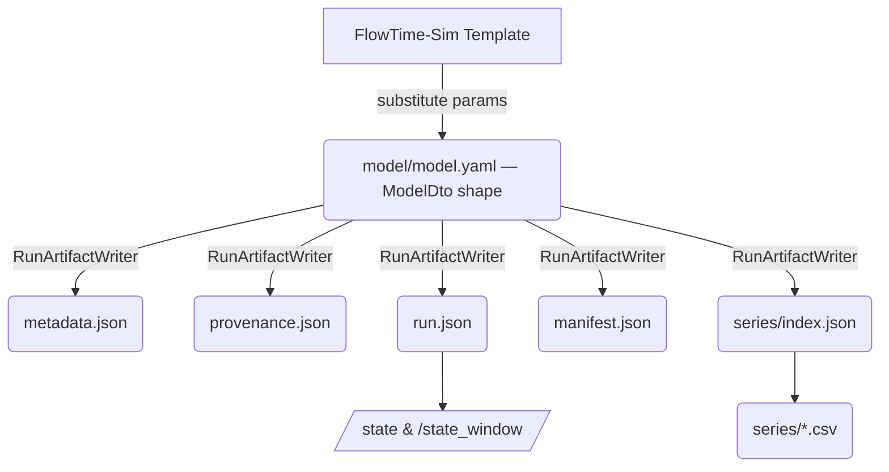

# FlowTime Schema Reference

This index lists the active schemas maintained by FlowTime Engine and FlowTime-Sim.

## One model, one schema, one validator

After E-24 Schema Alignment (m-E24-02 / m-E24-03), FlowTime has a single post-substitution model representation. FlowTime-Sim builds it directly; FlowTime Engine accepts and parses the same shape. The C# source of truth is [`ModelDto`](../../src/FlowTime.Contracts/Dtos/ModelDtos.cs); the structural contract is [`model.schema.yaml`](model.schema.yaml); the runtime validator is `ModelSchemaValidator` in `src/FlowTime.Core/Models/`.

`Template` (the authoring-time pre-substitution shape used by FlowTime-Sim) is a separate contract under [`template.schema.json`](template.schema.json).

## Engine Schemas

| Schema | File | Notes |
|--------|------|-------|
| Model definition | [model.schema.yaml](model.schema.yaml) / [model.schema.md](model.schema.md) | Canonical post-substitution model both Sim emits and Engine consumes. Source of truth for the field set is `ModelDto` (`src/FlowTime.Contracts/Dtos/ModelDtos.cs`). camelCase throughout (including provenance). |
| Manifest | [manifest.schema.json](manifest.schema.json) | Run metadata (hashes, RNG, provenance ref). |
| Telemetry manifest | [telemetry-manifest.schema.json](telemetry-manifest.schema.json) | Capture bundles (grid info, file inventory, provenance checks, class metadata). |
| Series index | [series-index.schema.json](series-index.schema.json) | Per-series metadata (id, component, hash). |
| Time-travel responses | [time-travel-state.schema.json](time-travel-state.schema.json) | `/state` and `/state_window` JSON envelope (supports optional `seriesMetadata`). |
| Legacy input | [engine-input.schema.json](engine-input.schema.json) | Deprecated; kept for backward-compatibility tests. |

### Quick reference — model schema snippet

```yaml
schemaVersion: 1
grid:
  bins: 24
  binSize: 5
  binUnit: minutes
  start: "2025-01-01T00:00:00Z"
nodes:
  - id: demand
    kind: const
    values: [120, 118, 122]
topology:
  nodes:
    - id: OrderService
      semantics:
        arrivals: "file:OrderService_arrivals.csv"
        served: "file:OrderService_served.csv"
provenance:
  generator: flowtime-sim
  generatedAt: "2026-04-25T12:00:00Z"
  templateId: order-system
  templateVersion: "1.0"
  mode: simulation
  modelId: "sha256:0123456789abcdef0123456789abcdef0123456789abcdef0123456789abcdef"
  parameters:
    bins: 24
    binSize: 5
```

### Schema validation

- Engine responses are validated by integration tests (`StateEndpointTests`, `StateResponseSchemaTests`).
- Model intake is validated by `ModelSchemaValidator` against `model.schema.yaml`. The canary `TemplateWarningSurveyTests` runs every shipped template through `TimeMachineValidator` at the `Analyse` tier.
- Canonical run artefacts written by `RunArtifactWriter` are structured as:



## FlowTime-Sim Schemas

| Schema | File | Notes |
|--------|------|-------|
| Template definition | [template.schema.json](template.schema.json) | Authoring-time template (metadata, parameters, grid, nodes, outputs). Validated by `TemplateSchemaValidator`. |
| Template generation | [template-schema.md](template-schema.md) | Reference copy of the FlowTime-Sim template schema (window, topology, parameters). |

After parameter substitution, FlowTime-Sim emits the unified `ModelDto` shape consumed by the Engine. Sim's provenance output feeds directly into the embedded `provenance:` block on the emitted model and into the run artefact `provenance.json`.

- Array parameters declare element type via `arrayOf` (`double` default; `int` supported). Length and per-element min/max constraints are enforced when arrays drive const nodes.

## Error handling

Invalid model YAML submitted to Engine returns `400 Bad Request`, for example:

```json
{
  "error": "Node 'served' references undefined node 'demand'"
}
```

## Historical note

Before E-24, two C# types described the post-substitution model: `SimModelArtifact` on the Sim side and `ModelDefinition` on the Engine side. The split was accidental drift introduced in October 2025; there was never a designed type boundary. m-E24-02 deleted `SimModelArtifact` (and its six satellite types) and routed Sim's emitter through `ModelDto` directly. m-E24-03 rewrote `model.schema.yaml` to describe the unified type with camelCase provenance. Existing stored bundles from before m-E24-02 are obsolete (forward-only — no migration). For full design rationale see `work/epics/E-24-schema-alignment/spec.md`.

## See also

- [Run Provenance Architecture](../architecture/run-provenance.md)
- [Template Schema Reference](template-schema.md)
- [API Reference](/docs/api/)
