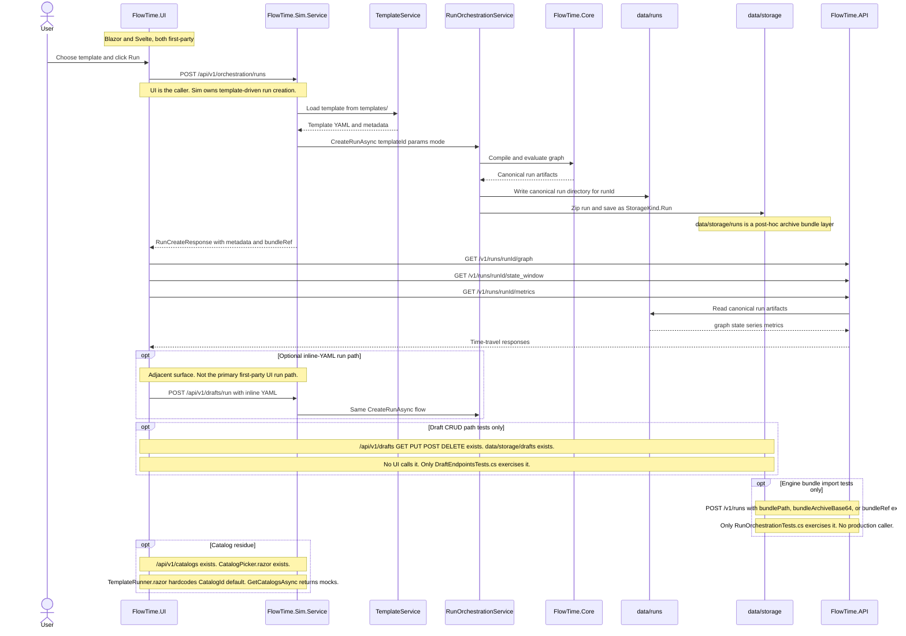
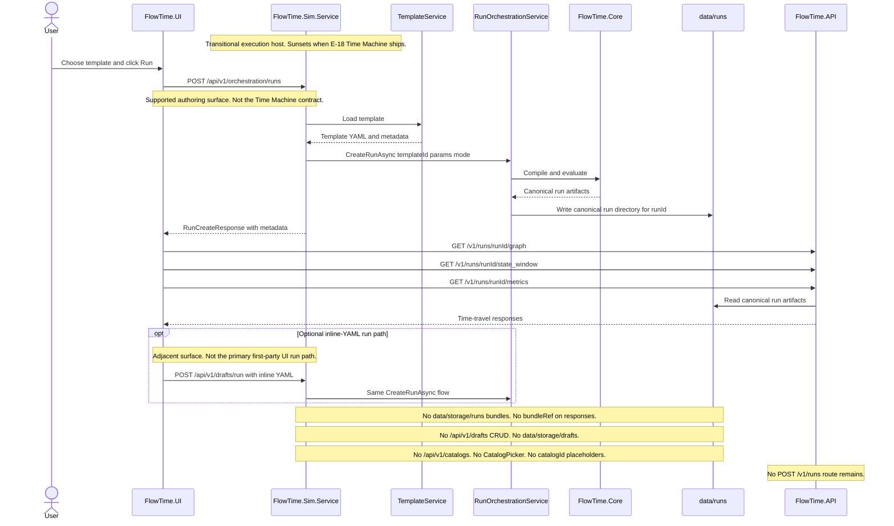
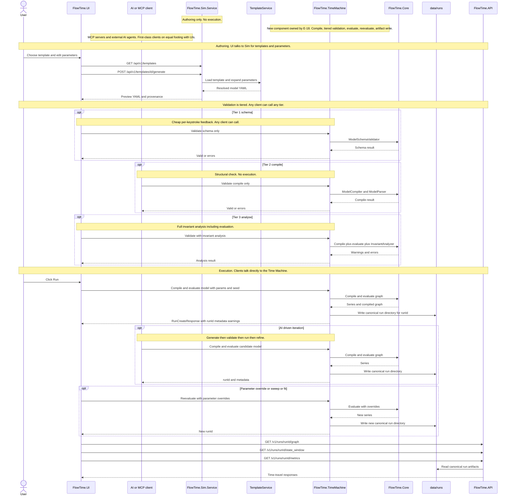

## Goal

Produce the authoritative inventory, boundary ADR, and retention/deletion decisions that govern the rest of E-19. When this milestone closes, every first-party compatibility and legacy seam outside E-16's analytical boundary has an explicit classification (supported / transitional / delete / archive), an owning downstream milestone, and a grep guard specification. No code is deleted in this milestone; decisions are locked so M-025, M-026, and M-027 can execute forward-only without re-litigating scope.

## Context

E-16 purified the analytical truth and consumer fact surfaces. Everything else — Sim authoring/orchestration endpoints, server-side drafts, archived run bundles, Engine bundle import, runtime catalogs, deprecated schema/template/example material, and Blazor compatibility wrappers — is still present in the tree. None of it is analytical, so folding it back into E-16 is wrong. But leaving it unowned makes temporary compatibility shims harden into a de facto product support promise.

This milestone does three things:

1. **Inventories** every in-scope surface exhaustively so later milestones inherit a single source of truth.
2. **Decides** the six open retention/responsibility questions the epic flagged (A1–A6), plus the responsibility-clarification framing for Engine/Core/Sim/Time Machine.
3. **Publishes** the boundary ADR (extended) and a new supported-surfaces matrix, both as durable documents that later milestones cite instead of rediscovering.

The spec also records the shared framing that governs every downstream E-19 milestone: no project renames in E-19, `FlowTime.TimeMachine` is a new separate component owned by E-18, `FlowTime.Core` stays pure, `FlowTime.API` stays as the query/operator surface over canonical runs, and Sim owns authoring (with transitional execution hosting until the Time Machine ships).

## Decisions Locked By This Milestone

These are recorded here as the authoritative source. `work/decisions.md` gets corresponding short entries pointing at this spec.

### Shared Framing

1. **No project renames in E-19.** `FlowTime.Core`, `FlowTime.Generator`, `FlowTime.API`, and `FlowTime.Sim.*` keep their names. The boundary ADR documents what each actually does.
2. **`FlowTime.Core` is the evaluation engine.** Pure library. `ModelCompiler.Compile` + `ModelParser.ParseModel` + `Graph.Evaluate`, plus the authoritative validators (`ModelSchemaValidator`, `ModelValidator`) and the invariant analyzers. No HTTP, no orchestration, no storage, no client awareness. E-19 does not touch it. **Forward (post-E-18): Core remains pure and unchanged in these invariants.** The Time Machine depends on Core, never the reverse. Core is the library of deterministic operations (the "instruction set"); the Time Machine is the hosted component that composes those operations into first-class callable services. Nothing new gets added to Core that would reintroduce HTTP, orchestration, or client awareness. When the Time Machine needs a capability, it either composes existing Core primitives or — if Core is genuinely missing a pure computational primitive — the primitive is added to Core as a pure library function, not to the Time Machine as a parallel implementation.
3. **`FlowTime.Generator` is today's shared orchestration layer** between `Sim.Service` and `API`. `RunOrchestrationService`, `RunArtifactWriter`, deterministic run ID logic, RNG seeding, and dry-run/plan mode all live here. **During E-19, Generator is unchanged — name, structure, and responsibilities all stay the same.** **Generator's forward fate is decided and scoped to E-18: Path B — extraction and deletion.** Most of Generator's current responsibilities (compile, evaluate, artifact write, run IDs, RNG seeding, dry-run) overlap the Time Machine's scope and cannot coexist with it. In E-18, Generator's execution-pipeline responsibilities are **extracted** into the new `FlowTime.TimeMachine` project, and `FlowTime.Generator` is **deleted** in the same milestone. No "Generator and Time Machine coexist in parallel" window is permitted — this matches the no-coexistence discipline established in E-16. The specific tier 3 analyser binding (`TemplateInvariantAnalyzer` currently in `FlowTime.Sim.Core.Analysis`) is also subject to the E-18 extraction: the invariant rules belong conceptually in Core, with the Time Machine composing them into the tier 3 validation surface. See decision D-032.
4. **`FlowTime.API` is the query/operator surface over canonical run artifacts.** It reads canonical run artifacts and exposes the current read/query and operator endpoints. It does not execute models, and when an obsolete API write path is retired E-19 deletes it outright instead of preserving a 410 or advisory tombstone.
5. **`FlowTime.Sim.Service` hosts authoring and, transitionally, execution.** Templates, parameter UX, provenance are permanent Sim responsibilities. Execution hosting is transitional — it exists in Sim only because no other HTTP host is wired to `FlowTime.Core` today.
6. **The Time Machine (`FlowTime.TimeMachine`) is owned by E-18 and is a new separate component.** Responsibilities: compile, tiered validation (schema / compile / analyse), evaluate, reevaluate, parameter override with stable runtime parameter identity, artifact write. Surfaces: in-process SDK, CLI, optional sidecar protocol. Not analytical primitives, not template authoring, not query/analysis of past runs. The Time Machine does not live inside Sim or API. **Dependency direction: Time Machine → Core, never reverse.** The Time Machine composes Core's pure operations (`ModelSchemaValidator`, `ModelCompiler`, `ModelParser`, `Graph.Evaluate`, invariant analyzers) into first-class callable services with consistent request/response shapes. It never reimplements what Core already does. In the BEAM/JVM framing: Core is the instruction set and execution kernel as a pure library; the Time Machine is the hosted machine that loads programs (compiled graphs), drives them, exposes iteration and reevaluation protocols, and presents a client-agnostic API. Naming rationale: FlowTime's execution component is an abstract machine in the BEAM/JVM sense — instructions (compiled graph), state (time grid plus accumulating series), deterministic stepping through time. "Time Machine" also aligns with the existing Blazor "Time Travel" UI feature that navigates runs the Time Machine produces, and the reevaluation semantics (rewind a compiled model, run it forward with different parameters) are literally time travel.
7. **When the Time Machine ships, Sim's orchestration endpoints are deleted by default.** If a temporary facade is kept at all, it must be justified by a concrete technical migration constraint, documented in the owning E-18 milestone, and treated as a short-lived bridge rather than a supported steady state. That migration is E-18's job. E-19 records the commitment so no new non-UI callers land on Sim orchestration in the meantime.
8. **The Time Machine serves all clients on equal footing.** Sim UI, Blazor UI, Svelte UI, MCP servers, external AI agents, tests, and CI are all first-class callers of Time Machine operations. No client is privileged. In particular, validation (A6) is a client-agnostic operation; MCP servers and AI agents generating candidate models need the same validation contract that UIs need for editor-time feedback.
9. **Telemetry is an adapter concern outside the Time Machine, with one exception.** The Time Machine itself does not contain external-telemetry-format-specific code (no Prometheus, no OTEL, no BPI event log parsing). External-format ingestion lives in adapter projects under `FlowTime.Telemetry.*`. The exception: writing the **canonical bundle** format (defined by E-15's schema, today produced by `TelemetryBundleBuilder` in Generator) is a Time Machine core capability, not a pluggable adapter, because it serves the **telemetry loop** that is fundamental to FlowTime's bootstrap, self-consistency, and AI-iteration use cases. The canonical run directory (`data/runs/<runId>/model/`, `series/`, `run.json`) and the canonical bundle (`model.yaml`, `manifest.json`, `series/`, CSV) are **two distinct artifacts with different purposes** — runs are the in-place clear-text debugging surface, bundles are the portable interchange format — and both are preserved by Path B. The bundle format may evolve independently of the run directory format. **`ITelemetrySource` is introduced** by E-18 m-E18-01b (after the Path B extraction cut in m-E18-01a creates the concrete `CanonicalBundleSource`), with multiple implementations once 01b ships (`CanonicalBundleSource`, `FileCsvSource`, plus future Prometheus/OTEL/event-log adapters under `FlowTime.Telemetry.*` delivered by M-003). **`ITelemetrySink` is explicitly deferred** until a second sink format exists; canonical bundle writing is a concrete Time Machine capability, not behind an interface. The **telemetry loop** (capture → bundle → replay → parity, established vocabulary from `work/epics/telemetry-loop-parity/spec.md`) is a first-class use case with three primary purposes: **specification/bootstrap** (generate target telemetry from a model to define what the real system must emit), **self-consistency testing** (round-trip verification of capture+replay correctness), and **AI iteration / model fitting** (compare model-generated telemetry to real observed telemetry, adjust model, iterate). Path B extracts both Generator's execution code (into the Time Machine) and Generator's telemetry-generation code (`TelemetryBundleBuilder`, `TelemetryCapture`, `CaptureManifestWriter`, `RunArtifactReader`) into the canonical bundle writer and `CanonicalBundleSource`. Existing public surfaces — `POST /telemetry/captures` API and `flowtime telemetry capture` CLI — are re-wired to the new home without changing their contracts. The parity harness itself, drift tolerance rules, and CI gating are not E-18's responsibility; they are owned by the Telemetry Loop & Parity epic.

### A1 — Sim orchestration endpoints

**`/api/v1/orchestration/runs` remains supported as the Sim authoring + transitional execution host for first-party UIs (Blazor and Svelte).** `/api/v1/drafts/run` (inline source only) remains supported as a narrower inline-YAML execution surface.

- `/api/v1/orchestration/runs` is the active first-party UI run path today.
- `/api/v1/drafts/run` is retained for explicit inline-YAML "run this now" flows, not as the default UI orchestration path.
- They are not the Time Machine contract, not the programmable contract, and not an external-integration surface.
- No new non-UI callers during E-19.
- No new responsibilities bolted onto them (no external auth, no batch APIs, no programmatic surfaces).
- Explicit sunset hook to E-18 Time Machine: when the Time Machine ships, these endpoints are deleted by default. A temporary thin facade is allowed only if a concrete technical migration constraint is documented in the owning E-18 milestone.

### A2 — Stored drafts

**Retire stored drafts entirely.** No UI exercises `/api/v1/drafts` CRUD today; the only callers are `DraftEndpointsTests.cs`. Active Blazor and Svelte run flows use `/api/v1/orchestration/runs`; retaining `/api/v1/drafts/run` is only about the inline-source "run this YAML right now" surface, not the default UI orchestration path.

Deletion scope (executed by M-025):
- `/api/v1/drafts` CRUD endpoints: GET, PUT, POST create, DELETE, list
- `StorageKind.Draft` and `data/storage/drafts/` directory
- `draftId` resolution branches in `/api/v1/drafts/validate`, `/api/v1/drafts/generate`, `/api/v1/drafts/run`
- `DraftEndpointsTests.cs` tests for CRUD paths (inline-source tests survive)

Retained: `/api/v1/drafts/run` with `DraftSource.type = "inline"` only. This is the narrow "run this YAML right now" surface. First-party template-driven run creation remains `/api/v1/orchestration/runs`.

If real model versioning is wanted later, it must be designed against compiled-graph identity (E-18 territory), not resurrected drafts.

### A3 — `data/storage/runs` + `bundleRef`

**Delete the ZIP/bundle archive layer.** Sim's post-hoc ZIP write to `data/storage/runs/<runId>` has no production reader; `bundleRef` is consumed only by `RunOrchestrationTests.cs` exercising Engine bundle import.

Deletion scope (executed by M-025):
- `StorageKind.Run` bundle ZIP writes in `RunOrchestrationService.CreateSimulationRunAsync`
- `BundleRef` / `StorageRef` return values on `RunCreateResponse`
- `data/storage/runs/` directory and backend write path for run bundles
- Any Sim-side references to bundle ZIPs

**Explicitly out of scope for deletion:** the canonical run directory layout at `data/runs/<runId>/` (`model/`, `series/`, `run.json`). That layout stays unchanged.

### A4 — Engine `POST /v1/runs` bundle import

**Delete bundle-import branches.** Only `RunOrchestrationTests.cs` exercises them; no UI, CLI, background job, or production workflow depends on Sim-exports-bundle → Engine-imports-bundle. The "loop" is designed but never wired.

Deletion scope (executed by M-025):
- `bundlePath`, `bundleArchiveBase64`, and `BundleRef` branches in `RunOrchestrationEndpoints.cs` `POST /v1/runs`
- `ExtractArchiveAsync` support helpers if unused after deletion
- Bundle-import tests in `RunOrchestrationTests.cs` (forward-only deletion)

Deletion includes the `POST /v1/runs` route itself. No 410-style rejection stub is retained once the bundle-import branches are removed.

If cross-environment run transfer is needed later, it comes back as an E-18 concern (Time Machine runs, programmable execution, portable artifacts) and gets designed properly.

### A5 — Catalogs

**Delete entirely.** `data/catalogs/` is empty. `TemplateServiceImplementations.GetCatalogsAsync` calls `GetMockCatalogsAsync` in both demo and API modes. `TemplateRunner.razor` hardcodes `CatalogId = "default", // No longer using catalogs`. No UI creates or selects a catalog. No tests assert meaningful catalog behavior.

Deletion scope (executed by M-025):
- `/api/v1/catalogs` endpoints (GET, PUT, POST validate) in Sim.Service
- `CatalogService`, `ICatalogService`, mock catalog service implementations
- `CatalogPicker.razor` (Blazor) and any Svelte catalog selector
- `CatalogId = "default"` placeholder callers and the `catalogId` field on request/response DTOs where present
- `data/catalogs/` directory
- Catalog-only tests

If catalogs ever come back, redesign from scratch against a real use case.

### A6 — Validation as a first-class, client-agnostic operation

**Retire the current `POST /api/v1/drafts/validate` endpoint in M-025. Preserve every library piece a future validation operation composes. Record a hard E-18 dependency: the Time Machine must expose tiered validation as a first-class, client-agnostic operation alongside compile, evaluate, reevaluate, parameter override, and artifact write.**

**Principle (recorded in the boundary ADR):** Validation — answering "is this YAML a correct FlowTime model?" — is a first-class, client-agnostic operation. `FlowTime.Core` owns the authoritative answer via `ModelSchemaValidator`, `ModelCompiler`, `ModelParser`, and `InvariantAnalyzer`. Sim UI, Blazor UI, Svelte UI, MCP servers, and external AI agents are all legitimate callers of validation, on equal footing. No single client — including Sim — is a privileged host for the validation operation.

**Context (grounded in code, April 2026):**
- `POST /api/v1/drafts/validate` exists in `src/FlowTime.Sim.Service/Program.cs:540-615`. It calls `TemplateInvariantAnalyzer.Analyze` in `Sim.Core.Analysis`, which internally chains `ModelCompiler.Compile` → `ModelParser.ParseModel` → `RouterAwareGraphEvaluator.Evaluate` → `InvariantAnalyzer.Analyze`. So the endpoint does use Core — but it also executes the full graph, not just schema/compile checking. The name is misleading; it is really "compile + evaluate + analyse, without artifact write."
- No UI (Blazor or Svelte) calls `/api/v1/drafts/validate`. Only `DraftEndpointsTests.cs` exercises it. Same unused-endpoint pattern as stored drafts (A2), bundle archive layer (A3), and Engine bundle import (A4).
- `FlowTime.Core` already exposes cheaper validators that nothing calls: `ModelSchemaValidator` (`src/FlowTime.Core/Models/ModelSchemaValidator.cs:21`) for pure schema checking, and `ModelValidator` (`src/FlowTime.Core/Models/ModelValidator.cs:21`) for schemaVersion/grid/structure checks. Both return `ValidationResult`.
- `TemplateInvariantAnalyzer` is the right *implementation* of the heaviest validation tier, but it lives behind one mislabeled HTTP endpoint on Sim, which is not the right *home* for a client-agnostic operation.

**Deletion scope (executed by M-025):**
- `POST /api/v1/drafts/validate` endpoint handler in `src/FlowTime.Sim.Service/Program.cs:540-615`
- Endpoint-specific tests (forward-only — the inline/draft-source validation path through this endpoint is unused)

**Explicitly preserved (out of scope for deletion now and later):**
- `FlowTime.Core.Models.ModelSchemaValidator` — tier 1 (schema-only) library
- `FlowTime.Core.Models.ModelValidator` — tier 2 adjacent (schemaVersion/grid/structure + legacy field detection) library
- `FlowTime.Core.Compiler.ModelCompiler` and `FlowTime.Core.Models.ModelParser` — tier 2 (compile without execute) library
- `FlowTime.Sim.Core.Analysis.TemplateInvariantAnalyzer` — tier 3 (full invariant analysis including graph eval) library
- `FlowTime.Sim.Core.Analysis.InvariantAnalyzer` — invariant rules themselves

These are the ingredients the future Time Machine validation operation will compose. Deleting the HTTP wrapper does not delete the validation capability.

**Hard dependency on E-18 (recorded in `work/decisions.md` and appended to the E-18 epic spec as an explicit scope item):** the Time Machine must expose **tiered validation**:

- **Tier 1 — schema:** YAML parses, JSON schema validates, class references resolve. Cheap, no compile. Intended for per-keystroke editor feedback and per-iteration AI inner-loop feedback. Backed by `ModelSchemaValidator`.
- **Tier 2 — compile:** Model compiles and parses into a `Graph`. Catches structural errors (topology, dependencies, expression compile). No execution. Backed by `ModelCompiler.Compile` + `ModelParser.ParseModel`.
- **Tier 3 — analyse:** Full invariant analysis. Includes graph evaluation under deterministic conditions. Catches semantic issues that only emerge after evaluation (capacity violations, conservation errors, runtime warnings). Backed by `TemplateInvariantAnalyzer` logic composed into the Time Machine.

All three tiers are callable from the Time Machine's in-process SDK, CLI, and sidecar protocol, with consistent request/response shapes. Clients: Sim UI, Blazor UI, Svelte UI, MCP servers, external AI agents, tests, CI. No client is privileged.

This is not optional for E-18. Validation and compile-only are natural siblings of compile-then-evaluate; leaving them out forces every client that needs "just check this" to pay the full evaluate cost, which breaks AI inner-loop performance and makes editor-time UX expensive.

**Retained unchanged in E-19:** `/api/v1/templates/{id}/generate` and `/api/v1/drafts/generate` (Sim). These are template authoring surfaces that validate as a *side effect* of materialising the model. They are not replacements for the first-class validation operation; they stay scoped to "give me the expanded model for this template and these parameters."

### Blazor / Svelte Support Policy (principles-level)

1. Blazor remains a supported first-party UI for debugging, operator workflows, and as a plan-B to Svelte. No retirement as a cleanup goal.
2. **Feature parity between Blazor and Svelte is not a goal.** Svelte is intentionally behind Blazor. Each UI carries only the features it actually has; neither is blocked waiting for the other.
3. Both UIs consume current Engine and Sim contracts. Shared contract changes (endpoints, DTOs, schemas) keep both UIs compiling and functional, but "functional" does not mean "featurally equivalent."
4. Blazor proceeds with planned deprecations and removals on its own track. Features Blazor is removing do not need to be built in Svelte first, and Svelte is not required to inherit them.
5. No stale compatibility wrappers, duplicate endpoint probes, or local metrics/state reconstruction where canonical endpoints exist — in either UI.
6. Neither UI carries demo/template generation or schema shapes that are deprecated on the shared contract surface.
7. Blazor-specific workflows (operator/debugging tools that only exist in Blazor) are supported as long as they call current contracts.

The inventory table (AC 3) will naturally show asymmetry: Blazor rows will include "deprecated, scheduled for removal" entries that have no Svelte counterpart. That is expected, not a gap.

## Acceptance Criteria

1. **Boundary ADR extended.** `docs/architecture/template-draft-model-run-bundle-boundary.md` contains a new "Responsibility Clarification" section (Core = evaluation library, Generator = orchestrator, API = query/operator surface over canonical runs, Sim = authoring + transitional execution host, Time Machine = new E-18 component) and three Mermaid sequence diagrams labelled **Current**, **Transitional (end of E-19)**, and **Target (post-E-18)**. The Target diagram shows the Time Machine as a distinct participant with both UI and AI/MCP clients as equal callers of tiered validation and execution operations. Diagrams correctly distinguish canonical run directory (`data/runs/<runId>/`) from bundle ZIP (`data/storage/runs/<runId>`). The ADR also records the A6 principle that validation is a first-class client-agnostic operation owned by Core and surfaced through the Time Machine.

2. **Supported-surfaces matrix published.** New file `docs/architecture/supported-surfaces.md` exists and contains the exhaustive inventory table (see AC 3), the Blazor/Svelte support policy verbatim from this spec, and the shared framing (no renames, Time Machine ownership by E-18, Core purity, API identity, Sim responsibilities, no privileged validation client).

3. **Exhaustive inventory table populated.** A single table in `supported-surfaces.md` covers every in-scope surface element with these columns:

   | Surface | Element | Current status | Decision | Target state | Owning milestone | Grep guard |

   Populated by systematic sweep of:
   - Every route in `src/FlowTime.API/Endpoints/*.cs`
   - Every route in `src/FlowTime.Sim.Service/Program.cs` and `src/FlowTime.Sim.Service/Extensions/*EndpointExtensions.cs`
   - Every HTTP call site in `src/FlowTime.UI/Services/*` and the Svelte UI equivalents (`ui/src/lib/api/*` or current path)
   - Every public DTO in `src/FlowTime.Contracts`
   - Every JSON/YAML schema file tracked in the repo
   - Every template under the active Sim template directory
   - Every example under `docs/examples/` (or equivalent current-surface example location)
   - Every `docs/` page that documents a contract on a current surface

   Every row with `Decision = delete` or `Decision = archive` has an owning downstream milestone (M-025, M-026, or M-027) and a grep guard specification. Every row with `Decision = supported` has a one-line rationale. Rows where the decision is still unclear are listed as explicit open questions at the bottom of the document, not silently marked supported.

4. **A1–A6 decisions are cited, not reinvented, in the inventory.** Every orchestration-endpoint, draft, bundle, import, catalog, and validation row in the inventory links to the corresponding decision section of this spec (or to `work/decisions.md` entries derived from it) rather than reargued inline.

5. **`work/decisions.md` updated.** Short entries exist for: the shared framing (no renames, Time Machine ownership by E-18), A1, A2, A3, A4, A5, A6, the Time Machine naming decision, and the Blazor/Svelte support policy. Each entry points at this milestone spec and/or the supported-surfaces doc for detail.

6. **E-18 epic spec updated with the validation requirement and Time Machine naming.** `work/epics/E-18-headless-pipeline-and-optimization/spec.md` (directory path preserved for historical stability) is updated in content to title the epic `E-18 Time Machine`, gains an explicit scope item for tiered validation (schema / compile / analyse) as a first-class operation alongside compile/evaluate/reevaluate/parameter-override/artifact-write with the client list (Sim UI, Blazor UI, Svelte UI, MCP servers, external AI agents, tests, CI) and the "no privileged client" principle, and has body references from "Headless" / `FlowTime.Headless` updated to "Time Machine" / `FlowTime.TimeMachine`. The same wrap pass also syncs `ROADMAP.md`, `work/epics/epic-roadmap.md`, and `CLAUDE.md` to the new naming and M-024 status.

7. **`CLAUDE.md` "Current Work" section updated.** E-19 status reflects that M-024 is complete (when the milestone closes) and names M-025 as the next milestone, consistent with the status-sync discipline in the repo's project rules.

8. **Epic status surfaces reconciled.** `work/epics/E-19-surface-alignment-and-compatibility-cleanup/spec.md` milestone table, `ROADMAP.md`, and `work/epics/epic-roadmap.md` all reflect M-024 status in a single pass at wrap time.

9. **Tracking doc maintained.** `work/epics/E-19-surface-alignment-and-compatibility-cleanup/m-E19-01-supported-surface-inventory-tracking.md` exists and is updated after each AC is satisfied.

10. **No code deletion in this milestone.** The inventory names what will be deleted and in which downstream milestone, but no endpoint, DTO, UI client, schema, template, example, or doc is deleted as part of M-024 itself. If the sweep discovers something obviously and trivially dead that cannot wait, it is logged in `work/gaps.md` with a target milestone rather than removed here.

## Guards / DO NOT

- **DO NOT** delete any code in this milestone. M-024 is a decision and documentation milestone. Every deletion is an AC of a downstream milestone with an explicit grep guard.
- **DO NOT** rename `FlowTime.Core`, `FlowTime.Generator`, `FlowTime.API`, or `FlowTime.Sim.*`. The shared framing explicitly disallows renames in E-19.
- **DO NOT** design the Time Machine component in this milestone. The Time Machine is E-18's responsibility. M-024 only records the commitment, the sunset hook, and the tiered-validation scope requirement (A6).
- **DO NOT** treat the current Sim orchestration path as the future Time Machine contract, in diagrams, ADR text, matrix entries, or decision records.
- **DO NOT** privilege any client (Sim UI, Blazor UI, Svelte UI, MCP, AI agent) in the Time Machine validation or execution contract. The "no privileged client" principle is load-bearing for the AI/MCP use case (A6) and must survive into E-18 design.
- **DO NOT** mark an inventory row `supported` to avoid making a decision. If a row cannot be decided now, it goes into the explicit open-questions section with a named owner, not silently into `supported`.
- **DO NOT** require Svelte feature parity with Blazor as a condition of any decision. Feature parity is explicitly not a goal.
- **DO NOT** fold analytical-series concerns into the inventory. Anything E-16 owns is out of scope.
- **DO NOT** fold E-10 Phase 3 primitives (`p3d`, `p3c`, `p3b`) into the inventory. Those are analytical primitives, not compatibility surfaces.
- **DO NOT** extend the boundary ADR with speculative future architectures beyond the three locked diagrams. The ADR is a snapshot of decided direction, not a design doc for E-18.
- **DO NOT** let the inventory be curated to only the seams already named in the epic. AC 3 requires exhaustive sweep across the listed surfaces.

## Sequence Diagrams (canonical content for the boundary ADR)

These three diagrams are the deliverable for AC 1. They are reproduced here so the spec itself is self-contained; the ADR extension uses them verbatim.

### Current

### Transitional (end of E-19)

### Target (post-E-18)

## Test Strategy

This milestone produces documents and decisions, not code. "Tests" are artifact-existence and consistency checks.

- **ADR artifact check:** `docs/architecture/template-draft-model-run-bundle-boundary.md` contains the Responsibility Clarification section and the three Mermaid diagrams. The Mermaid blocks parse (render via the repo's existing Mermaid pipeline or a lint pass).
- **Supported-surfaces doc check:** `docs/architecture/supported-surfaces.md` exists, contains the inventory table with all required columns, contains the Blazor/Svelte policy, and contains the shared framing.
- **Inventory completeness check:** A short script or manual checklist confirms every endpoint in `src/FlowTime.API/Endpoints/` and `src/FlowTime.Sim.Service/` has a row. Every `src/FlowTime.Contracts` public DTO has a row. Every tracked schema file has a row.
- **Decision-link check:** Every inventory row with `Decision in {delete, archive}` has a non-empty `Owning milestone` and `Grep guard` cell. Every row with `Decision = supported` has a non-empty rationale.
- **`work/decisions.md` consistency check:** Entries for A1–A5, shared framing, and Blazor/Svelte policy exist and point at this spec or `supported-surfaces.md`.
- **Status-sync check:** `CLAUDE.md`, `ROADMAP.md`, `work/epics/epic-roadmap.md`, and the E-19 epic spec milestone table all reflect the same M-024 status at wrap time.
- **Grep guard baselines (specification only, not enforcement):** For each delete-decision row, a candidate `rg` pattern is specified. The patterns are not asserted by this milestone — enforcement is the downstream milestone's AC — but they exist so the downstream milestone inherits them directly.

## Out of Scope

- All code deletion. Executed by M-025 (Sim authoring & runtime boundary), M-026 (schema/template/example retirement), and M-027 (Blazor support alignment).
- Any change to `FlowTime.Core`, `FlowTime.Generator`, or the canonical run directory layout at `data/runs/<runId>/`.
- Designing, implementing, or scoping the Time Machine component beyond recording requirements. The Time Machine is owned by E-18. M-024's only E-18-touching actions are (a) updating the epic title and body references to the new name and (b) appending the tiered-validation scope requirement.
- Renaming any existing project or namespace. `FlowTime.TimeMachine` is a new component added by E-18, not a rename of an existing one. `FlowTime.Core`, `FlowTime.Generator`, `FlowTime.API`, and `FlowTime.Sim.*` keep their names.
- Analytical-series work, warning fact ownership, consumer fact publication, or by-class purity. All owned by E-16 (complete).
- E-10 Phase 3 analytical primitives (`p3d`, `p3c`, `p3b`).
- Svelte feature parity with Blazor. Explicitly disavowed by the Blazor/Svelte policy.
- New compatibility shims, additive backward-compatibility phases, or "temporary" wrappers carried past this milestone.
- Cross-environment run transfer / portable bundle interchange. If ever needed, comes back as an E-18 concern.

## Dependencies

- **E-16** complete. Analytical truth boundary purified, consumer facts published. This milestone depends on E-16 being the authoritative owner of everything analytical so the E-19 scope line is clean.
- **Boundary ADR seed** already landed in commit `ef644d1` (`docs(work): define E19 surface boundary and ADR`). This milestone extends that document, it does not create it.
- No dependency on E-10 Phase 3, E-11 Svelte UI buildout, or E-18 Time Machine execution. M-024 runs as a parallel cleanup-planning lane. E-19's references to the Time Machine are forward commitments; E-19 does not wait for E-18 to ship.

## References

- `work/epics/E-19-surface-alignment-and-compatibility-cleanup/spec.md` — epic scope, constraints, milestone table
- `work/epics/E-16-formula-first-core-purification/spec.md` — prior boundary
- `work/epics/E-18-headless-pipeline-and-optimization/spec.md` — **E-18 Time Machine** epic (directory path preserved historically; content titled *E-18 Time Machine*). Owner of the Time Machine component and the tiered validation scope requirement. Sunset hook target for Sim transitional execution hosting.
- `docs/architecture/template-draft-model-run-bundle-boundary.md` — boundary ADR (extended by this milestone)
- `docs/architecture/supported-surfaces.md` — supported-surfaces matrix (created by this milestone)
- `work/decisions.md` — short decision entries (updated by this milestone)
- `ROADMAP.md`, `work/epics/epic-roadmap.md`, `CLAUDE.md` — status surfaces reconciled at wrap time
