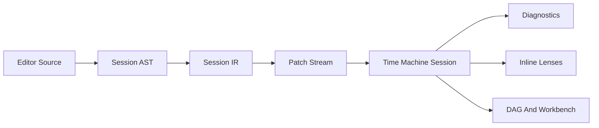

# Reference: Session Patch Vocabulary And Source-Span Model

This document defines the minimal session contract assumed by the expert
authoring surface proposal.

Its job is to give FlowTime one stable internal boundary between:

- the expert editor shell
- direct manipulation in the UI
- AI-assisted edits
- the Time Machine session
- inline lenses and DAG/workbench projections

The guiding rule is simple: **raw authoring text is not the execution
contract**. The execution contract is a structured session IR and a small patch
vocabulary.

## Design Principles

1. **Deterministic**
   The same base session revision plus the same patch yields the same session
   IR and the same evaluation result.

2. **Diffable**
   Patches should be small, serializable, reviewable, and reversible.

3. **Source-aware**
   Runtime results, diagnostics, and lens projections must be able to map back
   to exact authored spans.

4. **Shell-agnostic**
   The outer authoring shell may change over time. The session IR and patch
   model should not depend on one syntax surviving forever.

5. **Separated concerns**
   Semantic model changes and view-only session changes must not be conflated.

## Layers



## Core Concepts

### Document

The editable expert source buffer.

### Statement

A parsed authored unit with a stable `statementId`. A statement owns one or
more semantic edits and one or more source spans.

### Entity

A graph-level object with a stable `entityId`, such as a node, edge, parameter,
binding, or lens request.

### Session IR

The canonical in-memory representation of the expert session after parsing and
normalization, but before export.

### Patch

A small, versioned description of a change against a specific session revision.

### Projection

Any rendered result derived from session evaluation, such as diagnostics,
inline lenses, DAG highlights, or workbench cards.

## Source-Span Model

Plain-English version: a **source span** is just the exact slice of editor text
that produced some parsed statement or semantic object.

If the user writes:

```text
service auth
  .cap(180)
```

then the parser may record that `.cap(180)` came from, for example, line 2,
columns 3-11, and offsets 14-22 in the current document. That recorded range is
the source span.

The **source-span model** is simply the schema FlowTime uses to store those text
ranges and attach them to statements, entities, diagnostics, and inline lens
results.

Without this, the runtime can know that `node.auth.capacity` is overloaded, but
it cannot know where in the editor that fact should be shown.

### Shape

```json
{
  "documentId": "main",
  "documentVersion": 12,
  "startOffset": 84,
  "endOffset": 112,
  "startLine": 4,
  "startColumn": 3,
  "endLine": 4,
  "endColumn": 31
}
```

### Required fields

| Field | Meaning |
|-------|---------|
| `documentId` | logical document inside the session |
| `documentVersion` | editor document version used when the span was recorded |
| `startOffset` / `endOffset` | absolute offsets inside the document |
| `startLine` / `startColumn` | human-facing position for UI rendering |
| `endLine` / `endColumn` | human-facing end position |

### Offset convention

For the editor-facing session layer, offsets and columns should use UTF-16 code
unit indexing. That matches the dominant JavaScript editor/runtime model and
avoids constant translation friction in the browser.

If a later server-side tool wants Unicode scalar indexing, it can normalize at a
separate boundary. The session/editor layer should stay aligned with the live
authoring environment.

### Stability rules

- `statementId` should survive formatting-only edits and statement movement where possible
- `entityId` should survive syntactic rewrites that preserve semantic identity
- a semantic delete destroys the corresponding `entityId`
- a parser-generated replacement statement may keep the same `statementId` if it is the same authored unit after normalization

### Why source spans matter

Without source spans, the surface degenerates into separate tools:

- the editor knows only text
- the runtime knows only entities
- the visuals know only charts

With source spans, FlowTime can do the things the expert surface needs:

- highlight the statement that produced a warning
- show inline lenses beside the owning authored change
- jump from DAG node selection back to the source statement
- show AI proposals in the exact region they affect

## What Is Borrowed Versus What Is FlowTime-Specific

This is **not** invented from scratch, and it is also **not** copied directly
from Strudel.

### Borrowed from Strudel

- the idea that runtime facts should map back to exact authored text spans
- the idea that inline visuals and highlighting should be driven from those spans
- the broader live-session model where the active program/session result can be updated quickly without collapsing the surrounding UI

### Borrowed from general compiler/editor design

- AST nodes carrying source ranges
- source locations as line/column plus absolute offsets
- stable IDs for parsed units where possible
- revisioned patches instead of implicit mutable state

These are standard ideas from compilers, language servers, editors, and source
maps.

### FlowTime-specific design

- splitting semantic patches from session-view patches such as lenses and pinning
- attaching spans not just to syntax nodes, but to graph entities and analytical projections
- using the spans to connect the expert editor, the DAG, the workbench, and AI proposals
- keeping the execution truth in the Time Machine session IR rather than in arbitrary user code
- preserving an explicit export boundary back to the canonical FlowTime model

So the honest answer is: **modeled after Strudel in spirit, adapted through
standard compiler/editor patterns, and then made FlowTime-specific where our
execution model and canonical-truth rules require it.**

## Session Patch Envelope

Every patch should be sent as an envelope tied to a session revision.

```json
{
  "schemaVersion": "ft.session.patch.v1",
  "sessionId": "sess_01J2...",
  "patchId": "patch_01J2...",
  "baseRevision": 41,
  "author": {
    "kind": "user",
    "id": "editor"
  },
  "ops": []
}
```

### Required envelope fields

| Field | Meaning |
|-------|---------|
| `schemaVersion` | patch schema version |
| `sessionId` | target session |
| `patchId` | unique patch identifier |
| `baseRevision` | revision the patch expects to apply against |
| `author.kind` | `user`, `ai`, or `system` |
| `author.id` | optional identity for audit/debugging |
| `ops` | ordered patch operations |

### Revision handling

If `baseRevision` does not match the current session revision, the patch must be
rejected or rebased explicitly. Silent best-effort application is the wrong
default because it makes authored state hard to reason about.

## Minimal Patch Vocabulary

The first cut should keep the vocabulary intentionally small.

### Semantic operations

#### `upsertEntity`

Create or update a semantic entity.

Use for:

- node introduction
- node metadata edits
- parameter creation
- property normalization when one operation owns the whole entity payload

```json
{
  "op": "upsertEntity",
  "entityId": "node.auth",
  "entityKind": "service",
  "statementId": "stmt.auth.1",
  "sourceSpan": {
    "documentId": "main",
    "documentVersion": 12,
    "startOffset": 84,
    "endOffset": 112,
    "startLine": 4,
    "startColumn": 3,
    "endLine": 4,
    "endColumn": 31
  },
  "properties": {
    "label": "auth"
  }
}
```

#### `removeEntity`

Delete a semantic entity and any explicitly scoped owned session metadata.

```json
{
  "op": "removeEntity",
  "entityId": "node.auth"
}
```

#### `upsertConnection`

Create or update a graph connection.

```json
{
  "op": "upsertConnection",
  "connectionId": "edge.auth.checkout",
  "fromEntityId": "node.auth",
  "toEntityId": "node.checkout",
  "statementId": "stmt.edge.3",
  "sourceSpan": {
    "documentId": "main",
    "documentVersion": 12,
    "startOffset": 210,
    "endOffset": 234,
    "startLine": 10,
    "startColumn": 1,
    "endLine": 10,
    "endColumn": 25
  }
}
```

#### `removeConnection`

Delete a graph connection.

#### `setExpression`

Update one semantic property that is expression-backed.

Use for:

- capacity edits
- retry kernel edits
- routing expression edits
- scalar parameter edits

```json
{
  "op": "setExpression",
  "target": "node.auth.capacity",
  "statementId": "stmt.auth.cap",
  "sourceSpan": {
    "documentId": "main",
    "documentVersion": 12,
    "startOffset": 120,
    "endOffset": 128,
    "startLine": 5,
    "startColumn": 8,
    "endLine": 5,
    "endColumn": 16
  },
  "expr": "180"
}
```

#### `bindInput`

Bind an external or derived input to an entity property.

Use for:

- telemetry source binding
- series binding
- parameter reference binding

```json
{
  "op": "bindInput",
  "target": "node.auth.arrivals",
  "bindingKind": "telemetry",
  "sourceRef": "orders.created",
  "statementId": "stmt.auth.arrivals"
}
```

### Session-view operations

These affect the current expert session experience but do not belong in the
canonical export by default.

#### `requestLens`

```json
{
  "op": "requestLens",
  "lensId": "lens.auth.queueDepth",
  "entityId": "node.auth",
  "metric": "queueDepth",
  "style": "scope",
  "statementId": "stmt.auth.scope"
}
```

#### `clearLens`

Remove a lens request.

#### `pinEntity`

Pin an entity into the workbench.

#### `setFocus`

Move current editor or UI focus to a semantic entity or statement.

## Why separate semantic and session-view ops

This separation prevents several bad outcomes:

- exported models accidentally storing editor-only behavior
- direct manipulation polluting the canonical model with layout state
- AI agents confusing analytical inspection controls with semantic changes

Semantic ops are exportable. Session-view ops are typically not.

## Direct Manipulation Rules

Direct manipulation must round-trip into the same session model.

### Example: drag capacity handle

If the user drags a capacity handle for `auth`, the UI should emit a
`setExpression` patch against the owning statement.

If no authored statement exists yet, the system may create one in a managed
block, but from that point onward the change must still be represented as a
real statement with a real source span.

### Example: pin node in workbench

Pinning a node should emit `pinEntity`, not a semantic graph mutation.

## Diagnostics Projection

Diagnostics need a structured payload that can point to both semantic identity
and authored location.

```json
{
  "code": "FT1007",
  "severity": "warning",
  "message": "Utilization exceeds 1.0 in 6 bins",
  "entityId": "node.auth",
  "statementId": "stmt.auth.cap",
  "spans": [
    {
      "documentId": "main",
      "documentVersion": 12,
      "startOffset": 120,
      "endOffset": 128,
      "startLine": 5,
      "startColumn": 8,
      "endLine": 5,
      "endColumn": 16
    }
  ]
}
```

Diagnostics should be able to exist even when a precise source span is missing,
but the preferred order is:

1. `entityId`
2. `statementId`
3. one or more source spans

That gives every UI surface a reliable anchor.

## Lens Projection Shape

Lenses should be keyed by semantic identity, not by DOM placement.

```json
{
  "lensId": "lens.auth.queueDepth",
  "entityId": "node.auth",
  "metric": "queueDepth",
  "style": "scope",
  "seriesRef": "derived.queueDepth",
  "summary": {
    "max": 37,
    "current": 22,
    "deltaFromBaseline": -8
  }
}
```

The editor decides where to render the lens. The runtime decides what the lens
means.

## Export Boundary

Export to canonical FlowTime model should include:

- semantic entities and connections
- expression and binding state
- enough provenance to explain where the export came from

Export should exclude by default:

- pin state
- focus state
- lens placement
- temporary comparison baseline
- editor-only visual metadata

## AI Contract Guidance

The AI should operate on the same patch vocabulary as the human-facing session.

That means:

- AI can propose semantic patches
- AI can request lenses to inspect its own changes
- AI should not own source formatting as the primary truth boundary
- the UI can still render AI changes back into expert source text

The shared substrate is the point. A second AI-only contract would be a design
mistake.

## Recommended First-Cut Scope

The minimal viable contract is:

- source spans
- stable `statementId` and `entityId`
- patch envelope with revision checking
- `upsertEntity`
- `removeEntity`
- `upsertConnection`
- `removeConnection`
- `setExpression`
- `bindInput`
- `requestLens`
- `clearLens`
- `pinEntity`
- diagnostics keyed by IDs and spans

That is enough to support a meaningful expert editor, direct manipulation, DAG
sync, workbench pinning, and AI-assisted iteration without over-designing the
session layer.